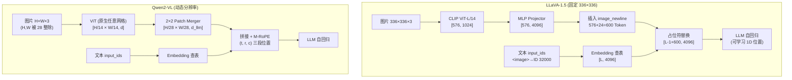

# 第 3 周教程：主流 VLM 架构与图像 Token 处理全流程

> **本周要回答的三个问题**
> 1. `input_ids` 里的 `<image>` 占位符到底是怎么被视觉 Embedding 替换的？
> 2. LLaVA-1.5（固定分辨率）和 Qwen2-VL（动态分辨率）的本质区别是什么？
> 3. 2D/3D-RoPE 是如何把"空间位置"注入注意力的？

对应学习计划：第 3 周。交付物：手绘 LLaVA-1.5 与 Qwen2-VL 的前向传播对比图（本文 2.4 与 4.4 节给出可直接照抄的 Mermaid 图与维度标注）。

---

## 1. 第一性原理：占位符替换的本质是 Embedding 拼接

### 1.1 根本矛盾

LLM 的输入是 `input_ids`（整数序列），经 Embedding 表查找变成 `inputs_embeds`（$[B, L, d]$ 浮点序列）。而视觉信息是 `pixel_values`（$[B, C, H, W]$），走的是完全另一条编码路径。**两条路径的输出必须在某个位置"汇合"**——汇合点选在哪里、怎么拼，就是 VLM 架构设计的核心问题。

主流方案（LLaVA 系、Qwen2-VL 等）的选择是：**在 Embedding 层汇合**。文本 Token 查表得到 Embedding，视觉 Token 经视觉塔 + Projector 得到 Embedding，两者在 $d$ 维空间里拼接成一条序列，之后进入 LLM 的所有层时，视觉与文本 Token **完全平等地**参与自注意力——LLM 内部不再区分模态。

### 1.2 占位符替换的标准实现

以 LLaVA-1.5 为例，用户输入 `"USER: <image>\n这张图里有什么? ASSISTANT:"` 的处理流程：

1. **Tokenizer 阶段**：`<image>` 被编码为一个特殊 Token ID（LLaVA 中是 32000，即词表扩出来的那个 ID）。此时 `input_ids` 中该 ID 出现一次，就代表"这里要塞入整张图的所有视觉 Token"。
2. **文本 Embedding**：`inputs_embeds = embed_tokens(input_ids)`，`<image>` 位置得到一个"无意义"的可训练占位向量。
3. **视觉路径**：`pixel_values` → Vision Tower → Projector，得到 $[B, 576, d]$ 的视觉 Embedding 序列（若含多图则拼接为 $[B, 576 \times K, d]$）。
4. **替换**：用 mask 索引把 `<image>` 占位向量替换成整段视觉 Embedding。核心代码只需几行：

```python
import torch

def merge_embeddings(input_ids, inputs_embeds, image_embeds, image_token_id):
    """
    input_ids:      [B, L]        文本 token id 序列, 含 <image> 占位
    inputs_embeds:  [B, L, d]     查表得到的文本 embedding
    image_embeds:   [B, N, d]     Projector 输出的视觉 embedding
    image_token_id: int           <image> 的 token id
    """
    B, L, d = inputs_embeds.shape
    N = image_embeds.shape[1]

    # 1. 找到每个样本中 <image> 的位置
    mask = input_ids == image_token_id              # [B, L]
    assert mask.any(), "input_ids 中没有 <image> 占位符"

    # 2. 构造新的序列长度: L - 1 + N (1 个占位符换成 N 个视觉 token)
    new_embeds, new_attn = [], []
    for b in range(B):
        pos = mask[b].nonzero(as_tuple=True)[0][0]  # 占位符位置
        pre, post = inputs_embeds[b, :pos], inputs_embeds[b, pos + 1:]
        new_embeds.append(torch.cat([pre, image_embeds[b], post], dim=0))
    out = torch.stack(new_embeds)                   # [B, L-1+N, d]
    assert out.shape[1] == L - 1 + N
    return out
```

Hugging Face `transformers` 中 `LlavaForConditionalGeneration.forward()` 的真实实现思路与此一致（用 `torch.where` 在扩展后的 embeds 上按 mask 混合，细节更工程化，如处理 `image_newline` 换行 Token）。**理解了上面这段代码，就理解了所有"Embedding 拼接"系 VLM 的核心机制。**

### 1.3 汇合点的其他选择（为什么不被采用）

- **在 LLM 中间层汇合**（如 VisualGPT 类方案，视觉特征作为 encoder-decoder 的中间注入）：视觉与文本的注意力交互被限制在特定层，深度交互不足，主流开源 VLM 已不采用。
- **在输出侧汇合**（视觉特征只用于检索增强）：完全丧失"看图说话"的生成式能力。

Embedding 层汇合的压倒性优势：**实现只需一次 `torch.cat`，且对 LLM 零侵入**——任意开源 LLM 都能直接当 Backbone 用。这是 LLaVA 系能快速跟进最新 LLM 的架构原因。

---

## 2. LLaVA-1.5：固定分辨率的完整数据流

### 2.1 端到端张量流转

输入：一张 $336 \times 336$ 图 + 一句文本。

| 步骤 | 模块 | 输出形状 | 说明 |
| --- | --- | --- | --- |
| 1 | ImageProcessor | $[3, 336, 336]$ | Resize 到固定分辨率 |
| 2 | CLIP ViT-L/14 | $[577, 1024]$ | 含 [CLS] 共 577 Token |
| 3 | 丢弃 [CLS]，取 Patch 序列 | $[576, 1024]$ | VLM 不用 [CLS] |
| 4 | MLP Projector | $[576, 4096]$ | 对齐到 LLM (Vicuna/Qwen) 维度 |
| 5 | Tokenizer 处理文本 | `input_ids: [L]` | `<image>` → ID 32000 |
| 6 | Embedding 查表 | $[L, 4096]$ | 文本部分 |
| 7 | 占位符替换（1.2 节） | $[L - 1 + 576, 4096]$ | 拼接完成 |
| 8 | LLM 自回归 | logits $[L', V]$ | 视觉与文本平等参与注意力 |

### 2.2 <image> 换行技巧：`image_newline` 与网格重排

CLIP 输出的 576 个 Token 原本是 $24 \times 24$ 的**二维网格**，展平后空间结构信息部分丢失。LLaVA-1.5 的一个小技巧：在 Projector 之后，把序列重排为 $24$ 行，**每行末尾插入一个可学习的换行 Token**（`image_newline`），让 LLM 的因果注意力感知到"行"结构。576 + 24 = 600 个 Token 进入 LLM。同理，部分实现会在末尾再加一行"行分隔符"。这类设计不影响原理理解，但读源码时会对不上 576 这个数——原因即在此。

### 2.3 固定分辨率的根本局限

$336 \times 336$ 的输入下，一个 Patch 覆盖 $14 \times 14$ 原始像素。对一张 $1024 \times 768$ 的原图，Resize 到 336 后每个 Patch 对应约 $43 \times 43$ 原始像素——**一张 A4 文档上的一行字会被压缩进一两个 Token**。这就是 LLaVA-1.5 在 OCR、图表理解上弱于后期模型的根本原因。工程界的补救催生了两个方向：

- **AnyRes**（LLaVA-1.6 / LLaVA-NeXT）：把高分辨率图切块成多个 $336 \times 336$ 子图分别编码再拼接，Token 数随分辨率线性增长；
- **原生动态分辨率**（Qwen2-VL 路线）：视觉塔直接接受任意分辨率输入。后者更优雅，是下面的重点。

---

## 3. Qwen2-VL：动态分辨率与 M-RoPE

（按学习计划主题展开，论文信息已核实：*Qwen2-VL: Enhancing Vision-Language Model's Perception of the World at Any Resolution*, arXiv:2409.12191。学习计划中写的 *"To See the World More Clearly"* 并非正式论文标题，特此修正。）

### 3.1 Naive Dynamic Resolution：把"分辨率"变成"Token 数"

Qwen2-VL 的视觉塔（重训的 ViT，约 675M）直接接受任意 $H \times W$ 输入：

1. **约束**：$H, W$ 必须能被 28 整除（patch size 14 × 后续合并因子 2）。
2. **切 Patch**：$N = \frac{H}{14} \times \frac{W}{14}$，每个 Patch 是 $14 \times 14 \times 3$。
3. **Token 数随图片自然变化**：一张 $448 \times 448$ 的图得到 $32 \times 32 = 1024$ 个 Patch Token；一张 $672 \times 448$ 的图得到 $48 \times 32 = 1536$ 个。

训练时用**两维桶（bin）机制**控制显存：图片按面积分桶，同桶内的 batch 打包，避免极端大图撑爆显存。推理时只需保证整图 Token 数不超过上下文预算。

**与 AnyRes 的本质区别**：AnyRes 是"多次固定编码再拼接"（工程补丁），Naive Dynamic 是"编码器原生支持任意网格"（架构能力）。后者不存在子图边界效应，相同分辨率下细节保留更好。

### 3.2 2D-RoPE 与 M-RoPE：位置编码如何适配二维与时间轴

回顾一维 RoPE（Rotary Position Embedding）：对 Query/Key 的每两个分量做旋转，旋转角是 Token 序号 $m$ 的线性函数，使注意力分数只依赖**相对位置** $m - n$。

**视觉 Patch 需要二维位置**：第 $i$ 个 Patch 位于网格 $(r_i, c_i)$（行、列）。Qwen2-VL 的做法是把隐层维度切成三段，分别编码三种位置：

| 维度段 | 编码内容 | 旋转角 |
| --- | --- | --- |
| 前 1/4 | 时间位置 $t$（图片恒为 0，视频为帧号） | $\theta_t \cdot t$ |
| 中 1/4 | 行位置 $r$ | $\theta_r \cdot r$ |
| 后 1/4 | 列位置 $c$ | $\theta_c \cdot c$ |

对文本 Token，三个位置取同一个全局序号（退化为标准 1D-RoPE）。这就是 **M-RoPE（Multimodal RoPE）**：一张图内的 Patch 有 $(0, r, c)$ 三元组位置，文本续在图片之后的 Token 有递增的一维位置。它统一解决了三个问题：

- 图片 Patch 保持二维空间结构（同行的 Patch 列位置相邻 → 注意力更强）；
- 视频帧之间有时间先后（$t$ 递增）；
- 与 LLM 原生 RoPE 训练分布兼容（文本部分完全一致）。

**对比 LLaVA-1.5**：视觉 Token 用的是 ViT 的可学习位置嵌入 + LLM 侧把视觉 Token 当作"连续一段"的一维序列——空间结构只靠 `image_newline` 和 Patch 顺序隐式表达。这是两种架构在"位置信息"上的本质差异。

### 3.3 Patch Merger：Token 压缩的新范式

Qwen2-VL 在 ViT 输出后做一次合并：把 $2 \times 2$ 相邻的 4 个 Patch Token 拼接成 1 个（维度 $\times 4$），再经一个单层 MLP 投影到 LLM 维度：

$$
[B, \tfrac{H}{14} \times \tfrac{W}{14}, d] \xrightarrow{\text{2×2 重排}} [B, \tfrac{H}{28} \times \tfrac{W}{28}, 4d] \xrightarrow{\text{MLP}} [B, \tfrac{H}{28} \times \tfrac{W}{28}, d_{llm}]
$$

$448 \times 448$ 的图：$1024$ Patch Token → **256 个 LLM Token**。这与 Q-Former 的区别是**有位置结构的确定性合并**（4 个固定邻居合并，保留局部空间关系），而非可学习查询的检索式压缩。它把"信息压缩"从 Bridge 职责中剥离——Bridge 不再决定"保留什么"，只负责"维度对齐 + 局部聚合"。

### 3.4 架构对比图（本周交付的核心，可直接照抄手绘）



手绘时的维度标注检查清单（每条都必须能在图上标出）：

- [ ] 视觉塔输出的 Token 数怎么算出来的（$\frac{H}{P} \times \frac{W}{P}$）；
- [ ] Projector 前后的特征维度（$d_v \to d_{llm}$）；
- [ ] 合并后进入 LLM 的视觉 Token 数（LLaVA 600 / Qwen $\frac{H}{28}\times\frac{W}{28}$）；
- [ ] 拼接后总序列长度（文本 $L$ + 视觉 $N$ 的关系）；
- [ ] 位置编码各注入在哪一段（LLaVA：视觉塔可学习 + LLM 1D；Qwen：M-RoPE 三段）。

### 3.5 多图与视频的扩展

- **多图**：每张图独立走视觉塔 → Projector，产出各自一段连续的视觉 Token，按 `...</img>` 分界拼接进文本序列。上下文预算是硬约束：两张 $448 \times 448$ 图就是 512 个 LLM Token。
- **视频**：沿时间轴均匀抽帧（如 2fps），每帧按图片处理，M-RoPE 的 $t$ 维标注帧号。注意帧间有大量冗余，工程上会用更激进的每帧 Token 合并或帧采样率控制总长。

---

## 4. 实现与验证

### 4.1 完整前向：用 Hugging Face 复现 1.2 节的替换逻辑

```python
"""
用 LLaVA 官方实现验证占位符替换后的序列长度。
运行方式: python week3_llava_forward.py
依赖: torch, transformers, pillow
"""
import torch
from transformers import LlavaForConditionalGeneration, AutoProcessor
from PIL import Image
import requests

model_id = "llava-hf/llava-1.5-7b-hf"
processor = AutoProcessor.from_pretrained(model_id)
model = LlavaForConditionalGeneration.from_pretrained(
    model_id, torch_dtype=torch.float16)

image = Image.open(requests.get(
    "http://images.cocodataset.org/val2017/000000039769.jpg",
    stream=True).raw).convert("RGB")

prompt = "USER: <image>\nDescribe this image. ASSISTANT:"
inputs = processor(text=prompt, images=image, return_tensors="pt")
print("input_ids shape:", inputs["input_ids"].shape)   # [1, L_text]
print("pixel_values shape:", inputs["pixel_values"].shape)  # [1, 3, 336, 336]

with torch.no_grad():
    out = model(**inputs, output_hidden_states=False,
                return_dict=True)

# 断言: 视觉 token 数 = (336/14)^2 + newline 数 = 576 + 24 = 600
n_img_tokens = 600
L_text = inputs["input_ids"].shape[1]
print(f"文本长度 {L_text}, 视觉 token {n_img_tokens}, "
      f"拼接后 LLM 序列长度应约 {L_text - 1 + n_img_tokens}")
```

运行后打印的序列长度应约为 `L_text - 1 + 600`，与手算一致即为通过。（具体数值随 processor 版本的 prompt 处理细节可能略有出入，±24 的差异通常来自 `image_newline` 的处理方式。）

### 4.2 手写 2D 位置编码对比实验

验证"二维网格重排后行/列相邻的 Token 位置更近"：

```python
import torch

def rope_angles_2d(n_rows: int, n_cols: int, half_dim: int = 16):
    """为 n_rows × n_cols 的 Patch 网格生成 2D RoPE 角度: [N, half_dim]"""
    inv_freq = 1.0 / (10000 ** (torch.arange(0, half_dim, 2).float() / half_dim))
    rows = torch.arange(n_rows).float()      # 行位置
    cols = torch.arange(n_cols).float()      # 列位置
    rr, cc = torch.meshgrid(rows, cols, indexing="ij")
    ang_r = rr.reshape(-1, 1) * inv_freq     # [N, half_dim/2]
    ang_c = cc.reshape(-1, 1) * inv_freq
    return torch.cat([ang_r, ang_c], dim=-1) # 前 8 维编行, 后 8 维编列


torch.manual_seed(0)
angles = rope_angles_2d(24, 24)              # 576 个 Patch, 网格 24×24

def rope_similarity(i: int, j: int) -> float:
    """两个位置经 RoPE 后的内积 (相对位置的函数)"""
    delta = angles[i] - angles[j]
    return float(torch.cos(delta).mean())


center = 12 * 24 + 12                        # 网格中心的 Token
right = center + 1                           # 右邻 (同行)
below = center + 24                          # 下邻 (同列)
far = 0                                      # 左上角 (远距离)

print(f"右邻相似度: {rope_similarity(center, right):.4f}")
print(f"下邻相似度: {rope_similarity(center, below):.4f}")
print(f"远邻相似度: {rope_similarity(center, far):.4f}")
assert rope_similarity(center, right) > rope_similarity(center, far)
assert rope_similarity(center, below) > rope_similarity(center, far)
print("✅ 2D RoPE: 空间相邻 Patch 的位置相似度高于远邻")
```

**预期输出**：右邻与下邻的相似度均明显高于远邻，断言通过。这验证了 M-RoPE"保留二维空间结构"的关键行为。

### 4.3 动态分辨率 Token 计数器

```python
def qwen2vl_tokens(h: int, w: int, merge: int = 2, patch: int = 14) -> int:
    """计算 Qwen2-VL 下任意分辨率图片的 LLM Token 数"""
    assert h % (patch * merge) == 0 and w % (patch * merge) == 0, \
        f"H/W 必须被 {patch * merge} 整除"
    return (h // (patch * merge)) * (w // (patch * merge))


for size in [(448, 448), (672, 448), (1344, 896)]:
    h, w = size
    print(f"{h}×{w} -> {qwen2vl_tokens(h, w)} LLM tokens")

# 448×448 -> 256 LLM tokens
# 672×448 -> 384 LLM tokens
# 1344×896 -> 1536 LLM tokens
```

---

## 5. 工程权衡与失效模式

### 5.1 两种架构的适用场景对比

| 维度 | LLaVA-1.5（固定分辨率） | Qwen2-VL（动态分辨率） |
| --- | --- | --- |
| 实现复杂度 | 低，生态最成熟 | 中（分桶、M-RoPE、Merger） |
| 单图 Token 成本 | 恒定 600 | 随分辨率 128~2048+ |
| OCR / 细粒度任务 | 弱 | 强 |
| 批处理效率 | 高（形状全同） | 需 padding / 打包，稍复杂 |
| 训练显存可预测性 | 完全可预测 | 需按桶控制，大图易 OOM |
| 适用场景 | 通用图文对话、低成本部署 | 文档理解、高分辨率、视频 |

**经验规则**：做一个新 VLM 应用，若以自然图片对话为主、对成本敏感，固定分辨率路线仍然是合理基线；只要涉及文档/截图/图表，必须上动态分辨率或 AnyRes。

### 5.2 三个代表性失效模式

**失效 1：高分辨率大图直接喂给固定分辨率模型**
- **症状**：模型对 $2000 \times 1500$ 的文档图"答非所问"，描述的东西像缩略图内容。
- **根因**：Resize 到 $336 \times 336$ 后文字完全不可分辨（每个 Patch 平均覆盖约 $88 \times 88$ 原始像素）。
- **定位**：把 Resize 后的图存盘肉眼看一眼——你看不清的字，模型更看不清。
- **修复**：换动态分辨率模型；或 AnyRes 切块；或对文档类输入先做版面裁剪再分区域提问。

**失效 2：多图场景 Token 超预算导致静默截断**
- **症状**：8 张图的 batch 里，后排图片的视觉 Token 被悄悄截掉，模型说"我只看到一张图"。
- **根因**：`max_length` / 上下文窗口按文本预估，没把 $600 \times 8 = 4800$ 视觉 Token 算进去。
- **定位**：打印拼接后的总序列长度 vs 模型 `max_position_embeddings`。
- **修复**：预算公式固定为 `总长 = 文本 Token + Σ(每图视觉 Token)`，超限时降分辨率或减图。

**失效 3：位置编码配置错误导致空间关系混乱**
- **症状**：模型能描述图中物体，但"左边的杯子"与"右边的杯子"张冠李戴；或视频帧序错乱。
- **根因**：微调时错误地修改了 `rope_scaling`、或合并 Patch 时打乱了行优先顺序（Merger 重排出错），2D 位置语义被破坏。
- **定位**：构造一个只有"左红右蓝"两个色块的合成图做探针测试，空间问答准确率应接近 100%；若显著低于此，查 Merger 的重排索引。
- **修复**：核对 Patch 重排是"行优先 + 2×2 邻域合并"；微调场景下不要动 RoPE 相关配置。

---

## 6. 延伸思考题

1. **复杂度核算**：一张 $896 \times 1344$ 的文档图，Qwen2-VL 产生多少 LLM Token？若 LLM 用 7B 模型、上下文 32k，理论上还能再放几张同尺寸图？（答案：$(896/28)\times(1344/28) = 32 \times 48 = 1536$；32k 上下文减去系统提示与回答预算后约可放 15~20 张——这就是多图文档任务的实际约束来源。）
2. **位置编码的本质**：LLaVA-1.5 没有 2D 位置编码也"基本能用"，说明空间信息部分可以被 Patch 顺序和内容特征隐式恢复。设计一个对照实验（打乱视觉 Token 顺序 vs 保持顺序），估计隐式空间信息对 VQA 贡献了多大比例的性能。（提示：可参考论文中对 Qwen2-VL 消融 M-RoPE 的做法——把 2D 位置退化为 1D 后 OCR 类任务下降明显，通用 VQA 下降较少。）
3. **架构推演**：如果让你设计一个"每秒 30 帧、连续 10 分钟"的监控视频理解模型，按 Qwen2-VL 的 Token 公式算一下原始 Token 需求，你会砍哪里？（提示：抽帧率、每帧分辨率、Merger 合并因子三者是仅有的旋钮，300 秒 × 30 帧 × 每帧至少 256 Token ≈ 230 万 Token，必须砍三个数量级——这解释了为什么视频 VLM 全都做激进压缩。）

---

*下一篇：[第 4-5 周：SFT 与 LoRA 微调实战](第4-5周-SFT与LoRA微调实战.md)*
