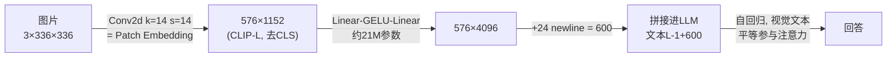

# 第 6 周教程：复盘与自测验收

> **本周目标**：把前五周的内容固化成"可复述、可推导、可复现"的能力，通过四项自测后进入 Stage 2。本文给出每道自测题的**参考答案与推导过程**，以及训练故障的系统化排查表。

对应学习计划：第 6 周。验收标准：四项自测全部达成；建议先遮住答案自测，再对照。

---

## 1. 自测一：理论计算——视觉 Token 数推导

**题目**：一张 $336 \times 336$ 的图片输入 Patch Size 为 $14 \times 14$ 的 CLIP 时，进入 LLM 的视觉 Token 是多少个？

### 参考推导（要求能徒手写出）

$$
N = \frac{H}{P} \times \frac{W}{P} = \frac{336}{14} \times \frac{336}{14} = 24 \times 24 = 576
$$

但**完整答案要区分两种口径**：

| 口径 | Token 数 | 说明 |
| --- | --- | --- |
| Vision Tower 输出 | 576（纯 Patch）或 577（含 [CLS]） | 取决于是否保留分类 Token |
| 进入 LLM 的视觉 Token | 600（LLaVA-1.5 实际） | 576 Patch + 24 个 `image_newline` 换行 Token |

自测时只答 576 属于"及格"，能主动区分 576 / 577 / 600 三种口径并说明来源，才算"达成标准"。同理应能推广：SigLIP-SO400M @384 → $\frac{384}{14}$ 不能整除，实际 SO400M 用 14×14 patch 时输入会被适配为可整除的网格（$27 \times 27 = 729$，即有效输入 378）；Qwen2-VL @448×448 → 1024 Patch → 合并后 256 个 LLM Token。

**衍生练习**（自测升级版，应能在 1 分钟内完成）：

1. $672 \times 448$ 图片过 Qwen2-VL（patch 14, 合并 2×2）→ $48 \times 32 = 1536$ Patch → **384** 个 LLM Token。
2. 一段 8 帧、每帧 $448 \times 448$ 的视频 → $8 \times 256 = 2048$ 个 LLM Token。
3. 上下文 32k 的模型，最多放多少张 $672 \times 448$ 图？→ 约 $32768 / 384 \approx 85$ 张（理论），实际预留文本空间后 50~70 张。

---

## 2. 自测二：架构理解——为什么冻结 Vision Encoder

**题目**：为什么当前多数 VLM 训练时会冻结 Vision Encoder？

### 参考答案（四个论点，要求完整说出前三个）

1. **通用表征破坏风险（最重要）**：视觉塔经数亿级图文对预训练，其表征是通用的。SFT 数据通常只有几千~几万条，梯度信号不足以"教会"视觉塔新东西，却足以**灾难性地破坏**已习得的通用视觉对齐——表现为训练域内过拟合、域外识别能力下降。这与 LLM 侧用 LoRA 而非全量微调是同一逻辑。
2. **显存与计算开销**：以 CLIP-L 为例约 300M 参数。开启训练意味着梯度 + Adam 优化器状态（约 4.8GB fp32 状态，2.4GB 梯度），并且**反向传播必须一路计算到视觉塔内部**，激活显存同步上升。冻结后视觉塔前向可以用 `torch.no_grad()` 甚至离线缓存特征（同一个视觉塔输出可复用于多轮训练实验，预计算特征是数据实验阶段的常用提效手段）。
3. **训练效率与收敛稳定性**：可训练参数减少 → 同样数据下过拟合风险降低、所需训练步数减少；且冻结的视觉塔保证"视觉语义空间"在训练全程不动，Projector 的对齐目标稳定，收敛更快更稳。
4. **工程迭代效率**：冻结视觉塔后，视觉特征可以预计算并持久化，多组 Projector/LLM 超参实验共享同一份特征缓存，单次实验成本大幅下降。

**何时解冻（加分量论点）**：目标域与预训练分布差距极大时（医学影像、遥感、红外），通用视觉特征本身失效，需要解冻视觉塔顶部若干层做 LoRA，或先用大规模域内图文对做视觉塔继续预训练（CPT），再做 SFT。判断依据是：冻结方案下训练收敛但视觉相关任务（定位、计数、细粒度属性）始终差。

---

## 3. 自测三：代码实操——20 行内演示占位符替换

**题目**：能否用 20 行以内的代码展示 `input_ids` 中的 `<image>` 标记是如何被 Projector 输出的 Visual Embeddings 替换的？

### 参考实现（第 3 周 1.2 节的核心压缩版）

```python
import torch

def merge(input_ids, inputs_embeds, image_embeds, img_id):
    """input_ids [B,L] | inputs_embeds [B,L,d] | image_embeds [B,N,d]"""
    B, L, d = inputs_embeds.shape
    N = image_embeds.shape[1]
    out = inputs_embeds.clone()
    for b in range(B):
        pos = (input_ids[b] == img_id).nonzero()[0, 0]
        pre, post = out[b, :pos], out[b, pos + 1:]
        out = torch.cat([
            out[:b], (torch.cat([pre, image_embeds[b], post]))[None], out[b + 1:]
        ])
        assert out.shape[1] == L - 1 + N        # 长度校验
    return out


ids = torch.tensor([[1, 99, 5, 6]])              # 99 即 <image> 占位
emb = torch.randn(1, 4, 64)                      # 文本 embedding
vis = torch.randn(1, 10, 64)                     # Projector 输出 10 个视觉 token
merged = merge(ids, emb, vis, img_id=99)
assert merged.shape == (1, 13, 64)               # 4 - 1 + 10 = 13 ✅
print("替换后长度 13 = 文本 4 - 占位 1 + 视觉 10")
```

验收要点：① 能解释 `-1 + N` 的长度变化；② 知道真实实现（`transformers` 的 Llava/Qwen2VL）用 `torch.where` + 预分配张量做向量化，循环版仅为演示；③ 知道 mask label 也要同步扩展（视觉 Token 的 label 为 -100，见第 4-5 周教程 2.2 节）。

---

## 4. 自测四：实战交付——训练证据清单

**题目**：是否成功运行过一次 VLM 的 LoRA 训练并产出可推理的 Checkpoint？

### 达成标准的物证清单

- [ ] **WandB Loss 曲线**：初始 loss 约 1~2（因模型/数据而异），呈快速下降后趋平；没有持续发散（lr 过大）或纹丝不动（lr 过小/数据为空）。
- [ ] **可加载的 Checkpoint**：`saves/` 下存在 adapter 权重（`adapter_model.safetensors`），或合并后的完整模型目录。
- [ ] **微调前后对比记录**：至少 3 组"域内 + 域外 + 格式遵循"的问答对比（第 4-5 周教程 3.4 节的四类测试），域内有可见改善、域外无退化。
- [ ] **一次训练故障的排查记录**（建议主动制造并修复一次，例如故意把 lr 设为 1e-5 观察 loss 不动，再修复）——这是把"失效模式"变成自身经验的最高效方式。

---

## 5. 训练故障系统化排查表

综合第 4-5 周的失效模式，按"症状 → 最可能根因 → 一句话定位动作"组织：

| 症状 | 最可能根因（按概率排序） | 定位动作 |
| --- | --- | --- |
| Loss 不降 | ① lr 过小 ② 数据未加载（路径/字段错）③ label 全 -100 ④ `lora_target` 未命中 | 冒烟测试 10 条样本 + 打印预处理样本 |
| 开局即 OOM | ① 未开 gradient_checkpointing ② batch 过大 ③ cutoff_len 含视觉 Token 后超预算 | bf16 + batch=1 + cutoff 2048 起步 |
| 中途 OOM | 动态分辨率大图 → 视觉 Token 峰值 | 预处理限制图片最大边；Token 公式预算 |
| Loss 降后回升 | 过拟合（epoch 过多 / r 过大） | 看 eval loss 拐点，回退最佳 checkpoint |
| 域内好、域外差 | 灾难性遗忘 | 混入 10~20% 通用数据；降 r/epoch |
| 推理与训练表现不一致 | template 不一致 / adapter 未加载 | 逐字符对比最终 prompt 字符串 |
| 输出全是重复字/空串 | 数据答案高度重复 / Projector 数值溢出 | 检查答案多样性；确认 bf16 而非裸 fp16 |
| NaN Loss | fp16 溢出（Projector 附近高发） | 切 bf16；检查 lr 是否过大 |

---

## 6. 阶段知识图谱复盘

进入 Stage 2 前，以下链路的**每个箭头**都应能独立推导（数字以 LLaVA-1.5 为例）：



五个必须能脱口而出的数字及其来历：

1. **576** = $(336/14)^2$ —— Patch 数，决定视觉 Token 预算；
2. **1152 → 4096** = $d_v \to d_{llm}$ —— Projector 的维度对齐职责；
3. **约 21M** = Projector 参数量 —— 占总参数 0.3%，决定"只训 Projector"的可行性；
4. **0.4%** = LoRA (r=8) 可训练参数占比 —— 决定单卡微调的可行性；
5. **84GB vs 14.5GB vs 4GB** = 全量/LoRA/QLoRA 的 7B 显存 —— 决定训练方案的选型。

能答上来数字本身只是起点，**每个数字背后"它决定了什么工程决策"** 才是本阶段的验收内核。

---

## 7. 综合思考题（进入 Stage 2 前的终极检验）

1. **端到端串联**：给定"用户上传一张 $1120 \times 896$ 的财报截图，要求模型输出表格 JSON"，从 Token 预算出发，设计完整方案：选哪种架构（固定/动态分辨率）？Token 数多少？上下文需要多大？训练数据怎么构造？（参考答案要点：必须动态分辨率或 AnyRes——固定 336 下表格线不可辨；$1120/28 \times 896/28 = 40 \times 32 = 1280$ Token；至少 4k 上下文；SFT 数据用"截图 + 结构化 JSON 答案"配对，r 建议 32+。）
2. **架构反推**：拿到一个陌生开源 VLM 权重（只有 config.json 和 safetensors），列出你判断其视觉塔类型、Projector 结构、分辨率策略的具体检查步骤。（要点：`config.json` 的 `vision_config` 看隐藏维度与 patch size；`mm_projector`/`merger` 字段看 Bridge 结构；`image_size` 与 `dynamic_resolution` 类字段看分辨率策略；再加载权重打印各模块形状实证。）
3. **成本敏感设计**：老板要求"VLM 单图推理成本压到最低，可接受 90% 分位质量"。你会怎么选分辨率、Bridge、LLM 大小？给出量化的 Token 与显存估算。（开放题，检查点：是否把"Token 数 → 注意力平方开销 → LLM 大小"的乘法关系算清楚。）

---

## 8. 进入 Stage 2 的衔接预告

Stage 2（VLM 训练实践与 SFT 微调）将在此基础上深入：

- SFT 数据工程的完整流程（指令生成、质量过滤、格式配比）——本阶段 500 条样本的手工构造将升级为系统化流水线；
- 多任务混合训练与训练稳定性——本阶段的"失效模式排查表"将升级为系统化的训练诊断方法论；
- 更大规模的 LoRA/全量微调选型——本阶段的显存核算公式将扩展到多卡并行场景。

带着第 7 节三道题的答案进入 Stage 2，你会明显更轻松。

---

*返回：[教程索引](README.md) ｜ 上一篇：[第 4-5 周：SFT 与 LoRA 微调实战](第4-5周-SFT与LoRA微调实战.md)*
