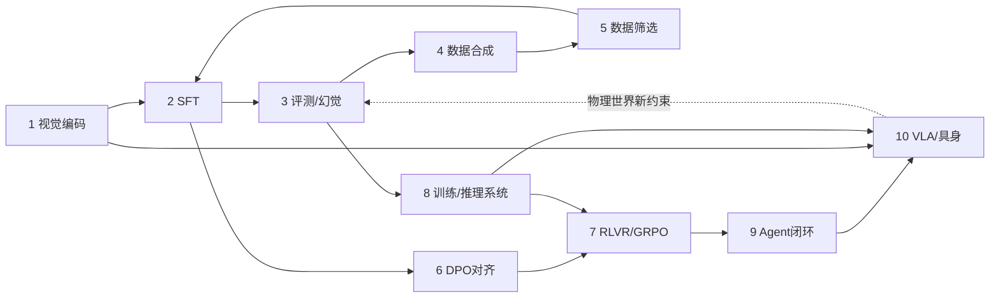

# 第 10 周教程：Sim-to-Real 与结课总结

> **本周要回答的三个问题**
> 1. Sim-to-Real 的两大鸿沟（视觉域 / 动力学）各自的成因与缓解手段是什么？
> 2. 真实机械臂 10~20Hz 的控制频率，如何用 Stage 8 的推理工程满足？
> 3. 结课作品集（Portfolio）应该包含什么，才能成为求职/申请的硬通货？

对应学习计划：第 10 周。交付物：《VLA 大模型端到端具身智能实践指南》——数据解析模块 + 闭环评测与加速推理模块 + 策略微调与消融结果，以技术长文或开源项目形式交付。

---

## 1. 第一性原理：仿真与现实之间隔着两层"物理谎言"

### 1.1 根本矛盾：仿真器的保真度 vs 真实世界的复杂性

在 SimplerEnv 里拿到 70% 成功率，接到真实 Franka 上可能只有 30%——**Sim-to-Real Gap**。它由两层独立鸿沟构成，必须分开诊断：

| 鸿沟 | 表现 | 成因 | 缓解手段 |
| --- | --- | --- | --- |
| **视觉域鸿沟**（Visual Gap） | 策略在仿真里"看得准"，实机上"看不准" | 渲染的纹理/光照/噪声与真实相机分布不同 | **Domain Randomization**：仿真中随机化光照、纹理、相机内参/位姿、背景，把训练分布撑宽到覆盖真实 |
| **动力学鸿沟**（Dynamics Gap） | 同样的动作序列，实机的物理响应不同 | 摩擦系数/阻尼/延迟/齿轮间隙等参数与真实机械臂有偏差 | 系统辨识（标定真实动力学参数）、动力学随机化、真机数据微调 |

**诊断纪律（先分离再治疗）**：把**同一策略、同一初始状态**分别在仿真与实机上执行，逐步对比观测与状态——若两边"看到的"不一样（视觉差异大）是视觉鸿沟；若"看到的差不多但动作响应不同"是动力学鸿沟。混合症状（最常见）需要两条腿同时治，但**一次只动一个变量**（Stage 3 归因纪律的物理版）。

### 1.2 Domain Randomization 的设计空间

域随机化（DR）的逻辑：**既然无法让仿真无限逼真，就让训练分布足够宽，把真实世界"包"进去**——真实成为训练分布内的一个普通样本。

| 随机化维度 | 参数示例 | 强度权衡 |
| --- | --- | --- |
| 光照 | 强度/色温/方向 | 过强破坏物体识别（Stage 1 的预处理分布纪律） |
| 纹理/材质 | 桌面/物体贴图随机 | 视觉塔 LoRA 配合（第 7-9 周） |
| 相机 | 内参/位姿/FOV/噪声 | 与真实相机标定误差匹配即可，不必过度 |
| 物体 | 位置/姿态/干扰物 | 任务相关维度要充分覆盖 |

DR 的失败模式恰好是"过犹不及"：随机化范围超过真实分布太远，模型学到的表征被稀释（容量浪费在不存在的世界上）；太窄则真实落在分布外。**DR 参数也应该被消融**——它是超参，不是信仰。

### 1.3 控制频率：Stage 8 推理工程的"期末考试"

真实机械臂要求 **10~20Hz**（即每步 50~100ms），而 OpenVLA-7B 的 bf16 前向在 A100 上约 200~400ms（经验量级）——**差 3~8 倍，这是硬约束不是优化项**。Stage 8 的工具箱按"延迟收益/质量代价"排序：

| 手段 | 延迟收益（经验量级） | 质量代价 | 备注 |
| --- | --- | --- | --- |
| **量化**（AWQ-INT4 / FP8） | 2~3× | 小（通用基准 ~1pt 内） | 第一刀；OpenVLA 论文验证量化部署不掉成功率（已核实） |
| **Action Chunking（k=4~8）** | k×（分摊到 k 步） | 开环 k 步（动态 k 缓解） | 第 1-2 周机制的部署化 |
| 小模型蒸馏 / 更小底座 | 3~10× | 需验证能力保留 | 与 Stage 5 的"Less is More"联动 |
| 异步推理流水线 | 掩码部分延迟 | 复杂度 | 推理第 i+1 chunk 时执行第 i chunk |

组合拳的典型配置：**AWQ-INT4（~2.5×）+ chunk=4（4×分摊）→ 有效控制频率 ×10**，足以把 3Hz 拉进 10~20Hz 区间。每一步都用 Stage 8 的基准方法实测，报告延迟 P95（控制频率看最坏情况）。

---

## 2. 实现与验证：结课作品集的三大模块

### 2.1 模块一：数据解析（第 3-4 周产出的固化）

- RLDS 加载器（含字段自省适配层、off-by-one 断言、分数据集统计报告）；
- 可视化工具（MP4 渲染 + 动作角标）；
- **README 必须包含**：支持的数据集列表、每数据集的字段适配说明、已知限制。

### 2.2 模块二：闭环评测与加速推理（第 5-6 周 + Stage 8）

- SimplerEnv 评测 harness（多 episode/variation、成功率统计、成功与失败视频归档）；
- 推理加速开关（bf16 / INT4 / chunk 参数化）+ 延迟基准（P50/P95）；
- **质量守恒断言**：加速配置的 SR 相对 bf16 基线的下降必须在噪声带内（第 5 周 Stage 8 量化纪律的具身版）。

```python
# 加速配置的验收断言骨架
def assert_speed_ok(base_sr, fast_sr, base_lat, fast_lat, sr_noise=0.05, need_hz=10):
    assert fast_sr >= base_sr - sr_noise, f"加速导致 SR 崩了: {base_sr:.0%}->{fast_sr:.0%}"
    eff_hz = 1000 / (fast_lat * 1000)                    # 1000ms / 单步延迟
    assert 1000 / (fast_lat * 1000) >= need_hz, f"有效频率 {eff_hz:.1f}Hz < {need_hz}Hz"
    print(f"✅ 加速验收: SR 保持 ({fast_sr:.0%}), 有效控制频率 {eff_hz:.1f}Hz ≥ {need_hz}Hz")
```

### 2.3 模块三：微调与消融（第 7-9 周）

- LoRA 微调脚本 + 数据构造（含 10% 回放）；
- A/B 消融（微调前后 + held-out 物体 + 通用抽查）；
- **失败案例集**：按失败模式分类的录像与归因（Stage 3/9 的纪律）。

### 2.4 结课报告的骨架（作品集的门面）

```markdown
# VLA 端到端具身智能实践指南
## 1. 系统总览 (一张图: 数据->微调->闭环评测->加速部署)
## 2. 数据解析 (支持 N 个 OXE 数据集; off-by-one 断言; 可视化样例)
## 3. 闭环评测 (协议: 任务/episode/variation/指标; SimplerEnv SR 结果表)
## 4. 策略微调 (LoRA 配置依据; Co-finetuning 配比; A/B 柱状图 + held-out)
## 5. 推理加速 (量化+chunk 组合拳; 延迟 P50/P95; 质量守恒断言)
## 6. Sim-to-Real 讨论 (DR 方案与实测; 动力学鸿沟的观察; 局限与下一步)
## 7. 复现指南 (环境/命令/种子/数据 hash——Stage 3 协议纪律的最终亮相)
## 8. 附录 (失败案例集 + 归因)
```

**作品集的说服力公式**：`可复现的闭环结果 + 对照实验 + 诚实的失败分析 + 明确的局限声明`。一份承认"Sim-to-Real 还差多少"的报告，比一份只晒成功视频的更有专业信用。

---

## 3. 工程权衡与失效模式

### 3.1 Sim-to-Real 策略的成本-收益

| 策略 | 成本 | 收益 | 适用 |
| --- | --- | --- | --- |
| 视觉 DR | 低（渲染参数） | 治视觉鸿沟 | 必做基线 |
| 动力学随机化 | 中（需物理理解） | 治动力学鸿沟部分 | 有仿真控制权时 |
| 真机数据微调（几百条遥操作） | 高（人工） | 直接治两端 | 上线前最后一步 |
| 系统辨识 | 中 | 治动力学（针对性） | 机械臂参数可测时 |

### 3.2 三个代表性失效模式

**失效 1：DR 过度——仿真内成功率高、表征被稀释**
- **症状**：随机化加强后仿真 SR 反而下降；实机表现与弱随机化版无差。
- **根因**：随机化分布远超真实需要（如光照变化到人类都看不清的程度），模型容量浪费在无意义的变体上。
- **定位**：DR 强度扫描曲线（强度 vs 仿真 SR vs 实机 SR）——实机 SR 的峰值通常在"仿真 SR 开始下降之前"。
- **修复**：以实机 SR 为 DR 强度的调参目标（仿真 SR 只是代理）。

**失效 2：延迟测量在"无负载"下测——实机部署即超频**
- **症状**：单卡空载测推理 90ms 达标，实机上叠加相机取流/控制回路后超 150ms。
- **根因**：控制回路的其他环节（图像传输/预处理/反归一化/安全检查）与模型推理抢资源——Stage 8 的"端到端延迟 ≠ 模型延迟"教训。
- **定位**：Nsys/Profiler 看整个控制回路的时序（含非模型段）。
- **修复**：按**端到端 P95** 达标；各环节异步化/降载（图像降采样、检查项简化）。

**失效 3：结课作品"只有成功视频"**
- **症状**：面试/评审第一问"失败案例呢？"——答不上，信用崩塌。
- **根因**：只记录成功 rollout，失败即重置。
- **定位**：——就是没做。
- **修复**：失败归档 + 归因分类（第 5-6 周）+ 每类至少一条视频与改善计划——**诚实的失败分析是本领域最强的专业信号**。

---

## 4. 延伸思考题

1. **DR 的信息论视角**：Domain Randomization 本质是"用数据分布的广度换取对未建模物理的鲁棒性"。把 Stage 5 的"分布覆盖"思想形式化：真实分布 $P_{real}$、仿真分布 $P_{sim}$、DR 后训练分布 $P_{train}$——写出"DR 成功"的分布包含条件，并讨论"覆盖 $P_{real}$ 但远离 $P_{sim}$ 最优区"的容量浪费如何量化。
2. **控制频率与智能的权衡全景**：把"大模型智能 vs 高频控制"的矛盾列成一张技术路线图（大模型低频出 chunk / 小模型高频闭环 / 分层架构：大模型规划 + 小模型执行 / 系统加速），评估每条路线的成熟度——这恰好是当前具身智能产业化的核心分岐，你的判断是什么？
3. **出师答辩预演**：假设评审问"你的系统在真实 Franka 上部署的最大障碍是什么？"——用本阶段学到的概念链（Sim-to-Real 双鸿沟 → 控制频率 → 安全闸 → 数据回收闭环）给出一个 3 分钟的结构化回答。能答好这道题，十个阶段就真正闭环了。

---

## 5. 十阶段收官：知识版图的最后一眼



从"图片如何变成 Token"（Stage 1）到"机械臂如何抓起可乐罐"（Stage 10），这条学习路径的每一个阶段都在为下一个阶段供给能力、也都在用下一个阶段的视角修正自己的假设。物理世界不会因为你的 loss 低而手下留情——**评测的严谨、数据的诚实、系统的丈量，才是这条路上真正的护城河**。

---

*返回：[教程索引](README.md) ｜ 上一篇各篇见索引 ｜ 出师自测：[阶段十自测验收与复盘](阶段十自测验收与复盘.md)*
