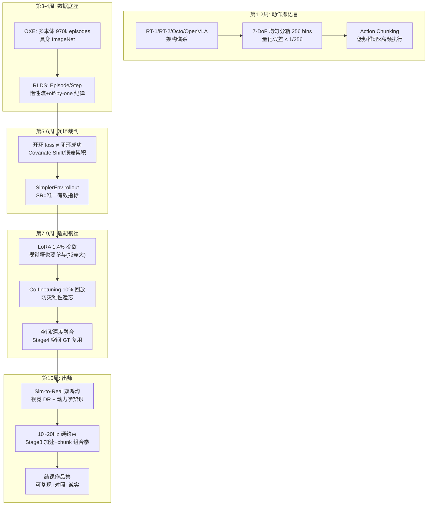

# 阶段十自测验收与复盘（出师答辩）

> **使用方法**：先遮住参考答案自答学习计划的四项终极自测，再对照打分。本阶段是全路径出师答辩——达成标准是"概念能讲、实验能复现、局限能自省"。

---

## 1. 自测一：OpenVLA 如何输出坐标和角度

**题目**：OpenVLA 是如何把一堆坐标和角度输出出来的？

### 参考答案（自测达成标准的展开）

**动作离散化 + 自回归 Token 生成**，四步链：

1. **动作空间定义**：7-DoF 连续动作 $[\Delta x, \Delta y, \Delta z, \Delta r, \Delta p, \Delta y_w, g]$，按数据集统计归一化到 $[-1,1]$；
2. **离散化（Tokenize）**：每一维独立均匀分箱到 256 个 bin（$\text{bin} = \lfloor \frac{a+1}{2} \cdot 256 \rfloor$，clip 到 $[0,255]$），映射到词表中的特殊动作 Token（每维一个 `<action_xx>`，一步动作共 7 个 Token）；
3. **自回归生成**：训练时这 7 个动作 Token 与文本 Token **无异**地参与 next-token prediction（跨模态联合微调正是"动作即语言"的意义所在）；推理时模型自回归生成 7 个动作 Token；
4. **反解（Detokenize）**：按 bin 中心反解回连续值，经数据集对应的归一化统计量（norm_stats）还原物理量，下发机械臂。

**加分细节**：量化误差半箱宽 $1/256 \approx 0.0039$ 归一化单位（0.8m 工作空间约 1.6mm）；归一化统计量必须随 checkpoint 迁移；OpenVLA 主干是 Prismatic VLM（DINOv2+SigLIP 双塔）+ Llama 2 7B（已核实）。

---

## 2. 自测二：为什么 loss 低但实机乱动

**题目**：为什么静态数据集上的动作预测 Loss 很低，在仿真/实机测试时机械臂还是会乱动甚至崩溃？

### 参考答案：Covariate Shift / 误差累积

**机制**：模仿学习的训练数据只覆盖**专家轨迹经过的状态分布**。开环 loss 低说明"在专家见过的状态上模仿得好"；但闭环执行中，第一步的微小误差 $\epsilon$ 使机器人进入**训练分布从未覆盖的偏离状态**——模型对 OOD 状态的预测不可靠，产生更大误差，状态进一步偏离……**误差以复利方式累积**（compounding error），最终崩溃。

三个层次的表述（达成标准 + 加分）：

1. **分布层面**：策略自己生成的状态分布 $P_{\pi}$ 与专家分布 $P_{\text{expert}}$ 随步数发散——模型在 $P_{\pi}$ 上没有监督信号，无法自纠错；
2. **数据层面**：专家数据里没有"错误之后如何恢复"的示范（偶尔有也是专家的高效恢复），模型没学过纠错行为；
3. **缓解方向的性质**：闭环评测暴露问题（Stage 10 第 5-6 周）、Action Chunking 减少暴露次数、数据增广/DR 扩宽训练分布、DAgger/失败状态回灌补齐 $P_{\pi}$、RL 在自身分布上继续优化（Stage 7）——**所有解法都围绕"让训练分布覆盖策略分布"**。

---

## 3. 自测三：为什么微调"倒水"要混通用 VQA 数据

**题目**：为什么在微调 VLA 学习一个"倒水"的新任务时，需要混入大量无关的通用 VLM 问答数据？

### 参考答案：灾难性遗忘的防治

**机制**：VLA 的能力是三层嵌套的——底层视觉表征（识别物体/场景）、中层语言语义（理解"倒水"指令与互联网概念）、顶层动作映射（倒水的运动模式）。纯动作数据微调时，梯度只来自"倒水"这一窄分布：

1. **语言/通用视觉表征被挤占**：7B 模型的参数容量被窄分布的梯度重写，通用 VQA 能力（物体识别、指令理解、开放对话）系统性退化——**灾难性遗忘**；
2. **倒水任务本身反而更差**：识别"杯子/水位线"依赖通用视觉表征，表征坏了，动作头再准也没用——遗忘不只伤通用，还反噬目标任务；
3. **公开证据**：OpenVLA 官网明确指出其（未混互联网数据的简化训练）在"互联网概念泛化"任务上逊于 RT-2-X（后者 co-fine-tune 保留了预训练知识）——已核实的直接证据。

**Co-finetuning 的作用**：混入的通用 VQA 数据为通用能力方向保留梯度锚点（Stage 6 第 3 周"锚"的机制），经验配比约 9:1，配比由"通用抽查集不掉分 + 新任务收敛"双信号调节。

---

## 4. 自测四：仿真闭环评估与微调的完整代码经验

**题目**：是否拥有在仿真环境（SimplerEnv / ManiSkill）中进行 VLA 闭环评估与数据微调的完整代码经验？

### 验收物证清单（结课作品集对照）

- [ ] **闭环评测**：SimplerEnv 部署 + OpenVLA rollout 脚本；成功率统计（≥10 episodes × 任务 × variation）；成功与失败视频归档；每步延迟 P50/P95；
- [ ] **微调实验**：LoRA 配置及依据（1.4% 参数、视觉塔参与）、Co-finetuning 配比、A/B 柱状图（+30% 门槛）+ held-out 物体成功率 + 通用抽查（防遗忘证据）；
- [ ] **加速部署**：量化/chunk 组合的有效控制频率计算 + 质量守恒断言（SR 不因加速崩塌）；
- [ ] **协议完整性**：评测框架版本、随机种子、norm_stats 归档、复现命令；
- [ ] **诚实声明**：失败案例分类归因、Sim-to-Real 局限、已知未解决问题。

---

## 5. 阶段知识图谱复盘

**五个必须能脱口而出的数字及其来历**：

1. **256 bins** = 动作词表的每维分箱数——量化半箱宽 1/256 ≈ 0.0039 单位（0.8m 工作空间约 1.6mm）；
2. **970k** = OpenVLA 的 OXE 预训练 episodes 数（64×A100 × 15 天）——通用策略的规模门槛；
3. **16.5% / 7×** = OpenVLA 以 7×更少参数胜 RT-2-X (55B) 的绝对成功率差（29 任务，论文口径）；
4. **1.4%** = LoRA 微调参数占比（匹敌全量微调）；且**只调最后层/冻结视觉塔效果差**；
5. **10~20Hz** = 真实机械臂控制频率 → 单步推理 50~100ms 的硬约束——Stage 8 推理工程的出师考题。

---

## 6. 综合思考题（出师答辩预演）

1. **跨阶段诊断大题**：你的 VLA 在 SimplerEnv 微调后 SR 从 40%→72%，实机只有 25%。列出完整的诊断决策树：先分离视觉/动力学鸿沟的方法、再定位微调侧（归一化/回放配比/数据泄漏）与部署侧（延迟/控制频率）的检查点。（提示：同初始状态双端对齐实验分离鸿沟；held-out 物体复测排除泄漏；P95 延迟排除频率违规——每个分支都对应前九个阶段的一件工具。）
2. **架构设计题**：为"餐厅送餐机器人"（移动底盘 + 简单臂 + 5Hz 控制 + 室内动态人群）设计 VLA 方案：模型选型（规模/是否 chunk）、数据策略（OXE 哪些子集 + 何种 DR）、评测协议（仿真指标 + 实机验收）、安全设计。每一项给出机制依据而非偏好。
3. **十年视角**：VLA 的"RT-1 → OpenVLA"三年演化把参数从专用小模型推到 7B 通用模型。预测下一个三年最可能的三个突破方向（数据规模化/动作表征/分层架构/仿真保真/硬件加速……任选），并说明你的依据与可证伪的检验方式——这道题没有标准答案，检验的是你**用前十个阶段的框架独立推演未知**的能力。

---

## 7. 出师寄语：十个阶段的一句话总纲

| 阶段 | 一句话 |
| --- | --- |
| 1 视觉编码 | 图片变成 Token，一切从这里开始 |
| 2 SFT/LoRA | 数据格式与 Loss Mask 是训练的语法 |
| 3 评测/幻觉 | 没有闭环数据的分数都是感觉 |
| 4 数据合成 | 归因规格决定合成靶点 |
| 5 数据筛选 | 少而精胜过多而杂 |
| 6 DPO | 偏好数据就是裁判 |
| 7 RLVR | 验证器思维贯穿数据与训练 |
| 8 系统工程 | 每字节数每毫秒都要有账 |
| 9 Agent 闭环 | 确定性的给程序，概率性的给模型 |
| 10 VLA/具身 | 物理世界只认成功率，不认 loss |

十个阶段的知识在 Stage 10 汇合成一个闭环：**看得懂（1-3）、造得出（4-5）、调得对（6-7）、跑得动（8）、接得上（9）、落得了地（10）**。出师不是终点——Stage 1 开篇的那条链路，如今你应该能从任何一个节点出发，向任意方向讲清楚它的上下游。这条路走通了，剩下的就是用真实问题去打磨它。

**恭喜出师。**

---

*返回：[教程索引](README.md) ｜ 上一篇：[第 10 周：Sim-to-Real 与结课总结](第10周-SimToReal与结课总结.md)*
