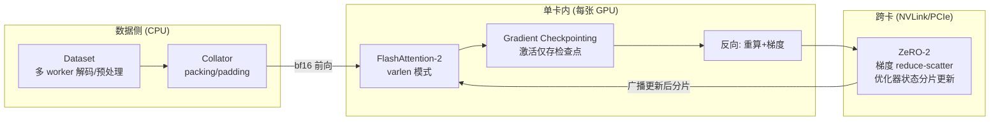

# 第 4 周教程：大规模训练工程实践与显存调优

> **本周要回答的三个问题**
> 1. DDP 与 DeepSpeed ZeRO-1/2/3 到底在切分什么？为什么 ZeRO-3 能省显存却可能更慢？
> 2. BF16 与 FP16 的位分配差异，为什么决定了大模型训练的生死？
> 3. FlashAttention-2 为什么快且省显存？Sample Packing 的算力账怎么算？

对应学习计划：第 4 周。交付物：DeepSpeed ZeRO-2/3 + FlashAttention-2 + Gradient Checkpointing，跑通一次 10k 级数据的 VLM SFT，记录显存、TFLOPS、总耗时。

本篇主题属于**系统与基础设施**类型，分析重点是显存、通信与算力的三角约束。

---

## 1. 第一性原理：训练显存与通信的账本

### 1.1 根本矛盾

训练一步 = 前向 + 反向 + 优化器更新。多卡并行的核心矛盾是：**模型状态（权重/梯度/优化器）希望每卡都有完整副本（通信少），但显存只放得下一份的若干分之一（必须切分）**。切得越碎，跨卡通信越多。分布式训练策略的本质，就是在"显存下限"与"通信开销"之间选一个工作点。

### 1.2 显存账本：训练一步到底要多少

设参数量 $P$、精度字节数 $b$（fp16/bf16 为 2）。延续第 2 周的账本，这里给出通用公式：

$$
M_{\text{states}} = \underbrace{P \cdot b}_{\text{权重}} + \underbrace{P \cdot b}_{\text{梯度}} + \underbrace{P \cdot 12}_{\text{Adam: } m,v \text{ fp32} + \text{fp32 主权重}}
$$

混合精度 + AdamW 的标准实现（如 PyTorch AMP + Apex/DeepSpeed）中，优化器为每个参数维护 fp32 主权重（master weights）+ fp32 一阶矩 $m$ + fp32 二阶矩 $v$，共 12 字节/参数。7B 模型：

$$
M_{\text{states}} = 7 \times 10^9 \times (2 + 2 + 12) = 112 \text{ GB}
$$

（注意：若用纯 fp16 优化器状态实现——某些框架可配——则减半；DeepSpeed 默认 12 字节口径，HF Trainer bf16 + AdamW 实测常落在 96~112GB 区间。**给数字时必须说明口径**。）

激活显存（无 checkpointing 时）：

$$
M_{\text{act}} \approx L_{\text{layers}} \times B \times S \times d \times c
$$

其中 $c$ 是每层每 Token 的激活字节数（与实现相关，数量级 10~34，取决于是否缓存 attention 权重、MLP 中间维等）。以 7B、$L=32$、$B=1$、$S=4096$、$d=4096$ 估算，激活可达 15~40GB——**与模型状态同量级**，这正是 gradient checkpointing 与 FlashAttention 存在的理由。

ZeRO 的三档切分（设卡数为 $N_d$）：

| 级别 | 切分对象 | 每卡模型状态 | 通信量（相对 DDP） | 瓶颈场景 |
| --- | --- | --- | --- | --- |
| DDP / ZeRO-0 | 无 | 全量副本 $112/N_1$ GB | 基准（仅梯度 all-reduce） | 显存足够、追求简单 |
| **ZeRO-1** | 优化器状态 | $112/4 \cdot \frac{1}{N_d} + \text{fp16 副本}$ | ≈ 基准 | 显存略紧的默认起点 |
| **ZeRO-2** | 优化器 + 梯度 | 权重 14GB + 状态分片 | ≈ 基准 | **VLM SFT 常用甜点** |
| ZeRO-3 | 优化器 + 梯度 + 权重 | 全部按 $N_d$ 分片 | 前向/反向各多一次 all-gather（权重参数收集） | 7B+ 单卡装不下权重时 |

ZeRO-2 与 ZeRO-3 的本质区别：ZeRO-2 每卡仍有完整权重副本（前向无通信），只把"可再生的"梯度与优化器状态分片；ZeRO-3 连权重都切，前向每层都要临时 all-gather 权重、用完即弃——**用通信换显存**。经验规则：8 卡内、7B 级、SFT 场景，ZeRO-2 + gradient checkpointing 通常够用且更快；ZeRO-3 留给"权重都装不下"的场景（如 72B 或超长序列）。

### 1.3 通信量与带宽的现实约束

DDP 一步的通信：梯度 all-reduce ≈ $2P \cdot b$ 字节（ring all-reduce 的系数近似 2）。7B fp16 单步 ≈ 28GB 跨卡流量。在 NVLink（~400GB/s 卡间）上约 70ms，在 PCIe/以太网（10~25GB/s）上可达数秒——**同样的 ZeRO-2，在两种互联上表现天差地别**。选型前先回答：你的集群卡间互联是什么？这是比"用不用 ZeRO-3"更先决的问题。

### 1.4 BF16 vs FP16：8 位指数位的意义

两种 16 位浮点的位分配：

| 格式 | 符号 | 指数 | 尾数 | 动态范围 | 精度 |
| --- | --- | --- | --- | --- | --- |
| FP16 | 1 | 5 | 10 | 最大 ~65504，最小正规数 ~$6\times10^{-5}$ | 较高 |
| **BF16** | 1 | **8** | 7 | **≈ FP32 的范围（~$10^{38}$）** | 较低 |

大模型训练的杀手不是精度不够，而是**范围溢出**：

- **FP16 的 overflow/underflow**：梯度标量（loss scaling 就是为它而生）与中间激活容易超出 $[-65504, 65504]$ 或下溢到 0。动态 loss scaling 是一层补丁：放大 loss 使小梯度可表示，反传后再缩回——补丁本身带来 scale 搜索的额外复杂度与偶发 `inf` 检测重试。
- **BF16 的设计哲学**：拿走 3 位尾数（精度降为 $2^{-7}$ 相对误差），换回与 FP32 相同的指数范围。深度学习的梯度本身只要求 2~3 位十进制有效数字的精度，但对范围极其敏感。**BF16 下不再需要 loss scaling**，NaN 风险大幅下降。

结论（业界共识）：Ampere 及之后架构（A100/H100/4090 等）训练一律首选 BF16；FP16 + 动态 loss scaling 是 V100 时代及少数不兼容场景的遗产方案。BF16 的代价（尾数少 3 位）对 SFT 的最终质量无可测影响——这与"训练动力学噪声"相比可以忽略。

---

## 2. 系统机制：FlashAttention-2 与 Sample Packing

### 2.1 FlashAttention 的两笔账

标准注意力把 $S \times S$ 的注意力矩阵完整物化到 HBM（高带宽显存）：

$$
\text{内存: } O(S^2), \quad \text{IO: 读写 } O(S^2 \cdot d) \text{ 次HBM}
$$

VLM 序列（视觉 Token 占大头）动辄 4k~16k，$S^2$ 项让注意力矩阵本身比模型权重还大，且大部分时间耗在 HBM 读写而非计算上——**注意力是访存受限（memory-bound）算子**。

FlashAttention 的解法是 **tiling + online softmax**：

1. 把 Q/K/V 切成小块（tile）载入 GPU 的 SRAM（片上高速缓存，比 HBM 快一个量级）；
2. 每块内算局部 softmax，用递推式修正全局分母（online softmax），**注意力矩阵从未完整物化**；
3. 反向时用重算（recompute）代替存储中间矩阵。

收益两笔：显存 $O(S^2) \to O(S)$；计算强度提升（HBM 读写量降一个量级），长序列下实测吞吐常见 2~4 倍提升（**数字依赖序列长度与硬件：越长收益越大；S=512 的短文本场景收益有限**——不要泛化成"永远快 4 倍"）。

**FlashAttention-2 相对 v1** 的改进：调整并行度到序列维度、减少非矩阵乘计算占比、更好地利用张量核，前向吞吐再提约 2 倍（官方口径，A100 实测）。对 VLM 的特殊意义：视觉 Token 让序列变长，正是 FA2 优势区间；且 FA2 的 varlen 模式是第 1 周 Sample Packing 的正确性基础。

工程用法：HuggingFace 模型加载时传 `attn_implementation="flash_attention_2"`（需安装 `flash-attn` 包且 GPU 架构支持）；退而求其次是 PyTorch 2.0+ 内置的 SDPA（`attn_implementation="sdpa"`，无需额外安装，性能略低于 FA2 但兼容性好）。

### 2.2 Gradient Checkpointing：用重算换显存的定量账

反向传播需要每层的激活来算梯度。Checkpointing 只保存少数"检查点层"的激活，其余层在反向时**重新前向计算**：

- 显存：激活从 $O(L)$ 层全存降到 $O(\sqrt{L})$ 量级（每 $\sqrt{L}$ 层存一个检查点）；
- 计算：额外一次前向，训练时间 +30~40%（经验范围）。

**何时必开**：VLM SFT 几乎总是开——视觉 Token 把序列拉长后激活膨胀，24GB 单卡不开基本跑不动 7B。何时慎开：梯度 checkpointing 与"冻结 Vision Tower"组合时注意，若视觉塔不需要梯度，其激活本可释放，误开视觉塔的 checkpointing 反而白白多算（一些框架会自动跳过无梯度模块，但要确认）。

### 2.3 Sample Packing 的算力账

设 batch 内样本长度为 $\{s_1, \dots, s_B\}$，预算长度 $S_{\text{budget}} = 4096$：

- **Padding 方式**：每样本占一格，实际计算 $B \times S_{\text{max}}$，利用率 $\bar{s} / S_{\text{max}}$。多模态样本长短差异大（有的 800 有的 3800），利用率常仅 40~60%；
- **Packing 方式**：把样本贪心装入 $\lceil \sum s_i / S_{\text{budget}} \rceil$ 条序列，利用率 >95%。

10k 样本、平均长度 1200 Token 的例子：padding 式实际处理约 $10^4 \times 4096 = 4.1 \times 10^7$ Token 格（按最长 4096 算），packing 式约 $1.2 \times 10^7$——**3.4 倍的算力差**，直接决定训练是 1 天还是 3 天。代价是第 1 周 2.4 节列出的三大工程细节（varlen 隔离、位置重置、边界完整），任一遗漏都会引入正确性问题。建议：数据量 <2k 或样本长度接近满预算时不折腾；10k 级且长短差异大时必开。

### 2.4 端到端训练系统视图



读图要点：CPU 数据管线与 GPU 计算是流水线关系，**任何一侧成为瓶颈都会让另一侧空转**（GPU 利用率长期 <50% → 查数据侧；数据 worker 全部 100% 而 GPU 空闲 → 增大 `dataloader_num_workers` 或预缓存视觉特征）。

---

## 3. 实现与验证

### 3.1 LLaMA-Factory + DeepSpeed 完整配置

`stage2_week4_zero2.yaml`（10k 数据 SFT，双卡 A100 40G 参考，可按比例缩放）：

```yaml
### 模型 (以 Qwen2-VL-7B 为例, 2B 可下调 batch 显存预期)
model_name_or_path: Qwen/Qwen2-VL-7B-Instruct
trust_remote_code: true

### 方法
stage: sft
do_train: true
finetuning_type: lora
lora_target: all
lora_rank: 16
lora_alpha: 32

### 数据
dataset: my_vqa_10k            # 10k 级混合数据 (第 3 周配方产出)
template: qwen2_vl
cutoff_len: 4096
preprocessing_num_workers: 16
dataloader_num_workers: 4
enable_package: true           # sample packing (若版本支持; 旧版用 neftune 等开关查文档)

### 训练超参
per_device_train_batch_size: 1
gradient_accumulation_steps: 4
learning_rate: 1.0e-4
num_train_epochs: 2.0
lr_scheduler_type: cosine
warmup_ratio: 0.03
bf16: true                     # 不是 fp16!
gradient_checkpointing: true

### 加速
flash_attn: fa2                # FlashAttention-2
deepspeed: examples/deepspeed/ds_z2_config.json   # ZeRO-2

### 输出与监控
output_dir: saves/qwen2vl-7b-zero2
logging_steps: 10
save_steps: 500
plot_loss: true
report_to: wandb
```

ZeRO-2 的 `ds_z2_config.json` 关键字段（DeepSpeed 官方示例裁剪）：

```json
{
  "train_batch_size": "auto",
  "bf16": { "enabled": "auto" },
  "zero_optimization": {
    "stage": 2,
    "allgather_partitions": true,
    "allgather_bucket_size": 500000000,
    "reduce_scatter": true,
    "contiguous_gradients": true
  },
  "gradient_accumulation_steps": "auto",
  "train_micro_batch_size_per_gpu": "auto"
}
```

ZeRO-3 只需改 `"stage": 3`，并追加：

```json
"zero_optimization": {
  "stage": 3,
  "offload_optimizer": { "device": "none" },
  "offload_param": { "device": "none" }
}
```

（`offload` 指把分片状态/参数挪到 CPU 内存——显存极限时的最后手段，通信量剧增、速度可慢 2~10 倍，仅在"跑起来"优先于"跑得快"时使用。）

启动与监控：

```bash
# 双卡启动
FORCE_TORCHRUN=1 llamafactory-cli train stage2_week4_zero2.yaml

# 监控三件事 (另开终端):
nvidia-smi --query-gpu=memory.used,utilization.gpu --format=csv -l 5   # 显存与算力利用率
```

### 3.2 训练效率报表：本次交付的度量方法

**MVP 要求记录的三个指标，采集方法：**

| 指标 | 采集方法 | 健康范围（A100 40G，7B LoRA 参考） |
| --- | --- | --- |
| 显存峰值 | `nvidia-smi` 训练稳定段读数，或 `torch.cuda.max_memory_allocated()` | 25~35GB（ZeRO-2, bf16, checkpointing 开） |
| 吞吐 TFLOPS | 估算：每步处理 Token 数 × 每 Token FLOPs ÷ 步时；或直接看 `deepspeed` 日志/speed 指标 | LoRA 场景 60~140 TFLOPS/卡（MFU 6~14%）；全量微调 MFU 常见 30~50% |
| 总耗时 | WandB 运行时长 | 10k 样本 × 2 epoch、4096 序列、双卡 LoRA：约 2~5 小时（量级参考） |

每 Token 训练 FLOPs 的标准估算（前向 2 倍 + 反向 4 倍 ≈ 6 倍参数量次乘加）：

$$
\text{FLOPs}_{\text{step}} \approx 6 \times P_{\text{active}} \times \text{Tokens}_{\text{step}}
$$

注意用**有效 Token 数**（packing 后的真实 Token，剔除 padding）：LoRA 下 $P_{\text{active}}$ 严格说只有参与计算的底座前向 $P$（LoRA 本身参数可忽略），按 7B 算即可。若算出的 TFLOPS 显著低于健康范围，按 3.3 的瓶颈排查表走。

### 3.3 瓶颈定位：一张 GPU 利用率读数就能走完的决策树

```text
GPU util 长期 < 50%?
├─ 是 → 算力供给不足或数据饥饿
│   ├─ 数据侧: dataloader worker 占用高? → 加 worker / 预缓存视觉特征 / packing 减少 CPU 拼装
│   └─ 通信侧: nvidia-smi 中卡间流量大且 GPU 交替忙闲? → 检查互联(NVLink?)、减小梯度累积、
│            ZeRO-2+小 batch 时适当加大 micro batch
└─ 否 (util 高但 TFLOPS 低) → 计算效率问题
    ├─ 确认 bf16 (fp16 会走不同 kernel 路径且可能降频重试)
    ├─ 确认 FlashAttention 生效 (日志或用 torch 统计 attention kernel 名)
    ├─ 序列太短? cutoff 1024 以下 tensor core 喂不饱
    └─ 小 batch + 长梯度累积? 增大 micro batch 提高单 kernel 并行度
```

### 3.4 NaN 与 OOM 的系统化排查

**NaN 排查流程**（按命中率排序）：

1. **精度配置**：日志确认 `bf16: true` 真的生效（HF Trainer 日志会打印）；用 fp16 时看 loss scaler 状态是否反复回退；
2. **学习率**：首步 lr 就过大（warmup 没生效）会让第一版更新即爆——打印前 10 步的 lr 与 grad_norm；
3. **梯度范数突变点**：WandB 上找 `grad_norm` 尖峰对应的 step，回查该 batch 数据（往往是一张异常图/超长样本）；
4. **二分定位**：`torch.autograd.set_detect_anomaly(True)`（速度慢 2~5 倍，只用于定位）直接给出溢出算子的栈；
5. **数据防御**：视觉 Token 区域 mask 漏配（第 1 周失效 2）会让 loss 在异常位置爆炸，回归掩码断言。

**Vision Tower 显存突刺 OOM**（学习计划点名的坑，自测清单考点）：

- **症状**：训练稳定数小时，突然某步 OOM 在 `visual_blocks` 相关栈里。
- **根因**：动态分辨率下，某张高分辨率图的视觉 Token 数是平均值的 5~10 倍（第 1 周 Token 公式：$\frac{H}{28}\times\frac{W}{28}$，一张 2016×1512 的截图 = 72×54×4 ≈ 3888 Token，而平均值可能只有 500）；其激活是平均样本的近 8 倍。
- **定位**：记录 OOM step 对应的样本，检查其 `image_grid_thw`；统计训练集视觉 Token 数分布的 P99。
- **修复**（按代价从低到高）：
  1. 数据管线限制图片最大面积/边长，超限降采样（治本，损失极小）；
  2. 按视觉 Token 数分桶组 batch（大图与小图不混批）；
  3. `PYTORCH_CUDA_ALLOC_CONF=expandable_segments:True` 缓解碎片（PyTorch 2.1+）；
  4. 最后手段：降低 micro batch 至 1 + 更深梯度累积。

---

## 4. 工程权衡速查表

| 需求 | 推荐组合 | 不推荐 |
| --- | --- | --- |
| 4×24G 卡跑 7B LoRA SFT | ZeRO-2 + bf16 + FA2 + checkpointing + packing | ZeRO-3（通信换来的显存省在 LoRA 场景浪费） |
| 单卡 80G 跑 7B 全量 SFT | ZeRO-1/2 + bf16 + FA2 | DDP（优化器状态副本塞不下） |
| 8×A100 跑 7B 全量 | ZeRO-1（梯度+优化器分片已够） | ZeRO-3（权重前向 all-gather 拖慢，显存却富余） |
| 72B 级全量 | ZeRO-3 + offload 或专用框架（Megatron/3D 并行） | 普通用户不建议自搭 |
| PCIe 互联的多卡 | 单卡能跑就单卡（DDP 通信会吃掉收益） | 大梯度累积 + 多卡假并行 |

## 5. 延伸思考题

1. **ZeRO 通信量推导**：证明 ZeRO-2 相对 DDP 的通信量几乎不变（梯度从 all-reduce 变为 reduce-scatter + 分片 all-gather，总量同级），而 ZeRO-3 前向反向各多出 $P \cdot b$ 量级的 all-gather；据此解释为什么"ZeRO-3 在快互联上惩罚小、慢互联上惩罚大"。
2. **MFU 计算实战**：用 3.2 的公式，代入你实际跑的一次训练（卡型、步时、Token 数、参数量）算 MFU，与 A100 bf16 峰值 312 TFLOPS 对比；若低于 10%，用 3.3 决策树定位主因并记录改进前后对比。
3. **Packing 的正确性检验**：构造"两条已知 loss 的样本"，分别单独前向与 packing 前向（varlen 隔离），断言逐 Token logit 一致（容差 1e-3）；再故意去掉 varlen 参数（退化为朴素拼接），观察哪些 Token 的 logit 发生漂移——这个实验是检验你真懂 packing 还是只会开开关的试金石。

---

*下一篇：[阶段二自测验收与复盘](阶段二自测验收与复盘.md)*
