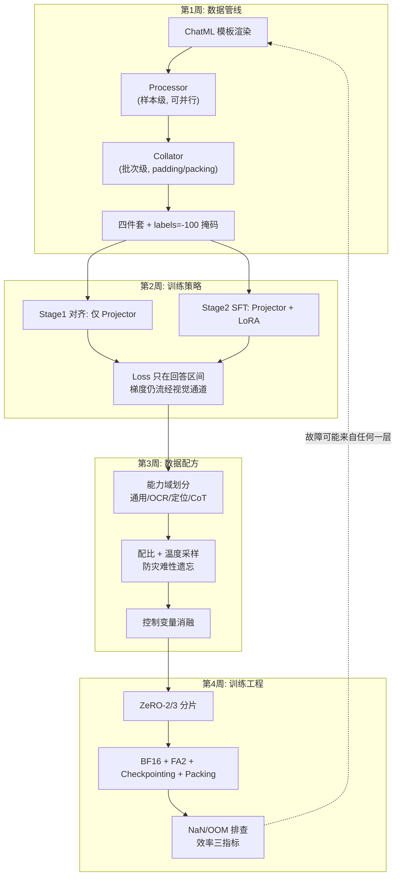

# 阶段二自测验收与复盘

> **使用方法**：先遮住下文的参考答案，自答学习计划的四项终极自测；再对照打分。达成标准不只是"知道答案"，而是能像下文那样**展开机制、给出定位动作**。

对应学习计划：阶段二终极自测清单。通过即可进入 Stage 3（评测体系与幻觉分析）。

---

## 1. 自测一：为什么 Vision Token 的 label 是 -100

**题目**：在 VLM 的 SFT 阶段，为什么图片的 Vision Token 不需要设置对应的 target label（即 label 为 -100）？

### 参考答案（三层，能答出前两层即达标）

1. **预训练与 SFT 的目标差异**（学习计划给出的达成标准）：纯文本 LLM 预训练对序列中**所有** Token 计算 next-token loss，因为整条序列都是"语言"，每个位置既是输入又是学习目标。VLM 的 SFT 中，视觉 Token 是**条件信号**：它经由视觉塔与 Projector 注入，不来自词表，也不在模型的自回归解码空间里——模型输出分布永远只采样文本 Token，为不可能被生成的 Token 计算 loss 是无意义的监督。
2. **任务定义**：SFT 优化的是 $P(\text{回答} \mid \text{问题}, \text{图片})$，loss 只在回答区间求和（第 1 周的掩码机制、第 2 周的公式 $\sum_{i \in A}$）。Prompt、格式头、视觉占位区全部掩码，同一逻辑。
3. **信号稀释**（工程加固论点）：一张图的视觉 Token 数（数百）远超回答长度（数十）。若参与 loss，交叉熵被"预测视觉 Token"这个任务外目标淹没，文本能力反而受损。
4. **重要澄清**（区分度高者加分）：**不算 loss ≠ 不传梯度**。回答位置的 loss 沿注意力路径回传到视觉 Token 的 embedding，进而更新 Projector。视觉 Token 不设 label 不影响 Projector 训练。

**何时例外**：视觉生成型统一模型（输出含图像 Token）或带视觉辅助预测任务的预训练中，视觉 Token 会参与 loss——那是另一个任务范式，SFT 阶段几乎从不开启。

---

## 2. 自测二：QLoRA 为什么在视觉部分先遇 OOM

**题目**：QLoRA 微调 VLM 时，为什么比纯文本 LLM 更容易在 Vision 部分遇到显存瓶颈（OOM）？

### 参考答案（机制 + 数字）

**核心论点：QLoRA 压缩的是"模型状态"，压不了"激活"；而 Vision Tower 恰恰是激活的大户。**

1. **账本结构**：QLoRA 把权重压到 4-bit（7B ≈ 3.5GB）、优化器状态只剩适配器，模型状态总共约 4GB。但**激活显存**由 batch × 序列长 × 隐藏维 × 层数决定，与权重精度无关——账本的大头从"模型状态"换成了"激活"，瓶颈自然转移到激活侧。
2. **Vision Tower 的激活放大器效应**：动态分辨率下视觉 Token 数随图片面积线性增长（$\frac{H}{28} \times \frac{W}{28}$），一张 2016×1512 的文档图产生近 3900 个视觉 Token，是典型文本样本（数百 Token）的近 10 倍。ViT 内部的注意力与 MLP 激活随 Token 数平方级（注意力矩阵）与线性项叠加膨胀，**单张高分辨率大图的激活即可吃掉数 GB 到数十 GB**（依赖分辨率与精度）。
3. **反向传播放大**：训练时反传需要保留/重算视觉塔的中间激活；即使 Vision Tower 冻结（QLoRA 场景常冻结），其前向激活在反向需要回传到 Projector 的路径上仍要物化，gradient checkpointing 配置若未覆盖视觉塔，突刺更明显。
4. **对照纯文本 LLM**：文本序列长度受 cutoff_len 硬约束、分布集中，激活显存可预测；视觉 Token 分布长尾（P99 可能是均值的 5~10 倍），**显存峰值由最极端样本决定**，因此"训练几小时后突然 OOM 在 visual blocks"是 VLM 特有故障（第 4 周 3.4 节的完整排查与修复链）。

**达标表述模板**："QLoRA 只压模型状态不压激活；视觉 Token 数随分辨率动态膨胀且长尾分布，Vision Tower 的中间激活成为显存峰值的主导项，且峰值由最大样本而非平均样本决定。"

---

## 3. 自测三：灾难性遗忘的数据配方调整

**题目**：微调后的 VLM 只会做 OCR、失去常规对话能力，如何调整 SFT 数据配方？

### 参考答案（分诊 + 三类手段）

**先分诊**：确认是"配方失衡导致的遗忘"还是"通用数据质量太差"。诊断探针：拿 50 条未训练的通用图文问句测试，若回答风格完全 OCR 化（见图就吐字符），基本是配比问题；若回答混乱或复读，先查训练超参与数据质量。

**三类调整手段**（学习计划达成标准要求的方案）：

1. **重采样（Resampling）**：降低 OCR 占比、提升通用占比（如从 2:8 调回 5:3:2），或用温度采样 $\alpha < 1$ 自动平衡（第 3 周教程 1.3 节）；为任何单一任务设采样上限（如 ≤40%）。
2. **通用回放数据（Replay）**：混入 10~30% 与当前专精任务无关的高质量通用指令数据（可以是底座模型发布过的开源 SFT 集），让语言能力的梯度方向在训练全程不被淹没——这是防遗忘最直接的手段，等价于持续学习文献中的 experience replay。
3. **损失权重/训练策略层面**：
   - 按任务设置 loss 权重（数据少但重要的任务加权，而非单纯堆数据）；
   - 缩短专精任务的训练时长（eval loss 拐点即停，过训是遗忘放大器）；
   - 降低 LoRA 秩 / 缩小可训练参数集合，限制权重被专精任务改写的范围（第 2 周的容量挤占机制）；
   - 两段式课程：先通用主导、后期专精提权但**始终保留通用回放**。

**根治视角**（加分）：若 OCR 是核心需求，正确的路径常是"扩大 OCR 数据绝对量 + 保持通用回放"，而不是无限压榨配比——配比只能在固定总量下再分配，OCR 能力的天花板由数据绝对量决定。

---

## 4. 自测四：ZeRO + BF16 工程闭环

**题目**：能否独立配置 DeepSpeed ZeRO-2/3 + BF16 跑通一次完整 SFT，并画出完整的 Loss 曲线？

### 验收物证清单

- [ ] **Checkpoint 可推理**：导出的 adapter 或合并权重能加载并输出正常文本；
- [ ] **WandB Loss 曲线平滑下降**：初始 loss（7B 底座常见 1.5~3）快速下降后趋平，无发散、无长期平台、无 NaN 尖峰；`grad_norm` 无持续爆表；
- [ ] **能复述三个配置决策的理由**：为什么 BF16 而非 FP16（指数位与动态范围，第 4 周 1.4 节）；为什么 ZeRO-2 而非 3（权重副本 vs 通信的取舍，1.2 节）；为什么开 gradient checkpointing（激活账本，2.2 节）；
- [ ] **记录过效率三指标**：显存峰值、TFLOPS/MFU、总耗时（第 4 周 3.2 节的采集方法）；
- [ ] **至少排除过一次故障**（NaN 或 OOM），有症状→定位→修复的记录。

---

## 5. 阶段知识图谱复盘

**五个必须能脱口而出的数字及其来历**：

1. **12 字节/参数** = Adam 优化器的 fp32 主权重 + $m$ + $v$——决定 ZeRO 切分什么；
2. **8 vs 5 位指数** = BF16 vs FP16——决定动态范围与 loss scaling 的存废；
3. **$O(S^2) \to O(S)$** = FlashAttention 的显存变化——决定长序列可行性与 packing 的实现基础；
4. **>95% vs 40~60%** = Packing vs Padding 的序列利用率——决定训练是 1 天还是 3 天；
5. **5~10 倍** = 极端样本视觉 Token 数对均值的倍数——决定 Vision Tower 显存突刺的形态。

---

## 6. 综合思考题（进入 Stage 3 前的终极检验）

1. **全链路故障归因**：一个同事报障："QLoRA 微调 Qwen2-VL 后，模型对文档图的回答完全是乱码。"给出你的排查顺序与每步的判据。（提示：沿本周知识图谱从数据侧到工程侧逐层走——先确认推理时 processor/template 与训练一致（第 1 周失效 4 的近亲）；再查训练中视觉 Token 是否被掩码/是否混入坐标格式冲突样本（第 3 周）；再查 QLoRA 的 NF4 量化配置与 gradient checkpointing 兼容性；最后用底座模型直接推理排除底座本身问题。）
2. **配方设计**：任务="把一个已对齐的通用 VLM 改造成'中文试卷 OCR + 公式定位'专用模型"，给出完整方案：数据配比、防遗忘手段、LoRA 挂载位置、训练精度与分布式配置，并说明每个选择的机制依据。（检查点：是否综合运用了第 1~4 周的所有决策框架，且每个选择能说出"为什么"而非"大家都这么配"。）
3. **效率优化的边际分析**：你的训练 MFU 只有 8%，依次尝试了 packing（+60% 吞吐）、FA2（+15%）、加大 micro batch（+10%）后仍有富余显存。下一个最该动的旋钮是什么？什么情况下"继续压榨 MFU"是不值得的？（提示：当 GPU 时间不再是墙钟时间的主导项（数据/IO/评测占大头），或训练只需跑一次而调优本身耗时超过节省量时，边际收益为负——工程优化要为交付服务，不为数字服务。）

---

## 7. 进入 Stage 3 的衔接预告

Stage 3（VLM 评测体系与幻觉分析）将正面处理本阶段埋下的伏笔：

- 本阶段发现的语言先验捷径（第 2 周失效 1：模型不看图也能答题）→ Stage 3 的幻觉度量与 Vision-Centric 评测设计；
- 本阶段的 held-out 评估集实践（第 3 周）→ Stage 3 的系统化 benchmark 体系（MMMU、MMBench、HallusionBench 等）与数据泄漏问题；
- 本阶段的配比消融方法论 → Stage 3 中"训练干预 vs 评测验证"的闭环。

带着第 6 节三道题的答案进入 Stage 3——你会发现自己已经在用评测的视角做训练了。

---

*返回：[教程索引](README.md) ｜ 上一篇：[第 4 周：大规模训练工程与显存调优](第4周-大规模训练工程与显存调优.md)*
