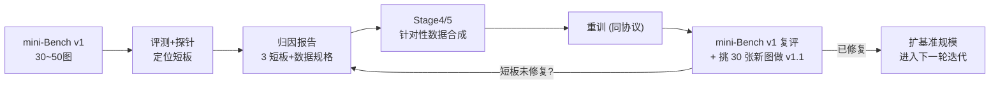

# 第 4 周教程：自建 Benchmark 与错误根源诊断

> **本周要回答的三个问题**
> 1. 为自己的场景（具身桌面/无人机/医疗）构建评测集，有哪些不可妥协的工程规范？
> 2. 拿到一份失败案例集，如何把错误归因到具体模块（视觉编码 / 投影 / LLM / 数据）？
> 3. "评测定位缺陷 → 补数据 → 重训 → 再评测"的反哺闭环怎么落地？

对应学习计划：第 4 周。交付物：30~50 张场景图的 mini-Benchmark（含 BBox/文本真值）+ 评估脚本 + 1 页纸 Failure Case 归因报告（总结 3 个最大短板）。

---

## 1. 第一性原理：为什么必须自建基准

### 1.1 根本矛盾：通用基准的分布 vs 你的场景分布

公开基准的价值在于**跨模型可比**，代价是分布折中：图片来自 COCO/VQAv2 时代的自然照片，问题模式是大众化的。而真实场景——机器人俯视的桌面、无人机视角的地面、内窥镜图像——与这个分布的差异是系统性的：

1. **视角差异**：具身相机的俯视/第一人称视角在公开基准中稀少，视觉塔的空间先验直接失效（Stage 1 的视觉塔在第三人称照片上预训练）；
2. **任务粒度差异**：桌面操作需要"杯子把手朝向"级别的细粒度属性，通用 VQA 只考"有个杯子"级别的存在性；
3. **代价结构差异**：公开基准错一题扣一分；你的场景里，漏检一个障碍物和把杯子认成碗，代价完全不同且不可交换。

通用分数因此只能回答"这个底子行不行"（刷选底座），不能回答"在我的场景里能不能用"（部署决策）。**自建基准的本质是把你真实任务的输入分布、任务粒度、代价结构三者固化成可复现的度量**——它是场景与模型之间的合同。

### 1.2 mini-Benchmark 的设计规范

30~50 张图的规模下，设计的严谨性比数量重要。五条不可妥协的规范：

1. **训练/评测隔离**：评测图绝不能出现在任何训练数据里（同源视频抽帧的相邻帧也算泄漏！相邻帧内容几乎相同，模型背下来等于作弊）。物理隔离方案：按"场景/视频 ID"切分，而非按帧。
2. **能力维度打标**：每条样本标注它考什么（存在性/计数/属性/空间关系/定位/OCR），诊断时按维度聚合才能定位短板——这直接决定第 3 节归因分析的分辨率。
3. **真值可复核**：BBox 与属性标注必须双人（或人+强模型）交叉复核。自己的标注错误会让"模型失败"变成"真值失败"，归因全盘皆错。自检手段：让人工标注者自己过一遍自己的基准，人类准确率低于 95% 的维度要重标。
4. **难度分层**：同一维度内按难度分档（如定位任务按目标尺寸分小/中/大三档）。只看总分无法发现"大目标满分、小目标全灭"这种指向分辨率瓶颈的模式。
5. **协议固化**：prompt 模板、答案提取规则、指标定义写成脚本随基准一起版本化——基准是代码不是表格（第 1 周的提取器直接复用）。

### 1.3 失败归因的因果链模型

评测告诉你**模型错了**，归因要回答**错在哪一环**。VLM 的推理链路可以分解为四个可独立的环节：

```text
图片 ──> ① 视觉编码(看没看清) ──> ② 投影对齐(翻译对没有)
       ──> ③ LLM 推理(用了没有/推理对没有) ──> ④ 输出格式(写对没有)
```

每个环节都有**专属的探针实验**（probe）——归因工程的核心思想是：**不做整体黑盒猜测，而是构造"只让一个环节可错"的受控输入，把错误定位到环节**：

| 环节 | 探针实验 | 判据 |
| --- | --- | --- |
| ① 视觉编码 | **No-image baseline**（纯黑图/噪声图）：第 3 周的方法 | 有图 vs 无图差异小 → 视觉没起作用 |
| ① 视觉编码 | **分辨率梯度**：同一图按 336/448/672/896 输入 | 分数随分辨率单调上升且大图显著更好 → 原分辨率下"看不清"是主因 |
| ① 视觉编码 | **裁剪放大**：把失败案例的目标区域裁出来放大再问 | 裁剪后答对 → 原图小目标被 Patch 网格淹没（Stage 1 的 14px 物理极限） |
| ② 投影对齐 | **特征直读**：视觉塔输出不经 LLM，直接用轻量头探测目标属性（如线性探针判颜色） | 视觉特征里信息存在但 VLM 答错 → 投影/LLM 侧丢失 |
| ③ LLM 推理 | **Text-only oracle**：把真值用文字喂给 LLM（"图中有红色杯子和蓝色碗，哪个在左？"） | 文本条件下的推理也错 → LLM 侧问题（与视觉无关） |
| ③ LLM 推理 | **Prompt 简化/CoT 开关**：换最简问法、强制先描述再回答 | 简化后答对 → 问题理解或长 prompt 干扰 |
| ④ 输出格式 | **提取失败率统计**（第 1 周必报指标） | "错误"里若提取失败占比高 → 是解析问题不是模型问题 |

归因报告的结论必须是这种形态："50 个定位失败案例中，34 个在裁剪放大后可答对（①分辨率瓶颈），9 个 Text-only oracle 也错（③推理），5 个真值有争议，2 个提取失败"——每个数字都指向一个可执行的修复动作。

---

## 2. 实现与验证

### 2.1 mini-Benchmark 的数据格式与评估脚本

```jsonl
// bench.jsonl 每行一条: 图像 + 分维度的问题 + 真值
{"id": "desk_001", "image": "images/desk_001.jpg", "dim": "grounding",
 "question": "框出图中的马克杯。", "gt_bbox": [213, 340, 412, 560], "difficulty": "small"}
{"id": "desk_002", "image": "images/desk_002.jpg", "dim": "attribute",
 "question": "红色积木在蓝色积木的左边还是右边？", "gt_text": "左边", "difficulty": "medium"}
{"id": "desk_003", "image": "images/desk_003.jpg", "dim": "counting",
 "question": "桌上有几支笔？", "gt_text": "3", "difficulty": "hard"}
```

评估脚本（复用 Stage 3 前两周的提取器与 IoU）：

```python
"""
mini-Benchmark 评估: 分维度/分难度聚合, 支持 No-image 与裁剪放大两种探针模式。
运行方式: python stage3_week4_mini_bench.py --bench bench.jsonl --pred preds.jsonl \
            [--probe none|noimage|crop]
依赖: 标准库 + PIL (探针模式)
"""
import argparse
import json
import random
import re
from collections import defaultdict


def iou(a, b) -> float:
    x1, y1 = max(a[0], b[0]), max(a[1], b[1])
    x2, y2 = min(a[2], b[2]), min(a[3], b[3])
    inter = max(0, x2 - x1) * max(0, y2 - y1)
    ua = (a[2]-a[0])*(a[3]-a[1]) + (b[2]-b[0])*(b[3]-b[1]) - inter
    return inter / (ua + 1e-6)


def parse_answer(item: dict, raw: str):
    """按维度复用第1周提取器逻辑 (此处精简内联)"""
    if item["dim"] == "grounding":
        m = re.findall(r"[\[（(]\s*(\d+)\s*[,，]\s*(\d+)\s*[,，]\s*(\d+)\s*[,，]\s*(\d+)\s*[\]）)]", raw)
        return [list(map(float, m[-1]))] if m else None
    norm = raw.strip().lower()
    m = re.search(r"(左边|右侧|右边|左侧|left|right)", norm)
    if item["dim"] == "attribute":
        return {"左边": "left", "左侧": "left", "left": "left",
                "右边": "right", "右侧": "right", "right": "right"}.get(
                m.group(1) if m else "", norm[:20] or None)
    m = re.search(r"\d+", norm)
    return m.group(0) if m else None


def score(preds: dict, bench: list[dict]) -> dict:
    """返回 {dim: {overall, by_difficulty, fail_ids}}"""
    out = defaultdict(lambda: {"n": 0, "correct": 0,
                               "by_diff": defaultdict(lambda: [0, 0]),
                               "fail": []})
    for item in bench:
        raw = preds.get(item["id"], "")
        ans = parse_answer(item, raw)
        if item["dim"] == "grounding":
            ok = ans is not None and iou(ans, item["gt_bbox"]) >= 0.5
        else:
            gt = item["gt_text"].lower()
            ok = ans is not None and (ans == gt or
                 (item["dim"] == "attribute" and ans in gt) or
                 (item["dim"] == "counting" and ans == str(int(gt))))
        s = out[item["dim"]]
        s["n"] += 1
        s["correct"] += ok
        s["by_diff"][item["difficulty"]][1] += 1
        s["by_diff"][item["difficulty"]][0] += ok
        if not ok:
            s["fail"].append(item["id"])
    return {k: {"acc": round(v["correct"] / v["n"], 3),
                "by_difficulty": {d: f"{c}/{n}" for d, (c, n) in v["by_diff"].items()},
                "fail_ids": v["fail"]} for k, v in out.items()}


if __name__ == "__main__":
    ap = argparse.ArgumentParser()
    ap.add_argument("--bench", required=True)
    ap.add_argument("--pred", required=True)
    ap.add_argument("--probe", default="none", choices=["none", "noimage", "crop"])
    args = ap.parse_args()

    bench = [json.loads(l) for l in open(args.bench)]
    preds = {d["id"]: d["raw"] for d in map(json.loads, open(args.pred))}
    assert len(bench) >= 30, "mini 基准至少 30 条才有聚合意义"

    report = score(preds, bench)
    # ---- 断言: 每个维度的失败样本均可追溯 ----
    all_fail = {i for r in report.values() for i in r["fail_ids"]}
    all_ids = {b["id"] for b in bench}
    assert all_fail <= all_ids, "失败样本 ID 超出基准范围, 预测文件与基准错位"
    n_pred_missing = len(all_ids - set(preds))
    assert n_pred_missing == 0, f"{n_pred_missing} 条样本缺少预测, 评测不完整"

    for dim, r in report.items():
        print(f"[{dim:10s}] acc={r['acc']:.1%}  by_difficulty={r['by_difficulty']}")
    json.dump({d: {"acc": r["acc"], "fail_ids": r["fail_ids"]}
               for d, r in report.items()},
              open(f"mini_bench_report_{args.probe}.json", "w"), ensure_ascii=False)
    print(f"报告已写入 mini_bench_report_{args.probe}.json (探针模式: {args.probe})")
```

**预期输出形态**：

```text
[grounding ] acc=43.3%  by_difficulty={'small': '3/15', 'medium': '6/12', 'large': '11/13'}
[attribute ] acc=68.0%  by_difficulty={'medium': '14/20', 'hard': '3/5'}
[counting  ] acc=35.0%  by_difficulty={'medium': '5/10', 'hard': '2/10'}
报告已写入 mini_bench_report_none.json (探针模式: none)
```

注意 `grounding` 的分难度读数（示意）：small 3/15 vs large 11/13——**总分 43% 掩盖了"大目标基本会、小目标几乎全灭"的双峰分布**，这个模式直接指向分辨率瓶颈（1.3 节探针①的裁剪放大实验随之触发）。这就是"难度分层"规范存在的意义。

### 2.2 探针模式的实现要点

- **noimage**：推理前把 `pixel_values` 替换为 `torch.zeros_like`（或全 0.5 灰图），其余管线不动——对比两份报告的逐条差异；
- **crop**：对 grounding 失败样本，用 GT BBox 外扩 1.5 倍裁图放大到模型最优分辨率再问——"裁剪后能答对"即判定分辨率瓶颈；
- 两种探针各产出一份 `mini_bench_report_{probe}.json`，归因报告的数据全部来自三份报告的 diff。

---

## 3. Failure Case 归因报告（1 页纸模板）

```markdown
# Mini-Bench 失败归因报告 (v1)
日期 / 模型与 checkpoint hash / 基准版本 (bench.jsonl 的 git hash)

## 1. 总览
30 图 × 3 维度共 85 题。整体: grounding 43.3% / attribute 68.0% / counting 35.0%。
提取失败率 2.4% (2/85, 已剔除后统计)。

## 2. 探针结果
| 探针 | grounding | counting | 结论 |
|---|---|---|---|
| none | 43.3% | 35.0% | 基线 |
| noimage | 41.7% (Δ≈0) | 33.3% (Δ≈0) | ⚠️ 视觉通道对这两维度贡献微弱 |
| crop×1.5 | 71.7% (small: 10/15) | — | 分辨率是 grounding 的主要瓶颈 |

## 3. 三大短板 (按修复优先级)
1. **小目标定位失效 (视觉编码侧)**: small 档 3/15, 裁剪放大后 10/15。
   机制: 672px 输入下 30px 目标 < 1.5 patch, 特征被淹没。
   → 动作: [数据] 增加小目标标注样本 + 高分辨率微调; [架构] 评估动态分辨率。
2. **计数幻觉 (语言先验主导)**: hard 档 2/10; noimage 探针 Δ≈0 且 FP 复核发现
   "桌上有 3 支笔"错答为"2 支"时模型并未逐个数。
   → 动作: [数据] 合成 2~6 个物体、强干扰场景的计数对 (Stage 4); [训练] 加 CoT 数据。
3. **空间关系视角混乱**: attribute 中"左/右"错 6/25, 人工复核发现 3 题真值视角
   约定不明确 (真值问题, 已修标注)。
   → 动作: [基准] 固化视角约定进题面; [数据] 补带视角说明的空间关系对。

## 4. 下一步 (Stage 4 输入规格)
- 小目标定位样本 ≥500, 目标尺寸 <32px, 含负例 (图中无指定目标);
- 计数 CoT 数据 ≥300, 物体数 2~6, 同类干扰物 ≥2;
- 空间关系样本 ≥200, 题面强制"以相机视角"。
```

报告的三条纪律：**每个结论都有探针数字支撑；区分"模型问题"与"基准问题"（本例的第 3 条短板里就藏着一个真值 bug）；每个动作都可执行、可验收**。

---

## 4. 工程权衡与失效模式

### 4.1 反哺闭环的节奏



关键纪律：**基准本身也要版本化迭代**——修复短板后，原基准会"过拟合"（你按失败案例补的数据正是这些题的近邻），复评时必须加入 fresh 样本（v1.1），否则提升是幻觉。

### 4.2 三个代表性失效模式

**失效 1：用训练数据的近邻图做评测，提升是背题**
- **症状**：补数据重训后 mini-Bench 从 43% 涨到 80%，换新场景图立刻跌回 45%。
- **根因**：评测图与补的训练图来自同源视频/同批采集，模型记住了这些具体场景。
- **定位**：训练后直接问训练图，若接近满分而 fresh 图差很多即坐实。
- **修复**：按来源 ID 隔离（1.2 规范 1）；补数据阶段就把"held-out 来源"预留出来。

**失效 2：把基准 bug 归因为模型短板**
- **症状**：归因报告说"空间关系能力差"，修了两轮数据无改善。
- **根因**：真值视角约定不明（谁的左边？）、或 BBox 标注系统性偏移（用了不同的坐标原点），模型其实"答对了"。
- **定位**：归因报告里专设"真值争议"桶（本模板第 3 条短板的写法）；人工复核失败样本时先怀疑标注再怀疑模型。
- **修复**：基准发布前的人工基线测试（人类 <95% 的维度重标）；BBox 类真值用画框可视化肉眼过一遍。

**失效 3：探针结论过度泛化**
- **症状**：noimage 探针显示 Δ≈0，结论写成"视觉通道完全失效"，于是推翻整个架构。
- **根因**：探针只覆盖了本基准的 85 题（多为先验可答题），不能外推到模型整体。
- **定位**：按"必须看图才能答"的子集分层重算（第 3 周思考题 2 的方法）。
- **修复**：探针结论限定在"该维度、该难度档"内表述；重大架构结论需通用基准（MME/POPE）交叉验证。

---

## 5. 延伸思考题

1. **基准的统计功效**：30 张图的 mini-Bench，若真实准确率从 43% 提升到 60%，这个差异在统计上显著吗？计算一下置信区间（提示：n=50 时 43% 的 95% 置信区间约 ±14%，与 60% 的区间重叠——**不显著**。由此推出 mini 基准的正确用法：看趋势与失败模式迁移，不纠结单点分数；或用配对检验（同题前后对比 McNemar 检验）提升功效）。
2. **探针的组合设计**：把 No-image 与分辨率梯度组合成"信息量阶梯"（无图 → 336 → 672 → 896 → 裁剪放大），对每个失败样本标注"在哪一级开始答对"。这个阶梯数据的分布（大量样本在'裁剪'级才答对 vs 无图就能答对）分别指向什么修复路径？
3. **成本核算**：你的场景需要"上桌物品识别 ≥95% 可用率"，mini-Bench 显示 60%。用 Stage 2 的数据配方方法论 + 本周的归因结论，估算需要多少标注数据、多少轮"归因→合成→重训"迭代才能达标，并说明哪些环节可以用合成数据替代人工标注（衔接 Stage 4 的主题）。

---

*下一篇：[阶段三自测验收与复盘](阶段三自测验收与复盘.md)*
