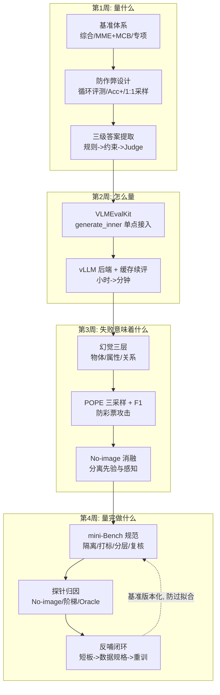

# 阶段三自测验收与复盘

> **使用方法**：先遮住参考答案自答学习计划的四项终极自测，再对照打分。达成标准不只是"知道结论"，而是能像下文那样给出**机制推导与可执行方案**。

对应学习计划：阶段三终极自测清单。通过即可进入 Stage 4（数据合成与数据工程）。

---

## 1. 自测一：彩票攻击下的 POPE 指标变化

**题目**：POPE 评测中，如果模型面对所有询问都倾向于回答"Yes"，其 Precision、Recall 和 $F_1$ Score 会发生什么变化？

### 参考推导

POPE 正负样本均衡（各半）。设总题数 $N$，模型无脑全答 Yes：

$$
TP = \tfrac{N}{2},\quad FN = 0,\quad FP = \tfrac{N}{2},\quad TN = 0
$$

$$
\text{Recall} = \frac{TP}{TP+FN} = 100\%,\qquad
\text{Precision} = \frac{TP}{TP+FP} = \frac{N/2}{N} = 50\%
$$

$$
F_1 = \frac{2 \cdot P \cdot R}{P + R} = \frac{2 \times 0.5 \times 1}{1.5} \approx 66.7\%
$$

**结论**：Recall 被拉满至 100%（它只度量"真实存在的物体你找到了多少"，全 Yes 当然全找到）；Precision 骤降至 50%（等于随机）；F1 被压到约 $2/3$。**因此 POPE 报告必须同时含 Precision / Recall / F1 / Yes Ratio 四项**，只看 Recall 会把"满嘴跑火车"的模型捧成满分。

**防范机制（达成标准的后半句）**：POPE 的题面设计与指标选择共同构成防彩票机制——① 正负样本严格 1:1，使"全 Yes"策略的期望 Precision 恰为随机水平；② F1 对 FP 与 FN 对称惩罚，任何单向偏置策略都会在 F1 上付出代价；③ Yes Ratio 作为偏置的直接仪表，让 degenerate 模式一眼可见。同一哲学在 MME 中以 Acc+ 体现（正反两问都对才计分）。第 3 周教程 2.2 节的断言脚本已把这个推导变成可执行验证（all-Yes → R=1.0, F1≤0.67）。

---

## 2. 自测二：区分"没看见"与"瞎编"

**题目**：如何用实验判断模型的错答是因为"没看见图（视觉编码缺失）"还是"语言模型本身在瞎编（Language Prior）"？

### 参考方案（No-image Baseline 消融）

**核心操作**：同一批评测问题跑两遍——原图一遍、图像替换为纯黑/纯白/噪声图（或干脆不给图）一遍，对比逐条回答。

**判读矩阵**：

| 无图 vs 有图的行为 | 诊断结论 | 修复方向 |
| --- | --- | --- |
| 回答高度一致（无图也答同样的内容） | 模型在按语言先验答题，视觉通道贡献 ≈ 0——**瞎编** | 训练侧：修数据配方防"捷径"（Stage 2 失效 1），补显式负例 |
| 无图时接近随机/全 No，有图显著更好 | 视觉在工作，剩余错误是**感知失败**——真没看见 | 视觉侧：分辨率/编码（Stage 1 结论），或小目标数据（Stage 4） |
| 无图时 Yes Ratio 显著偏高（>60%） | 系统性 Yes 偏置 | 先校准偏置（数据补负例）再谈能力 |
| 部分子集一致、部分子集差异大 | 分层看：按"必须看图才能答"的题目子集重算一致率 | 按维度归因 |

**方案升级（加分量）**：单靠 No-image 有盲区——"无图也能答对"的题（纯先验可答）会稀释信号。补两个探针增强归因分辨率：

1. **信息量阶梯**：无图 → 低分辨率 → 高分辨率 → 目标区域裁剪放大，记录每个失败样本"从哪一级开始答对"。在"裁剪"级才答对的样本 → 分辨率/小目标瓶颈；全阶梯都错 → 投影或推理侧。
2. **Text-only oracle**：把真值信息文字化喂给 LLM 侧（"图中有 A 和 B，A 在左，B 在右，……"），若文本条件下推理仍错 → LLM 推理问题，与视觉无关。

这套三探针（No-image / 阶梯 / Oracle）就是第 4 周归因报告的方法论骨架。

---

## 3. 自测三：VLMEvalKit 快速接入自定义模型/数据集

**题目**：能否在 VLMEvalKit 中快速集成一个全新的自定义 VLM 模型或自定义数据集？

### 参考路径（1 小时达成标准）

**接入自定义模型（已核实框架接口，约 30 分钟）**：

```python
# vlmeval/vlm/my_model.py
from ..api.base import BaseAPIAdapter  # 或 from .base import BaseModel

class MyVLM(BaseModel):                 # 本地模型继承 BaseModel
    def __init__(self, model_path: str, **kwargs):
        self.model = load_my_model(model_path)   # 你的加载逻辑

    def generate_inner(self, message, dataset=None):
        # message: [{'type': 'image', 'value': <PIL.Image|path>},
        #           {'type': 'text', 'value': '问题文本'}]
        prompt = message[-1]['value']
        image = next(m['value'] for m in message if m['type'] == 'image')
        return self.model.generate(image, prompt)   # 返回纯文本即可

# 注册到 vlmeval/config.py 的 supported_VLM 字典:
#   'my_vlm': partial(MyVLM, model_path='...')
# 之后: python run.py --model my_vlm --data POPE ...
```

框架的设计把接入面收窄到 `generate_inner()`（README 原文：只需实现这一个函数，数据下载/调度/落盘/打分全由框架处理）。API 型模型则继承 `BaseAPIAdapter`，只需实现 `PromptType -> str` 的调用转换。

**接入自定义数据集（约 20 分钟）**：最小路径是把数据整理为框架已支持的 TSV 格式放到 `vlmeval/dataset/` 认识的目录（或用自定义 TSV 类），字段含 `index / image / question / answer`（选择题再加 `options / answer`）。更复杂的协议（自定义指标如 IoU@0.5）则继承 `ImageVQADataset` 类并覆写 `evaluate()`。

**验收动作**：接入后先跑 `--data POPE` 截断子集（20 条）冒烟，检查预测 TSV 内容正常、`_acc.csv` 出数——两步通过即达标（第 2 周教程思考题 3 是此题的实操预演）。

---

## 4. 自测四：从评测报告反推数据缺陷

**题目**：能否根据 POPE / MME 的失败案例，明确提出下一阶段（Stage 4）需要补强的数据类型？

### 参考框架：失败模式 → 数据规格的映射表

| 评测观察（证据） | 归因 | Stage 4 数据需求 |
| --- | --- | --- |
| POPE Adversarial F1 显著低于 Random，Top-FP 类别集中（如椅子/餐桌） | 共现先验诱导幻觉 | 高共现物体的**显式负例对**："图中有餐桌"配"图中没有椅子"的标注对；每个高频类别 ≥100 条负例 |
| No-image 探针 Δ≈0 | 语言捷径 | 模型"不看图必错"的题——问法上强制依赖视觉细节（具体数量、非常规属性组合）的样本 |
| MME count/position 子任务低 + 裁剪探针后改善 | 分辨率/小目标 | 小目标样本（<32px）、高分辨率原图 + 对应密集 QA；计数场景 2~6 物体 + 同类干扰物 |
| MME reasoning 子任务低，Text-only oracle 也错 | LLM 推理弱 | Visual CoT 数据：先描述证据链再给结论的样本（多步推理） |
| 空间关系错且真值复核无争议 | 空间编码/视角约定 | 带明确视角约定的空间关系对（"以相机视角，A 在 B 左侧"），左右均衡防方向偏置 |
| 提取失败率高（>5%） | 输出格式 | 训练数据答案格式规范化；或评测协议加约束 prompt（这不是数据问题，别硬用数据修） |

**达成标准的表述模板**："MME 计数子任务 35% 且失败样本中 68% 在裁剪放大后答对、No-image 无差异 → 主因是小目标感知瓶颈而非推理 → Stage 4 需要 ≥500 条小目标（<32px）计数样本（2~6 物体、含同类干扰、来源与评测集隔离）+ 若干高分辨率微调轮次。"——观察、归因、规格三段齐全。

---

## 5. 阶段知识图谱复盘



**五个必须能脱口而出的数字及其来历**：

1. **100% / 50% / 66.7%** = 全 Yes 策略的 Recall / Precision / F1——为什么四指标缺一不可；
2. **1:1** = POPE 正负样本比——彩票攻击的期望收益归零的基础；
3. **31.4%** = GPT-4V 在 HallusionBench 的问题对准确率（2024 初）——图文关系推理远未解决；
4. **0.5** = IoU@0.5 阈值——"大致框对"的工程默认线，严格场景 0.75/0.9；
5. **±14%**（约） = n=50 时 43% 准确率的 95% 置信区间半径——mini 基准为什么只能看趋势不能抠单点。

---

## 6. 综合思考题（进入 Stage 4 前的终极检验）

1. **端到端诊断推演**：某 QLoRA 微调后的模型，MME 总分从基线的 1850 掉到 1400，但 POPE F1 从 0.85 升到 0.92。给出至少两个互斥的假设，并设计实验区分。（提示：假设一——专精数据导致通用感知遗忘但幻觉抑制生效（数据配比问题）；假设二——微调让输出变保守（Yes Ratio 降），POPE 受益于偏置校正而 MME 受损于拒答倾向；用 Yes Ratio、MME 子任务画像、无图探针三者区分。）
2. **基准设计题**：为"无人机巡检电线缺陷"设计 mini-Bench：列出 5 个能力维度、每维度的题目形态与真值类型、2 个必须防的泄漏陷阱、以及你会内置的 2 个探针。（检查点：隔离按"巡检批次"而非图片；视角与光照作为难度分层轴；安全相关错误代价不对称 → 报告 $F_\beta$ 而非裸 F1。）
3. **方法论迁移**：本阶段的"探针归因"（受控输入定位模块缺陷）与 Stage 1 的架构知识如何互相印证？举一例说明"评测发现"如何倒推回 Stage 1 的某个设计选择（例：裁剪放大探针的收益 → 印证动态分辨率/AnyRes 的必要性；POPE Adversarial 脆弱性 → 印证对比学习全局对齐稀释属性细节的判断）。

---

## 7. 进入 Stage 4 的衔接预告

Stage 4（数据合成与数据工程）正是本阶段全部输出的消费方：

- 第 4 周归因报告的"数据规格"三段式 → 合成数据的需求文档；
- 幻觉 Top-FP 类别与负例对需求 → 合成管线的优先级排序；
- mini-Bench 的版本化纪律 → 合成数据的隔离与验收规范（合成数据也必须过 held-out 检验）。

带着第 6 节三道题的答案与一份真实的归因报告进入 Stage 4——你的数据合成将不再是"多造点数据"，而是**有靶点的精确补强**。

---

*返回：[教程索引](README.md) ｜ 上一篇：[第 4 周：自建 Benchmark 与失败归因](第4周-自建Benchmark与失败归因.md)*
