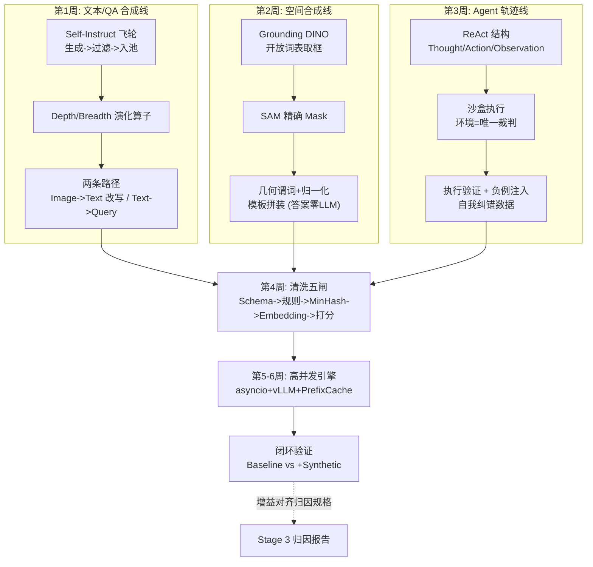

# 阶段四自测验收与复盘

> **使用方法**：先遮住参考答案自答学习计划的四项终极自测，再对照打分。达成标准是能给出**机制解释 + 工程方案**，而非背结论。

对应学习计划：阶段四终极自测清单。通过即可进入 Stage 5（数据质量评价与高效筛选）。

---

## 1. 自测一：Depth 与 Breadth Evolution

**题目**：什么是 Self-Instruct 中的 Depth Evolution 与 Breadth Evolution？如何在多模态场景下应用？

### 参考答案

**Depth Evolution（深度演化）**：不改变任务主题，**纵向加深任务的处理难度**——通过添加限制条件（"必须包含颜色/朝向，不得提及背景"）、深化推理链（"先观察→再推断→后结论"的 CoT 要求）、增加步骤（单问变多问链）、提高精度要求（结构化 JSON 输出）。对应学习计划达成标准的"添加限制条件、多步 Reasoning"。

**Breadth Evolution（广度演化）**：**横向扩展任务的场景与领域**——跨域迁移（日常场景→仓储巡检/医疗/无人机视角）、视角切换（换提问者身份：盲人助手/安全员/儿童）、任务类型转换（VQA→定位→对比→纠错）。对应"跨域扩展 Image Scene"。

**多模态场景的应用要点**（与纯文本的差异）：

- Depth 的着力点是**感知粒度**（"有个人"→"穿蓝衬衫、左手持机、目光向左的人"）与推理链长度——但受教师模型感知能力约束，超界任务会产生带 CoT 的幻觉（第 1 周失效 2）；
- Breadth 的着力点是**"图像内容 × 领域角色 × 任务模板"的组合空间**——同一张图跨域改写可获得指数级的指令多样性，但**图像内容本身的多样性无法凭文本演化产生**，需配合种子图的分布规划或文生图扩充。

---

## 2. 自测二：无人工标注的空间数据合成

**题目**：如何不依赖人工标注，自动化地为一张普通图片生成带有精准 Bounding Box 和空间关系提问的训练数据？

### 参考方案（三段式流水线）

1. **检测取框**：用开放词表检测器 Grounding DINO，以自然语言短语（"cup . laptop . book ."）为输入，输出任意类别的检测框与置信度；低分框（如 <0.35）过滤。（需要更精确的掩码时接 SAM：DINO 的框作为提示，SAM 输出高质量 Mask——Grounded-SAM 组合，语义来自 DINO、几何精度来自 SAM。）
2. **几何计算**：像素坐标按目标模型约定归一化（如 Qwen2-VL 的 0~1000 整数、$[x_1,y_1,x_2,y_2]$ 顺序），计算中心点/面积；两两配对物体，用**带抗歧义带的几何谓词**判定空间关系（水平/垂直比较须限制纵向偏差 $\leq \alpha \cdot \min(h_a, h_b)$，对角摆放宁可不生成）。
3. **模板拼装**：JSON Prompt 模板填充生成三类 QA——定位类（"定位图中杯子，输出坐标"→归一化框）、空间关系类（"杯子和笔记本哪个在左边？"→谓词判定的答案）、计数类（同标签实例数）。**答案由几何计算产生，LLM 只许改写问法、不许碰答案**；每条附 provenance（来源框与置信度）供审计。

**加分点**：坐标约定全局唯一 + 静态校验断言（Stage 3 失效 3 的教训）；真值争议样本（对角关系）直接跳过而非硬标。

---

## 3. 自测三：为什么语义去重比精确匹配重要

**题目**：为什么做语义去重（Vector Deduplication）比简单的精确字符串匹配（Exact Match）更重要？

### 参考答案

**记忆效应的根源**（达成标准前半句）：训练损失的视角下，$k$ 条近似重复样本等效于把该模式的学习权重放大 $k$ 倍。大模型的过拟合与"背诵"正是高权重样本的记忆——而合成数据与爬取数据中最大的重复形态**不是精确重复，而是"字面不同、语义雷同"**：模板坍缩生成的"同模板换实体"、对同一事实的多种改写、同一问题的多种问法。这些样本：

1. **完全逃过 Exact Match**（字符串逐字节比较，一条都抓不到）；
2. 大部分逃过 MinHash 字面去重（shingle 重叠率因实体替换而低于阈值）；
3. 只有 Embedding 余弦相似度能在**语义空间**里识别"这批数据在教同一件事"。

不清理的后果：梯度分布被最平庸的模板扭曲（模型复读模板）、评测近邻泄漏导致虚高（Stage 3 失效 3）、有效数据量远低于名义数据量。

**工程实现**（达成标准后半句）：① 用 Sentence-Transformers（文本）或 CLIP（图文）对每条数据编码并 L2 归一化；② 建 FAISS `IndexFlatIP`（归一化向量的内积 = 余弦相似度）；③ 每条检索最近邻，相似度 > 阈值（0.92 起点，按分布人工抽检校准）判为重复，簇内择优保留；④ 关键工程细节——**去重键分层**：把 answer 拼进相似度输入或按维度设阈值，豁免"同模板换答案"的教学必需样本族（第 4 周失效 1），否则会误杀计数/格式类训练信号。

---

## 4. 自测四：万级/日的高并发 Pipeline

**题目**：能否搭建一个单日可合成万级数据、且带有自动校验的高并发 Pipeline？

### 参考架构（模块化五件套）

```
┌─ ① 任务构造器 ─────────────────────────────┐
│ 种子池 + 演化算子 -> prompt (公共前缀前置)     │
├─ ② 并发执行器 (asyncio) ───────────────────┤
│ Semaphore 限并发 = vLLM max_num_seqs        │
│ AsyncOpenAI 客户端 + 指数退避重试 + 逐条落盘   │
├─ ③ 服务端 (vLLM/SGLang) ───────────────────┤
│ continuous batching + prefix caching        │
├─ ④ 自动校验闸 (实时) ───────────────────────┤
│ Schema Check (JSON/字段/长度)                │
│ 内容校验 (一致性双答/工具回验/坐标合法性)       │
├─ ⑤ 离线清洗与交付 ─────────────────────────┤
│ MinHash + Embedding 去重 + 质量打分 Top-K    │
│ -> HF Dataset (含 provenance 与审计记录)     │
└────────────────────────────────────────────┘
```

**万级/日的核算**：10k 条 ÷（24h × 60min）≈ 7 条/分钟的均值要求——即便按 8 小时有效窗口也只需 ~21 条/分钟，单卡 7B + 48 并发（实测 100~300 条/分钟）有充足余量；瓶颈管理重点在**失败重试预算**与**校验闸的吞吐匹配**（LLM 校验的调用数是合成的 1~2 倍，需独立并发池）。

**Producer-Consumer 要点**：生产（prompt 构造）与消费（API 调用+落盘）用 `asyncio.Queue` 解耦，落盘协程独占文件句柄（`asyncio.Lock`）；断点续跑按 `key`（种子+算子的哈希）去重跳过。

**验收物证**：完整模块化代码 + 一份运行审计日志（时间戳、吞吐曲线、失败分类计数、校验通过率）+ 产出的 HF Dataset 卡片（数据来源、清洗参数、质量分布）。

---

## 5. 阶段知识图谱复盘



**五个必须能脱口而出的数字及其来历**：

1. **$P[\min h(A) = \min h(B)] = J(A,B)$** —— MinHash 估计 Jaccard 的核心恒等式，海量字面去重的数学基础；
2. **0.92** —— 语义去重余弦阈值的学习计划起点，但必须按自己数据的分布人工抽检校准；
3. **48 并发 ≈ 100~300 条/分钟**（7B 教师/单卡 A100/300 Token 输出，经验量级）—— 万级/日目标的无压力下限；
4. **前缀占比 ≈ Prefill 节省比例** —— Prefix Caching 收益的算术，决定 prompt 排布纪律；
5. **7 条/分钟** —— 万级/日均摊到 24h 的均值要求，说明"高并发"的真实含义是稳健而非极限。

---

## 6. 综合思考题（进入 Stage 5 前的终极检验）

1. **产线诊断推演**：你的流水线连续三天产出质量分持续下降（同样的 prompt 与参数）。列出至少四个互斥假设与对应的判别仪表。（提示：教师模型服务被换版本/量化；种子池耗尽导致重复采样模板坍缩；清洗闸的 Judge 版本漂移（分数标尺变了）；温度/采样参数被上游配置覆盖。用"固定 100 条金样本回归评测"隔离是数据变了还是尺子变了。）
2. **三线配比决策**：Stage 3 归因报告显示三大短板为"小目标定位（视觉）""计数幻觉（先验）""多步推理（LLM）"。设计本周合成数据的三线配比、每线的规模与验收指标，并说明哪条线的数据最需要第 4 周的"分层去重豁免"。（提示：空间线产出最精确但多样性低（模板化），最易被语义去重误杀——豁免策略优先给它；计数线与先验线的负例对要防比例失衡。）
3. **边际成本分析**：合成数据从 3k 扩到 30k，预期增益曲线大概是什么形状？在哪个点应该把预算从"扩量"转向"提质/改分布"？（提示：合成数据共享教师的知识边界，同分布扩量呈次线性增益且渐近教师上限——Stage 1 讲过的"能力边界"；而分布缺口（新场景种子）才打开新增益空间。用本周闭环实验的分组数据实测拐点。）

---

## 7. 进入 Stage 5 的衔接预告

Stage 5（数据质量评价与高效筛选）把本阶段的"样本级质量"升级为"数据集级科学"：

- 本阶段的质量分（1~5 Judge 分）→ Stage 5 的多维质量模型（perplexity、difficulty、diversity 的正交度量）；
- 本阶段的 Top-K 截取 → Stage 5 的最优数据选择算法（如基于影响力/梯度的选择）与预算-质量前沿；
- 本阶段的分布偏斜担忧（样本满分 ≠ 分布正确）→ Stage 5 的核心命题：**在有限训练预算下选"哪 10%"数据**。

带着第 6 节三道题的答案与一份真实的闭环增益报告进入 Stage 5——你已经拥有 Stage 5 要优化的那条"生产线"了。

---

*返回：[教程索引](README.md) ｜ 上一篇：[第 5-6 周：高吞吐 Pipeline 与闭环验证](第5-6周-高吞吐Pipeline与闭环验证.md)*
