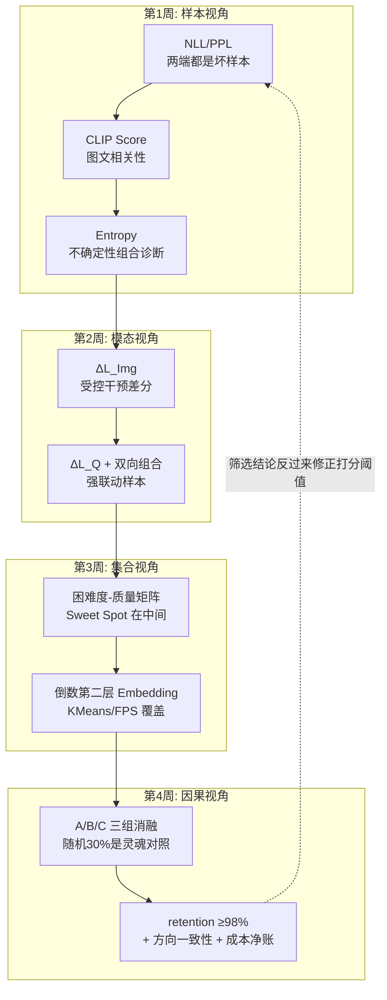

# 阶段五自测验收与复盘

> **使用方法**：先遮住参考答案自答学习计划的四项终极自测，再对照打分。达成标准是**机制 + 方案**双重完备。

对应学习计划：阶段五终极自测清单。通过即可进入 Stage 6（Post-training 偏好对齐与 DPO 实战）。

---

## 1. 自测一：为什么不能只挑 NLL 最大的样本

**题目**：为什么不能单纯挑选 NLL（Loss）最大的样本作为训练集？

### 参考答案

**机制**：NLL 度量的是"参考模型对答案的意外程度"，但意外有**两种性质完全不同的来源**：

1. **可学习的新知识/新能力**（高价值样本）；
2. **模型"不该学也学不会"的内容**——OCR 乱码、标注错误、图文错配、破损图片、语法破碎的机器生成文本（Outliers/噪声）。

实测分布上，最高 NLL 段**富集的是第 2 类而非第 1 类**：噪声样本的 NLL 上界远高于正常难题（乱码回答的逐 Token 概率可以低到接近 0，把 NLL 推到正常样本的数倍），且从"模型没见过"的角度它们也最"意外"。只取 Top NLL 等于把训练集向噪声端截断——训练这类样本的梯度方向指向"输出不连贯内容"，轻则污染语言流畅性，重则 loss 爆炸、训练崩溃（学习计划达成标准的原文要求）。

**正确方案**：**两端截断**——高 NLL 端（如 5%）视为噪声候选剔除（可再过一道质量闸抢救"难而正确"的新任务样本），低 NLL 端（如 20%）视为冗余剔除，保留中间 Sweet Spot。第 1 周 1.3 节的三段表与第 3 周的困难度矩阵是该答案的完整展开。

---

## 2. 自测二：Image Necessity 的公式与工程实现

**题目**：什么是多模态中的"Image Necessity（图像必要性）"？如何用公式表达？

### 参考答案

**定义**：图像必要性度量"**去掉图像后，模型对正确答案的预测损失上升多少**"——即图像对回答的因果贡献（因果而非相关：它是一次只扰动图像、固定问题与答案的受控干预）。

$$
\Delta L_{\text{Img}} = L\big(A \mid \text{No-Image},\ Q\big) - L\big(A \mid \text{Image},\ Q\big)
$$

**读法**：$\Delta L_{\text{Img}} \approx 0$ → 图像对预测零贡献，"伪多模态数据"（模型靠语言先验即可，训练等效于掺图噪声的纯文本 SFT）；$\Delta L_{\text{Img}} \gg 0$ → 图像携带答案信息，真多模态样本；负值 → 可疑（图文矛盾或错标），转人工审查。

**工程实现逻辑**（达成标准的后半句）：对每条样本做**两次同构前向**——真实图像一次、破坏图像（全黑图，或模糊/Token 置换等温和破坏）一次，两次共享同一 batch 构成与回答区掩码（Stage 2 的 label=-100 口径），取回答区 per-token 平均 NLL 之差。批量实现要点：① 两次前向严格同构以避免批处理差异污染差分；② 全黑图是参考模型分布外输入，需做正增益占比的 sanity check（若 ΔL 全体为负则 OOD 噪声支配，换温和破坏方式）；③ 扩展为双向信息增益时与 Question Necessity $\Delta L_{\text{Q}} = L(A \mid X, \varnothing) - L(A \mid X, Q)$ 做 rank 归一化后加权组合。

---

## 3. 自测三：兼顾困难度与多样性的算法设计

**题目**：如何同时兼顾数据的"困难度（Difficulty）"与"多样性（Diversity）"？

### 参考答案（两段式组合）

**第一段：困难度轴——两端截断保中间**。以参考模型 NLL 为困难度代理，剔除两端：低 NLL（过简单，零梯度信号）与高 NLL（噪声富集区），保留 Sweet Spot（模型能力临界点，梯度既非零又可信）。质量底线（CLIP 分、规则校验）串联在前。

**第二段：多样性轴——Embedding 聚类 + 簇内均匀采样**。仅按 NLL 筛选会导致领域坍缩（高分样本全是同类任务）。解法：

1. 抽取目标模型**倒数第二层隐层表征**（回答区池化），它比 CLIP 特征更贴近训练动力学的相似性；
2. PCA 降维（64~128 维，抗维度灾难）+ L2 归一化（防长度方向坍缩）；
3. **K-Means 聚类**（簇 ≈ 隐式任务域），配额按簇大小（或温度化软平衡）分配；
4. **簇内按 NLL 等间隔分层采样**——在每个语义域内部仍覆盖困难度谱系，而非只取簇内"最难的"。

替代/补充方案：**最远点采样（FPS）**直接在几何上最大化选中点的两两距离（均匀覆盖、不假设簇结构），对离群点更敏感；K-Means 路线的优势是配额可控、簇可人工命名审查。验收断言：各簇均非空（多样性）、Coreset 的 NLL 均值接近阶段一产出（困难度无偏移）——第 3 周 2.1 节脚本内置。

---

## 4. 自测四：可复现的消融证据

**题目**：是否拥有可复现的实验数据，证明筛选算法在删减 50% 以上数据后性能几乎不衰减？

### 验收物证清单

- [ ] **三组消融完整**：A 全量 / B 随机 30%（灵魂对照组）/ C 筛选 30%，同底座、同超参、同种子清单，YAML 逐字段 diff 归档；
- [ ] **评测协议冻结**：VLMEvalKit commit + 提取器版本 + 裁判模型 + 全新 work-dir（Stage 3 纪律）；评测集与打分管线物理隔离（防泄漏）；
- [ ] **多基准 + 多种子**：≥2 个基准 × ≥2 个种子，报告均值±方差与 **C>B 的方向一致率**（比单点 98% 更本质的证据）；
- [ ] **逐项 retention 表**：每个基准的 $\bar{S}_C / \bar{S}_A$ + 聚合 retention ≥ 98%（或如实报告偏差并分析）；
- [ ] **成本净账**：打分 GPU 时 + 训练节省 = 端到端等效节省倍率；
- [ ] **WandB 训练曲线**：三组的 loss 曲线（确认 B/C 收敛充分，排除"欠训练"混杂——第 4 周失效 3）；
- [ ] **复现包**：数据 hash、参考模型版本、筛选脚本、随机种子、环境记录。

---

## 5. 阶段知识图谱复盘

**五个必须能脱口而出的数字及其来历**：

1. **5% / 20%** —— 高 NLL 噪声端与低 NLL 冗余端的默认截断比例（噪声率与参考模型强度的函数，非常数）；
2. **~0** —— 伪多模态样本的 $\Delta L_{\text{Img}}$ 取值（图像零因果贡献的判定线）；
3. **0.92→第 4 阶段 / 0.15→本阶段** —— 语义去重与 CLIP 质量底线两处阈值的语境差异（阈值永远绑定分布与用途）；
4. **倒数第二层** —— Embedding 聚类特征的标准取层（任务语义表征；中层偏句法、末层偏解码）；
5. **98% / 30%** —— retention 达标线与剪枝比例的配对——Less is More 的量化承诺及其前提（等效于 2 倍以上端到端成本节省）。

---

## 6. 综合思考题（进入 Stage 6 前的终极检验）

1. **跨阶段串联诊断**：Stage 4 闭环实验中"+Synthetic 组"增益微弱。现用 Stage 5 工具复盘：对合成池与公开池分别计算 NLL 分布与 ΔL_Img 分布，给出三种可能的诊断结论及各自对应的 Stage 4 修复动作。（提示：合成池 NLL 整体偏低 → 教师生成的都是底座已会的，Stage 4 应提高演化深度；ΔL_Img 普遍趋零 → 合成 QA 的"看图必要性"不足，出题模板需加视觉硬约束；两池分布高度重叠 → 合成数据无增量信息，应换种子分布。）
2. **筛选与配比的边界**：Stage 2 第 3 周的"数据配比防遗忘"与本阶段的"质量筛选"存在张力——按质量筛选天然会压缩某些"低质量但保平"的通用数据。设计一个"配比约束下的筛选"算法：在满足各能力域最低配额的前提下最大化整体质量分。（提示：带约束的组合优化——各域内独立排序截断 + 域间配额下界；与 Stage 4 思考题的温度采样公式合流。）
3. **前瞻 Stage 6**：本阶段筛选出的高 NLL（难）样本与 DPO 有什么天然联系？思考"难度"信号在偏好对构造（chosen/rejected 的差距控制）中的三种用法。（提示：DPO 偏好对需要 chosen 与 rejected 有可学习的差距——全简单样本的 rejected 与 chosen 几乎无差（梯度消失），全噪声样本的 rejected 又把模型推向乱码；中等难度 + 有区分度的 rejected 正是 DPO 数据的 Sweet Spot——Stage 5 的指标体系可以直接迁移成 DPO 数据的筛选器。）

---

## 7. 进入 Stage 6 的衔接预告

Stage 6（Post-training 偏好对齐与 DPO 实战）将把本阶段的能力升级到"偏好级"：

- 本阶段的参考模型 NLL → DPO 的参考策略 $\pi_{\text{ref}}$（同一数学对象在 RLHF/DPO 中的角色）；
- 本阶段的"难度筛选" → DPO 偏好对的难度控制与 rejected 构造（合成 rejected 的质量筛选）；
- 本阶段的消融纪律 → DPO 超参（β、lr）消融的实验设计模板。

带着第 6 节三道题的答案与一份完整的 A/B/C 消融报告进入 Stage 6——你已经具备读懂 DPO 损失函数背后全部工程动机的知识底盘。

---

*返回：[教程索引](README.md) ｜ 上一篇：[第 4 周：Less is More 消融验证](第4周-LessIsMore消融验证.md)*
