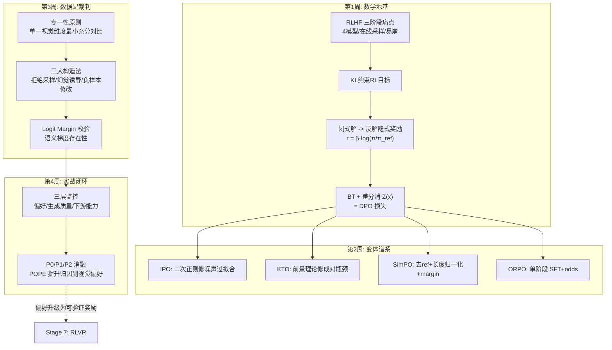

# 阶段六自测验收与复盘

> **使用方法**：先遮住参考答案自答学习计划的四项终极自测，再对照打分。理论题要求能**徒手推导**，实战题要求**物证齐全**。

对应学习计划：阶段六终极自测清单。通过即可进入 Stage 7（RLVR 与 Multimodal Reasoning）。

---

## 1. 自测一：DPO 如何绕过显式 RM 与 PPO 采样

**题目**：DPO 是如何绕过显式训练 Reward Model 和 PPO 采样的？

### 参考推导（四步链，要求能默写）

1. **起点：KL 约束 RL 目标**——$\max_\theta \mathbb{E}[r^*(x,y)] - \beta\,\mathbb{D}_{KL}[\pi_\theta \| \pi_{\text{ref}}]$；
2. **闭式最优解**——该目标有解析形式 $\pi^*(y|x) = \frac{1}{Z(x)} \pi_{\text{ref}}(y|x) \exp(r^*(x,y)/\beta)$；
3. **反解隐式奖励**——$r^*(x,y) = \beta \log \frac{\pi^*(y|x)}{\pi_{\text{ref}}(y|x)} + \beta \log Z(x)$：**任何奖励函数都可由"策略与参考模型的对数概率比"表示**，策略模型自身即隐式奖励模型（论文标题的含义）；
4. **代入 Bradley-Terry + 差分消元**——把隐式奖励代回偏好分布 $P(y_w \succ y_l) = \sigma(r(x,y_w) - r(x,y_l))$，同一 $x$ 下 $\beta \log Z(x)$ 在分差中抵消，剩余的负对数似然就是 DPO 损失：

$$
\mathcal{L}_{\text{DPO}} = -\mathbb{E} \log \sigma \left( \beta \log \frac{\pi_\theta(y_w|x)}{\pi_{\text{ref}}(y_w|x)} - \beta \log \frac{\pi_\theta(y_l|x)}{\pi_{\text{ref}}(y_l|x)} \right)
$$

**"绕过"的本质**：RM 被隐式奖励重参数化吸收进策略本身（不再需要显式训练 $r_\phi$）；RL 目标被转化为对**静态偏好对的直接极大似然**（不再需要在线采样与打分环境）。整个 RL 问题坍缩成一个监督式交叉熵——这也是为什么 DPO 训练形态与 SFT 几乎一样（离线数据、单损失、两层模型）。

---

## 2. 自测二：SimPO 的两项核心改进

**题目**：SimPO 相比 DPO 做出了哪两项核心改进？为什么能降显存并缓解长度偏置？

### 参考答案

**改进一：完全抛弃 $\pi_{\text{ref}}$，奖励改为长度归一化的 log 概率** $r = \frac{\beta}{|y|} \log \pi_\theta(y|x)$。
- 降显存的机制：DPO 的 ref 只为提供"相对比较的锚点"（隐式奖励是 log 比值，必须有分母）；SimPO 把奖励定义为**绝对量**（每 Token 平均置信度），不需要比值即不需要 ref——7B 场景直接省一个模型（约 14GB 权重 + 每次 ref 前向）。
- 缓解长度偏置的机制：DPO 用 per-sequence 求和口径，长序列 logp 天然更负，长度信号混入奖励；除以 $|y|$ 后奖励与长度解耦，"长=坏"的伪信号被数学上移除。

**改进二：引入显式 margin $\gamma$**。这是去 ref 的**共生设计**而非独立功能：DPO 的 ref 同时充当"防跑飞"的 KL 锚；去掉 ref 后模型出现了新的退化捷径——把 chosen 与 rejected 的概率**双双压低**（归一化分差照样拉开、损失照样降，但绝对生成质量崩了）。$\gamma > 0$ 要求 chosen 的归一化奖励必须**至少高出 $\gamma$** 才计为分对，堵死了这条捷径（第 2 周测试 2 的数值验证）。

一句话总结（自测达成标准的完整版）："**长度归一化**（治长度偏置、使奖励无需 ref 差分形式）+ **显式 margin**（补上去 ref 后缺失的绝对质量锚点）——两者共生，共同实现免 Reference 的偏好优化。"

---

## 3. 自测三：只有坐标不同的偏好对好不好

**题目**：多模态 DPO 训练中，如果 Chosen 和 Rejected 答案在字面上几乎一样，只有空间坐标不同，这样的数据好不好？

### 参考答案：极度优质（需满足两个前提）

**为什么优质**：

1. **单一变量、高对比度**：两回答唯一的差异就是坐标数值——模型若想拉开隐式奖励分差，**唯一的路径**是从视觉特征中读准位置，任何语言先验捷径（Stage 3 的"不看图蒙对"）在此完全失效。它强制性地把梯度引导到视觉/空间维度。
2. **对症下药**：空间幻觉（关系/定位错）正是 Stage 3 诊断出的幻觉类型之一；这类对是对症的传统"整句好坏对"无法精确治疗的（整句对比的梯度会被语言维度稀释）。

**两个必要前提**（加分项）：

1. **坐标约定一致**：chosen 与 rejected 使用同一归一化基准与分量顺序（Stage 3 的坐标 schema 纪律），否则模型学到混乱的格式；
2. **差异幅度适中**：坐标差应处于"模型踮脚可辨"的区间（如 20~40 像素 @1000 归一化），差 1 个单位的对太弱（模型学成噪声），差 500 的对太强（只学会粗粒度判别）。

**补充监督手段**：这类对训练时可用 margin 分布确认"可分但不平凡"（`rewards/accuracies` 应爬向 0.7~0.85 而非一步到 0.98）。

---

## 4. 自测四：独立跑通 DPO/SimPO 并监控隐式奖励

**题目**：是否独立跑通了一次 VLM 的 DPO/SimPO 对齐流程，并在 WandB 中监控到了合理的 Implicit Reward 增长？

### 验收物证清单

- [ ] **完整对齐脚本**：YAML/Python 配置归档，标注 β、lr、epoch、梯度裁剪与**其选型依据**（第 4 周 1.2 节的对照）；
- [ ] **WandB 三层曲线**：
  - 偏好层：`rewards/margins` 稳步增大后趋平、`rewards/accuracies` 爬至 0.7~0.9；
  - 质量层：`logps/chosen` 仅缓降无暴跌、`logps/rejected` 下降更快；
  - 无崩溃信号（acc 冲 0.98 / chosen 暴跌 / margin 暴涨后平台均需解释）；
- [ ] **POPE 前后消融表**：含 P0（SFT 底座）/ P1（+DPO 幻觉对）/ P2（+DPO 随机对）三组，POPE 提升达 ≥3% 且 **P1 > P2**（归因到视觉偏好内容而非 DPO 本身）；
- [ ] **通用能力无损证据**：通用抽查集持平（对齐税受控）；
- [ ] **协议冻结声明**：评测框架 commit / 裁判 / 提取器 / work-dir 新鲜度四要素归档。

---

## 5. 阶段知识图谱复盘

**五个必须能脱口而出的数字及其来历**：

1. **4 → 2 → 1** = PPO/DPO/SimPO 驻留模型数——免 RM 演进的显存账本；
2. **β = 0.1** = DPO 最常用锚定强度，且必须与 lr（SFT 的 1/10 以下）联动；
3. **log 2** = policy==ref 时 DPO 损失的初值（$-\log\sigma(0)$）——零起点性质的数值锚；
4. **0.7~0.9** = `rewards/accuracies` 的健康区间（<0.6 没在学，≥0.98 表面捷径）；
5. **1.4k vs 10k** = RLHF-V 段级精标偏好对胜过 LLaVA-RLHF 粗标的数据效率证据（CVPR 2024 已核实）——偏好数据质量>数量的定调数字。

---

## 6. 综合思考题（进入 Stage 7 前的终极检验）

1. **推导变体**：把 DPO 推导中的 BT 模型换成"列表版"（人类从 K 个回答中选最好的，Plackett-Luce 模型），推导对应的"列表 DPO"损失。它相比两两 DPO 需要什么数据、可能带来什么增益？（提示：损失变为 $\sum_k \log \frac{\exp(\beta \hat{r}(y_k))}{\sum_{j \geq k} \exp(\beta \hat{r}(y_j))}$ 形式；Best-of-N 排序数据天然匹配——第 3 周拒绝采样的候选列表直接可用。）
2. **抑幻的三条路线对比**：现在你手里有三种治幻觉的手段——DPO 偏好对齐（本周）、Stage 4 的负例数据 SFT、Stage 3 的推理时干预（prompt 约束）。给"POPE Adversarial F1 从 0.79 提升到 0.85"这个目标设计三种方案的成本-效果预估，并说明你优先选哪条、什么条件下换路线。（开放题，检查点：DPO 治"输出偏好"层、SFT 治"知识覆盖"层、推理时干预治"即时约束"层——幻觉的成因层次决定路线选择。）
3. **前瞻 Stage 7**：RLVR（可验证奖励的强化学习）用**程序化验证器**（数学答案对错、代码测试通过）替代人类偏好。对比 DPO 与 RLVR 的奖励来源与适用边界：多模态推理任务（几何题、图表计算）该用哪个？为什么 RLVR 的验证器思想在 Stage 2/4 早有伏笔？（提示：执行验证是 Stage 4 Agent 数据的灵魂、工具回验是第 3 周的校验手段——RLVR 只是把"验证器"从数据构造环节挪进了训练环节；可验证领域（数学/代码/定位 IoU）RLVR 上限更高，开放领域仍是偏好方法的地盘。）

---

## 7. 进入 Stage 7 的衔接预告

Stage 7（RLVR 与 Multimodal Reasoning）将把本阶段的"从偏好中学习"升级为"从可验证结果中学习"：

- 本阶段的隐式奖励 $r_\theta = \beta \log \frac{\pi_\theta}{\pi_{\text{ref}}}$ 与 KL 正则 → RLVR 的策略优化中的同一正则结构（GRPO/PPO 系）；
- 本阶段偏好对的难度控制（Sweet Spot）→ RLVR 的 prompt 难度筛选（太易全对无梯度、太难全错无信号——与 Stage 5 的两端截断完全同构）；
- 本阶段的 Logit Margin 校验 → RLVR 的 reward 分布诊断（组内全对/全错的样本无梯度）。

带着第 6 节三道题的答案与一份 P0/P1/P2 消融报告进入 Stage 7——"验证器思维"将是你已经拥有两次实战的老朋友。

---

*返回：[教程索引](README.md) ｜ 上一篇：[第 4 周：VLM 偏好对齐实战与抑幻验证](第4周-VLM偏好对齐实战与抑幻验证.md)*
