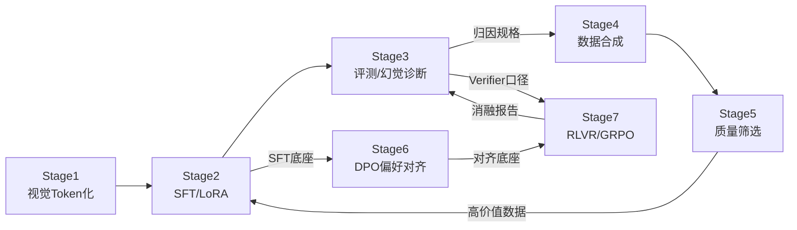

# 第 6-7 周教程：轨迹过滤、Multi-Rollout 采样与 Post-Training 三路消融

> **本周要回答的三个问题**
> 1. 为什么全 0/全 1 的组没有梯度？轨迹过滤与 DAPO 式动态采样的机制是什么？
> 2. SFT vs DPO vs GRPO 三路消融怎么设计才公平？各自涨的到底是什么？
> 3. 模式坍塌、过早收敛、死循环复读三大失败模式的信号与止血方案是什么？

对应学习计划：第 6-7 周。交付物：完整消融报告——同一 Task/Benchmark 上 Model 1（SFT）/ Model 2（DPO/SimPO）/ Model 3（GRPO-RLVR）三路对比：准确率、平均回答 Token 长度、幻觉发生率，并剖析 GRPO 的收益来源。

---

## 1. 第一性原理：梯度信号的统计学

### 1.1 根本矛盾：RL 的有效数据率天然低下

第 1 周 1.3 节已埋下伏笔：组相对优势 $A_i = (r_i - \bar{r})/(\sigma_r + \epsilon)$ 在**组内无区分**时趋零。定量地，一个组能产生梯度信号的条件是 $\sigma_r > 0$——即组内"有好有坏"。设单条 rollout 的通过率为 $p$，则 $G$ 条全对概率 $p^G$、全错概率 $(1-p)^G$：

$$
P(\text{有效组}) = 1 - p^G - (1-p)^G
$$

代入数值：$p=0.9, G=8$ → 有效率仅 **17%**（全对 43% + 全错 0% 被浪费）；$p=0.5, G=8$ → 93%；$p=0.1, G=8$ → **43%**。结论：**pass@1 在两端（太易/太难）时，超过一半的采样算力在产零梯度垃圾**——这不是 bug，是组相对机制的固有性质，工程上只能靠"任务难度匹配 + 过滤 + 重采样"逼近有效边界。

（顺带修正一个常见误解：全对组并非绝对无用——去掉 std 归一化的变体（Dr.GRPO/DAPO 的讨论）下全对组仍有"保持高概率"的微弱正则作用；但在标准 GRPO 的口径下，其优势严格为 0，学习计划的表述（方差为 0、无贡献）是准确的。）

### 1.2 轨迹过滤的两种工程形态

| 形态 | 机制 | 成本 | 适用 |
| --- | --- | --- | --- |
| **被动过滤（Advantage Masking）** | 组后置检查：$\sigma_r < \tau$ 的组整体置 $A_i=0$，照常走流程但无梯度 | 零额外采样（浪费已发生） | 快速止血 |
| **主动重采样（DAPO 式 Dynamic Sampling）** | 持续采样直到攒够"有效组数"才进入更新 | 多耗采样算力，换更高有效数据率 | 算力可换效果时 |
| **难度过滤（数据侧）** | 按 pass@G 把数据池分层，动态配比（第 4-5 周思考题 3） | 前置打分成本 | 长训练、任务难度谱宽 |

主动重采样有一个微妙收益：它把"有效组占比"从分布决定变成预算决定——**用算力买梯度质量**。DAPO（基于 verl 复现，AIME 2024 上 50 分的开源 SOTA，已核实）把 dynamic sampling 与去 KL、clip-higher 等一起列为成功要素，印证了"信号纯度"在规模化 RL 中的权重。

### 1.3 三条 Post-Training 路线的机理差异（消融的理论框架）

| 维度 | SFT | DPO/SimPO | GRPO (RLVR) |
| --- | --- | --- | --- |
| 监督信号 | 模仿标注 CoT（过程监督） | 偏好对比（相对监督） | 结果奖励（结果监督） |
| 数据需求 | CoT 全标注 | 好坏对 | 只需可验证 GT |
| 改变什么 | 注入行为模式 | 调整输出分布的偏好倾向 | **放大采样分布中的成功模式** |
| 典型副作用 | 僵化/过拟合模板 | 长度偏置/对齐税 | 长度爆炸/模式坍塌/熵坍塌 |
| 涨分的本质 | "学会了新的解题套路" | "在会的东西里选更好的" | "把偶尔做对变成稳定做对" |

消融报告的"收益点剖析"就按这张表展开：GRPO 涨的那几分，来自"探索成功率的提升"还是"格式稳定性"还是"回答精炼"？把聚合分数拆解到行为维度，报告才不是数字罗列。

---

## 2. 实现：过滤与三路消融

### 2.1 组过滤与有效率的量化监控

```python
"""
组有效率监控 + Advantage Masking + 动态重采样骨架。
运行方式: python stage7_week6_traj_filter.py   (自带测试)
"""
import torch


def group_valid_mask(rewards: torch.Tensor, eps: float = 1e-4, tau: float = 1e-3) -> torch.Tensor:
    """rewards: [B*G] 或 [B, G]; 返回每组是否有效 (std>tau)"""
    g = rewards.reshape(-1, 8) if rewards.dim() == 1 else rewards
    return g.std(dim=-1, unbiased=False) > tau


def masked_advantage(rewards: torch.Tensor, eps: float = 1e-4, tau: float = 1e-3):
    """无效组的优势置 0; 返回 (adv, valid_mask)"""
    g = rewards.reshape(-1, rewards.shape[-1]) if rewards.dim() == 2 else rewards.unsqueeze(0)
    std = g.std(dim=-1, unbiased=False, keepdim=True)
    valid = (std > tau).float()
    adv = (g - g.mean(dim=-1, keepdim=True)) / (std + eps)
    return (adv * valid).reshape_as(rewards), valid.reshape(-1)


def dynamic_resample(rollout_fn, prompt, G, max_rounds=3, tau=1e-3):
    """DAPO 式: 采样直到拿到有效组或耗尽轮数; rollout_fn(prompt)->(answers, rewards)"""
    for _ in range(max_rounds):
        outs, rewards = rollout_fn(prompt, G)
        if rewards.std(unbiased=False) > tau:
            return outs, rewards
    return outs, rewards                                    # 耗尽则按被动过滤处理


def _tests():
    torch.manual_seed(0)
    # 全 0 组 -> 掩码失效
    adv, mask = masked_advantage(torch.zeros(8))
    assert mask[0] == 0 and adv.abs().max() < 1e-4, "全同组应被掩码"
    # 有区分组 -> 正常
    r = torch.tensor([1.0, 0.0, 0.0, 1.0, 0.0, 1.0, 0.0, 0.5])
    adv, mask = masked_advantage(r)
    assert mask[0] == 1 and abs(adv.mean().item()) < 1e-4
    # 有效率的理论核对: p=0.9,G=8 -> 1-0.9^8-0.1^8 ≈ 0.570 (修正: 1 - p^G - (1-p)^G)
    p, G = 0.9, 8
    valid_rate = 1 - p**G - (1-p)**G
    assert 0.55 < valid_rate < 0.59, f"理论有效率 {valid_rate:.3f}"
    print(f"✅ 过滤机制测试通过; p=0.9,G=8 的理论有效组率 = {valid_rate:.1%}")


if __name__ == "__main__":
    _tests()
```

**预期输出**：`✅ 过滤机制测试通过; p=0.9,G=8 的理论有效组率 = 57.0%`

verl 侧的对应开关：算法级过滤/动态采样在 `algorithm` 节点配置（DAPO recipe 里有完整实现可参照）；自研过滤逻辑的最小侵入做法是在 reward_function 里返回 0 并依赖组内 std 自然判零——但**显式 mask + 有效率监控**（把 `valid_ratio` 加进 WandB）才是可运营的做法。

### 2.2 三路消融的执行设计

**公平性约束**（比第 5 阶段消融更严，因为三条路线的数据形态不同）：

1. **同底座、同评测协议**（不变项）；
2. **数据同源**：SFT 用 1k CoT 标注、DPO 用由同批 GT 构造的偏好对（第 6 周方法）、GRPO 用原始 $(image, q, GT)$——**承认数据形态差异是路线的一部分**，但 GT 必须同池，报告里写清各路线消耗的数据形态与量；
3. **算力口径**：报告各路线的总 GPU 时（DPO 省采样、GRPO 费采样——成本差异本身就是路线比较的一部分）；
4. **评测三维度**（学习计划指定）：准确率（任务 benchmark）、平均回答 Token 长度、幻觉发生率（POPE/自建幻觉探针）。

### 2.3 消融报告模板

```markdown
# Post-Training 三路消融报告（空间推理任务）
底座: Qwen2-VL-2B (SFT 后) | 评测: 自建 geo-500 + POPE | 协议冻结声明: [链接]

| 模型 | 数据形态/量 | GPU 时 | Acc@geo | 平均长度(Tok) | 幻觉率 | 备注 |
|---|---|---|---|---|---|---|
| M1 SFT | 1k CoT 标注 | 6h | 41.2% | 210 | 22.5% | 推理模板单一 |
| M2 SimPO | 3k 偏好对 | 4h | 44.8% | 186 | 19.1% | 回答更精炼 |
| M3 GRPO | 5k (image,q,GT) | 9h | **57.6%** | 342 | **14.8%** | CoT 变长且分化 |

## GRPO 收益点剖析
1. 探索成功率: pass@16 从 M1 的 61% → 74% (部分来自新推理路径涌现);
2. 格式稳定性: 合法输出占比 88% → 99% (格式奖励固化);
3. 长度代价: +132 Token/条 (推理链变长是主要成分, 已排除复读: 打乱图片消融通过);
4. 失效残留: 12% 样本仍空间关系错 (视角混淆, 归因见失败案例 #7)。

## 结论
GRPO 在可验证空间任务上显著优于 SFT/DPO (+12.8pt), 收益主要来自
"采样分布中的正确模式被稳定化"; 代价是 1.5x 算力与回答长度增长。
幻觉率同步下降的原因: Verifier 强制"先观察后回答"的行为模式挤占了先验答题空间。
```

---

## 3. 工程权衡与失败模式

### 3.1 三大失败模式的信号与止血

| 失败模式 | 可观测信号 | 根因 | 止血 |
| --- | --- | --- | --- |
| **模式坍塌**（输出多样性骤降） | 生成熵曲线骤降；不同 prompt 输出趋同 | 优势信号过强 + 过久更新，分布缩到几个高分模式 | 降 lr/早停；加熵正则；混入 KL（恢复锚定）；DAPO 的 clip-higher（放宽低概率 Token 的上升空间，保探索） |
| **过早收敛**（reward 平台期远早于预期） | reward 停滞但 pass@16 仍低 | 有效组率枯竭（1.1 节）+ 熵坍塌 | 动态重采样、课程化难度、提高 temperature 恢复探索 |
| **死循环复读** | response_length 暴涨 + 重复 n-gram 占比飙升 | 长度被间接正选择 + 熵坍塌下模型卡在局部循环 | 长度/重复惩罚；截断采样；检查是否 KL=0 裸奔 |

三者的共同底因是**熵坍塌**（策略分布的探索性枯竭）——监控生成熵是 RLVR 长训的必备仪表（verl 可配 entropy 系指标；"Entropy Mechanism of RL" 等生态工作已核实存在，专门研究此现象）。

### 3.2 失败案例分析的写作规范

消融报告的失败案例部分（学习计划要求的 Failure Cases）按 Stage 3 第 4 周的归因纪律：

1. 每个失败模式配 **3~5 个具体案例**（原图 + 完整输出 + 正确答案）；
2. 归因到层：数据（GT 歧义）/奖励（验证器口径）/训练（熵坍塌）/能力（底座天花板）——用探针实验（换 GT 口径、重采样、换底座）区分；
3. 每条归因给出**下一轮迭代的具体动作**（改数据/改奖励/改超参/换路线）。

---

## 4. 延伸思考题

1. **有效数据率的成本模型**：用 1.1 节公式画出"有效组率 vs pass@1"曲线（G=8），标出你任务的当前 p 值。若把 G 从 8 提到 16，p=0.9 时有效率如何变化？由此推导"低通过率任务应该用大 G 还是先降难度"的决策规则。
2. **三路线的组合形态**：实际系统常用"SFT 冷启动 → GRPO"或"SFT → DPO → GRPO"的流水线。思考：DPO 插在中间的价值是什么（如输出风格归一化降低 RL 的探索空间）？什么情况下 DPO 中间层反而有害（提示：DPO 的长度偏置会把采样分布先推歪，RL 再放大这个歪斜）。
3. **把消融升级为方法论**：本阶段的三路消融只测了一个任务。设计一个"路线-任务匹配矩阵"实验：{空间推理、OCR 提取、通用对话、图表计算} × {SFT, DPO, GRPO}，预测矩阵中每格的相对强弱并给出机理归因——这份预测矩阵本身就是你进入 Stage 8/9 前"什么任务用什么后训练路线"的决策资产。

---

## 5. 阶段收束：从 Stage 1 到 Stage 7 的能力全景

进入 Stage 8（训练系统与推理工程）前，回顾这条能力链的闭环：



每一环的失效模式都有前序阶段的工具可诊断、每一环的产出都有后续阶段的消费口——这张图不是隐喻，是你已实际搭建过的系统。

---

*下一篇：[阶段七自测验收与复盘](阶段七自测验收与复盘.md)*
