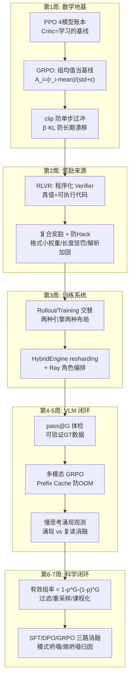

# 阶段七自测验收与复盘

> **使用方法**：先遮住参考答案自答学习计划的四项终极自测，再对照打分。本阶段理论题要求推导 + 机制解释，框架题要求讲清**设计动机**而非复述名词。

对应学习计划：阶段七终极自测清单。通过即可进入 Stage 8（大模型与多模态训练系统及推理工程）。

---

## 1. 自测一：GRPO 为什么不需要 Critic

**题目**：为什么 GRPO 不需要 Critic 模型？它的 Advantage 是如何计算的？

### 参考答案

**Critic 的本职**：策略梯度需要优势 $A_t = R_t - V(s_t)$——减去基线 $V(s_t)$ 以降低梯度方差（"好于平均才加强"）。传统 PPO 里 $V(s_t)$ 由一个与策略同规模的价值网络**学习**得到，这带来：第二个全量模型的权重+梯度+优化器状态（7B 约 28GB+）、价值估计误差污染优势、Critic 自身的训练超参负担。

**GRPO 的替代**：同一 prompt 采样 $G$ 条回答，**组内平均奖励 $\text{mean}(\mathbf{r})$ 是基线的蒙特卡洛估计**（无需学习）：

$$
A_i = \frac{r_i - \text{mean}(\mathbf{r})}{\text{std}(\mathbf{r}) + \epsilon}
$$

- 分子：与组内平均比，"这条回答好多少"——基线减除的方差缩减目的与 PPO 完全一致；
- 分母 std 归一化：优势无量纲化，奖励尺度变化不影响梯度尺度（超参可迁移）；$\epsilon$ 防除零，并使"全同组"的优势自然趋零（无信号语义自洽）。

**省显存的完整表述**：Critic 从"驻留模型 + 训练开销"退化为"组内均值的一次减法"——省下第二个可训练模型的全部显存与计算（7B 约 28GB+），且不引入价值估计误差。代价：基线质量受 $G$ 限制、序列级优势无 Token 级 credit assignment（第 1 周 1.3 节）。

---

## 2. 自测二：防 Reward Hacking 的工程手段

**题目**：如何防止模型在 RLVR 训练中通过伪造 `<think>` 标签或死循环长文来"偷分"？

### 参考答案（三大攻击面 × 封堵手段）

**攻击面 1：格式刷分**（空壳 `<think>`、滥用格式符号）
- 空壳检测：`<think>` 内最小内容长度约束，空/极短不给格式分；
- 门槛化/衰减制：格式奖励改为一次性门槛（首次满足后衰减），防"刷格式"成为最优策略；
- 权重压制：$w_{\text{format}} \leq 0.15$，正确性主导（第 2 周 1.2 节纪律）。

**攻击面 2：长度套分 / 死循环复读**
- 长度惩罚：超阈值线性扣分（扣而不清零，且阈值按任务合理设置——别误杀必要的长思考）；
- 重复惩罚：n-gram 重复率超限扣分；
- 监控联动：`response_length` 单调暴涨 + 重复 n-gram 占比是 hack 的直接仪表（第 4-5 周失效 2）。

**攻击面 3：解析层钻空**（答案藏进 think、answer 里塞多个候选蹭判定）
- 解析器加固：严格闭合匹配、`<answer>` 缺失/重复直接 0 分、think 与 answer 的最终数值一致性校验；
- 多候选蹭分：答案抽取规则取"最后一个"而非"任意一个命中"；解析失败显式计 0。

**复合原则**（达成标准的总纲）：**正确性主导 + 格式小权重 + 惩罚显式可关 + 验证器版本化审计 + held-out 攻击集定期扫描**。以及最根本的一条：奖励复合结构中每个分项都可独立审计（RewardBreakdown），任何异常先 breakdown 再调参。

---

## 3. 自测三：verl HybridEngine 的高速切换机制

**题目：** 能否解释 verl 中 HybridEngine 如何实现 Training 与 Generation 状态的高速切换？

### 参考答案

**要消除的开销**：RL 每个迭代步在"训练态（FSDP/Megatron 分片布局，管前向反向）"与"生成态（vLLM/SGLang 布局，管自回归采样）"间切换，操作同一份 Actor 权重。朴素做法是全量收集权重 → 推理引擎重新初始化加载——权重传输与引擎初始化耗时可超过计算本身。

**HybridEngine 的机制**（官方口径：efficient actor model resharding，eliminates memory redundancy and reduces communication overhead during transitions）：

1. **权重常驻**：训练结束不销毁权重，推理结束不重新加载——两组引擎共享同一组 GPU 上的同一份参数；
2. **原地 resharding**：在两种并行布局之间做**分片重排**——只传输布局差异所需的分片，配合通信原语优化，而非全量广播；
3. **Ray 编排的角色复用**：同一组 GPU 在不同阶段被重新指派为 Actor-Worker / Rollout-Worker，显存中的权重按需"换形态"（训练分片 ↔ 推理引擎权重），KV cache 池在生成阶段按需重建、阶段结束后释放，消除显存冗余。

**回答的加分结构**：先说清"切换的是什么"（同一份权重的并行布局，不是两个模型），再说"省的是什么"（全量传输与重新初始化），最后落到 verl 的设计哲学（混合控制器：控制流单进程编排、数据流 worker 组内执行——HybridFlow 论文的核心）。

---

## 4. 自测四：VLM GRPO 实战与慢思考观测

**题目**：能否成功在 VLM 上跑通 GRPO，并观测到模型自主产生 `<think>` 慢思考逻辑与准确率提升？

### 验收物证清单

- [ ] **训练前体检记录**：pass@G ≥ 30~50% 的 rollout 体检（无此步骤 = 白跑风险）；
- [ ] **verl 运行日志**：`reward/mean` 上升、`actor/kl_divergence` 受控、`response_length` 轨迹（暴涨需解释/止血）；
- [ ] **演变快照表**：第 0/100/500 步的同题 `<think>` 均长、正确率、涌现/复读人工判定（第 4-5 周 2.5 节模板）；
- [ ] **涌现 vs 复读的消融**：打乱图片后 CoT 内容变化（视觉依赖性验证）——把 Stage 3 探针用于涌现验证；
- [ ] **三路消融报告**：SFT/DPO/GRPO 的 Acc、平均长度、幻觉率对比 + GRPO 收益点剖析（第 6-7 周 2.3 节模板）；
- [ ] **可复现包**：verl commit、配置 YAML、Verifier 版本、数据 hash、种子。

---

## 5. 阶段知识图谱复盘

**五个必须能脱口而出的数字及其来历**：

1. **4 → 3 → 0 个 Critic**：PPO（学习的 Critic）→ DPO（无 Critic 无采样）→ GRPO（无 Critic，组均值替代）——显存演化的主线；
2. **$1 - p^G - (1-p)^G$** = 有效组率公式——"静默训练停滞"的诊断依据（p=0.9, G=8 → 仅 57%）；
3. **pass@G ≥ 30~50%** = RLVR 开训门槛——RL 只能放大分布中已有的成功模式；
4. **clip 1±0.2** = 单步信任域，超界梯度冻结（测试 3 中 `x.grad[3]≈0` 的直接证明）；
5. **0.1 / 0.9** = 格式/正确性奖励的默认权重配比——格式是脚手架不是目标。

---

## 6. 综合思考题（进入 Stage 8 前的终极检验）

1. **端到端故障归因**：你的 VLM GRPO 训练中，`reward/mean` 前一百步正常上升后突然停滞，同时 `response_length` 翻倍、生成熵骤降。给出至少三个互斥假设与各自的判别实验。（提示：①复读 hack（长度惩罚缺失/失效）——查重复 n-gram；②熵坍塌过早收敛——查生成熵与输出多样性，算有效组率；③Verifier 被钻空（长度相关分项泄漏）——reward breakdown 分项审计 + held-out 攻击集扫描。）
2. **架构反推**：给你的多模态 GRPO 任务（640×640 图、G=8、回答 512 Token 上限）估算一组的 KV cache 显存（用 Stage 1/2 的公式：层数 × KV 头维 × Token 数 × 精度），再算 prefix cache 共享后的节省比例。这份估算是 `gpu_memory_utilization` 配置的定量依据。
3. **跨阶段方法论审计**：RLVR 的"Verifier 思维"与 Stage 3 的"评测思维"、Stage 4 的"执行验证"是同一枚硬币的三面。写一篇 500 字短文《可验证性：从评测到训练的同一根主线》，串起三个阶段的具体机制并指出一处共性失效面（提示：验证器口径与真实目标的漂移——评测口径漂移、reward 口径漂移、Agent 执行反馈失真，三处同构）。

---

## 7. 进入 Stage 8 的衔接预告

Stage 8（大模型与多模态训练系统及推理工程）把本阶段的"跑通一次 RL"升级为"系统工程化"：

- 本阶段的 verl HybridEngine / 显存预算 → Stage 8 的完整训练系统栈（Megatron 并行、训练-推理一体引擎）；
- 本阶段的 rollout 耗时占比分析 → Stage 8 的推理工程（vLLM/SGLang 深度调优、量化、投机解码）；
- 本阶段的"RL 需要一半算力做生成"的洞察 → Stage 8 的核心命题：**训练系统与推理系统的边界正在融合**。

带着第 6 节三道题的答案与一份三路消融报告进入 Stage 8——你已经从"用框架的人"变成了"理解框架为什么长这样的人"。

---

*返回：[教程索引](README.md) ｜ 上一篇：[第 6-7 周：轨迹过滤与三路消融](第6-7周-轨迹过滤与三路消融.md)*
