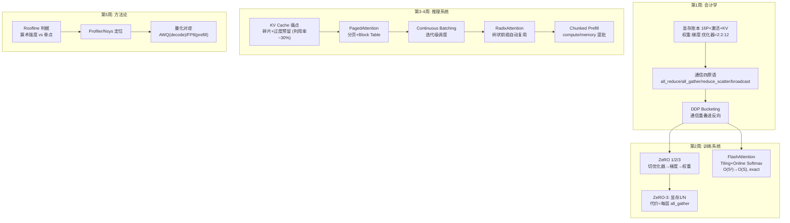

# 阶段八自测验收与复盘

> **使用方法**：先遮住参考答案自答学习计划的四项终极自测，再对照打分。本阶段是系统与基础设施主题——达成标准是**公式能算、机理能讲、数据能出**。

---

## 1. 自测一：13B 模型的显存推导

**题目**：一个 13B 的全精度（FP16）大模型，采用 AdamW 优化器，只算权重、梯度和优化器状态，至少需要多少 GB 显存？

### 参考推导（逐项 + 合计）

| 项 | 公式 | 13B 结果 |
| --- | --- | --- |
| 权重（FP16/BF16） | $2P = 2 \times 13 \times 10^9$ B | **26 GB** |
| 梯度（FP16） | $2P$ | **26 GB** |
| 优化器状态：FP32 主权重备份 | $4P$ | 52 GB |
| 优化器状态：FP32 动量 $m, v$ | $8P$ | 104 GB |
| **合计** | $16P$ 字节/参数 | **208 GB** |

即 $13 \times 16 = 208$GB——与学习计划达成标准的数字完全一致（权重 26 + 梯度 26 + 优化器 156 = 208）。

**三个必须附带的口径说明**（区分"背数字"与"懂账本"）：

1. 这**不含激活显存**（batch × seq × 层 × 隐维的函数，第 1 周 1.2 节），实际训练还要加上它；
2. "FP32 备份"指混合精度训练中优化器持有的 FP32 主权重——更新在 FP32 域进行，故动量与主权重都是 FP32（$4+4+4=12$ 字节/参数）；
3. 若优化器用 8-bit 状态（bitsandbytes）或 ZeRO 切分，账本相应变化——**报数字必报口径**。

---

## 2. 自测二：ZeRO-2 与 ZeRO-3 的核心差异

**题目**：DeepSpeed ZeRO-2 与 ZeRO-3 的核心差异是什么？为什么 ZeRO-3 会带来额外的通信开销？

### 参考答案

**切分范围**：

- **ZeRO-2**：切优化器状态 + 梯度，**权重每卡保留全量**。每卡状态 ≈ $2P + 14P/N_d$；
- **ZeRO-3**：优化器 + 梯度 + **权重**全部切分，每卡状态 = $16P/N_d$。

**ZeRO-3 额外通信的机制**（达成标准原文）：权重被切分后，**每次前向与反向计算每个层时，该层的完整参数都不在本卡上，必须发起 `all_gather` 通信把参数片临时拼齐**，用完即释放，反向重复一遍——每层每步多出前向一次 + 反向一次的参数 all-gather（Stage 8 第 2 周 1.2 节的 $6P$ vs DDP $2P$ 的 3 倍通信推导）。

**对比表述模板**："ZeRO-2 用 reduce-scatter 替代 DDP 的 all-reduce，省显存（梯度不驻留）而总通信量与 DDP 同量级；ZeRO-3 进一步切权重，把'通信'从只同步梯度升级为每层计算前后都要聚合参数——显存下限降到 1/N，代价是参数级 all-gather（可被分层预取与计算重叠部分掩盖，快互联上近乎免费、慢互联上不可用）。"

---

## 3. 自测三：PagedAttention 解决的核心问题

**题目**：vLLM 的 PagedAttention 解决了传统 KV Cache 的什么核心问题？

### 参考答案

**核心问题：KV Cache 的静态连续预分配导致的显存碎片与浪费**。传统实现为每个请求按 max_length 预分配一整块连续显存，三处浪费（vLLM SOSP 2023 论文口径）：预留未用（内部碎片，生成远短于 max_length 时）、过度保守预留、以及连续分配要求产生的外部碎片——**实测有效利用率常仅 20~40%**。后果：同样的显存装不下多少并发请求，batch 上限被人为压低。

**PagedAttention 的方案**：借鉴 OS 虚拟内存——KV Cache 切成固定大小物理 Block（如 16 Token/块），请求持有 Block Table（逻辑块→物理块映射），**按需分配、物理上不必连续**；块内碎片 <4%；同前缀请求可共享物理块（Copy-on-Write）；显存紧张时块可换出。

**完整表述模板**："PagedAttention 解决了静态预分配导致的内存碎片（内部+外部）与过度预留浪费，把 KV Cache 有效利用率从 ~30% 提到 ~90%，使同显存可容纳的并发 batch 提升数倍——与 Continuous Batching（调度侧）互补，共同构成 vLLM 高吞吐的两大基石。"（顺带能讲 Block Table / 按需分页 / 前缀共享三件配套设计即为优秀。）

---

## 4. 自测四：训练环境 + 推理服务 + 性能报告

**题目**：能否独立配置 DeepSpeed 训练环境，并熟练使用 vLLM 或 SGLang 搭建高性能推理服务？能否用 Nsys/Profiler 定位瓶颈并产出数据报告？

### 验收物证清单

**训练侧**：

- [ ] DeepSpeed ZeRO-2/3 的 `ds_config.json`（关键注释：stage、prefetch、offload 决策理由）；
- [ ] 一次真实训练的显存瀑布实测（Stage 2/第 1 周脚本产物）+ FA2 开关对照数据（TFLOPS + 显存峰值 + 序列长度三要素）；
- [ ] 故障记录：至少一次 OOM/通信问题的定位与修复（带 Profiler/Nsys 证据）。

**推理侧**：

- [ ] vLLM/SGLang 服务部署配置（预算参数及选型理由）；
- [ ] 压测报告：QPS / TTFT(p50,p95) / ITL(p50,p95)，与基线对照；
- [ ] 前缀缓存场景的命中率与 prefill 缩减数据（若业务有共享前缀）。

**诊断方法论**：

- [ ] 一份 Chrome Trace 或 Nsys 时间线截图 + Top 3 CUDA Kernels；
- [ ]瓶颈归类判定（Compute/Memory-Bound）与判据（Roofline 或 kernel 构成分析）；
- [ ] 至少一个干预的对照实验（量化/融合/参数调整），量化收益与精度回归。

---

## 5. 阶段知识图谱复盘

**五个必须能脱口而出的数字及其来历**：

1. **16 字节/参数** = bf16 权重 2 + 梯度 2 + AdamW fp32（m+v+主权重）12——13B→208GB 的来源；
2. **$16P/N_d$** = ZeRO-3 每卡模型状态——以及它的代价（每层 all-gather）；
3. **$O(S^2) \to O(S)$** = FlashAttention 的显存变化，且是 **exact** attention（非近似）；
4. **20~40%** = 传统 KV Cache 管理的有效利用率（vLLM 论文口径）——PagedAttention 攻击的靶心；
5. **$I^* = P_{\text{compute}}/P_{bw}$** ≈ 156（A100 bf16）= Roofline 脊点——decode GEMV（强度≈2）与 prefill GEMM 分居两侧，决定量化收益的分布。

---

## 6. 综合思考题（进入 Stage 9 前的终极检验）

1. **全链路显存审计**：一个"Qwen2-VL-7B + ZeRO-3（8×A100）+ GRPO"训练任务，估算训练态与 rollout 态各自的每卡显存构成（权重分片 / 优化器分片 / 梯度 / 激活 / KV Cache / 视觉编码器峰值），并回答：为什么 RL 训练的显存管理比 SFT 难一个量级？（提示：两态共享 GPU 但显存构成完全不同——第 7 周失效 1 的系统性展开；verl 的 `gpu_memory_utilization` 旋钮就是这道题的工程出口。）
2. **引擎选型报告**：业务是"多轮 VLM 文档助手"（每轮带同一文档图 + 追问，平均 6 轮，日均 5 万次会话）。给出引擎选型（vLLM/SGLang）、关键配置（前缀缓存/分辨率上限/并发）、预估的 prefill 节省比例与显存预算，并设计验收压测。（检查点：文档图视觉 Token 进前缀共享、轮次路径在 Radix 树上延伸、成本折算成 GPU 时。）
3. **系统工程师的成长陈述**：回顾 Stage 1→8，写一篇 800 字短文《从算法到系统：我理解的大模型工程》，要求至少串起五个跨阶段的技术复用（例：显存账本贯穿 2/7/8 三个阶段、验证器思维贯穿 3/4/7、评测协议贯穿 3/5/6/8……）。这份陈述是进入具身智能（Stage 9）前的自我盘点——Stage 9 会把所有系统技能放到"物理世界延迟与噪声"的新约束下。

---

## 7. 进入 Stage 9 的衔接预告

Stage 9（Multimodal Agent 规划、工具调用与闭环执行）把视角从"单次推理"扩展到"多步闭环"：

- 本阶段的延迟指标（TTFT/ITL）→ Agent 的**步间延迟预算**（多步工具调用的延迟复利）；
- 本阶段的吞吐成本核算 → Agent 的**每任务成本模型**（一条任务 = N 次模型调用 + M 次工具执行）；
- Stage 7 的轨迹/验证器 → Agent 的**过程评估与失败恢复**（RL 训练过的 Agent 在 Stage 9 变成产品）。

系统层的所有优化，在 Agent 场景会被"步数"放大——这就是为什么系统工程师的视角对具身/Agent 方向是刚需。带着你的诊断报告与选型决策进入 Stage 9。

---

*返回：[教程索引](README.md) ｜ 上一篇：[第 5 周：性能诊断 Profiling 与量化加速](第5周-Profiling与量化加速.md)*
