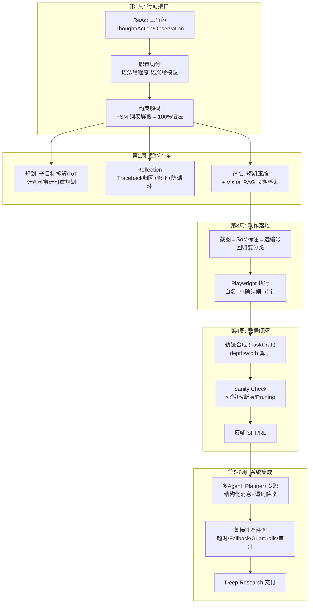

# 阶段九自测验收与复盘

> **使用方法**：先遮住参考答案自答学习计划的四项终极自测，再对照打分。本阶段达成的标志是**系统跑得通、失败说得清、数据拿得出**。

---

## 1. 自测一：ReAct 三角色的职责与数据格式

**题目**：ReAct 范式中的 Thought、Action、Observation 分别承担什么角色？它们在数据格式中如何分隔？

### 参考答案

**角色分工**：

- **Thought**：推理与决策层——分析当前状态、规划下一步为什么这么做。它是模型内部"思考"的外化，不产生副作用；
- **Action**：行动层——对工具的结构化调用指令（工具名 + 参数），**产生副作用**（执行代码/操作页面/查询 API）；
- **Observation**：环境反馈层——工具执行结果/报错/新截图，**由外部世界产生、注入上下文**，不是模型生成的。

**数据格式与流转**（要求能画出循环图）：

```text
Task → Thought₁ → Action₁ → Observation₁ → Thought₂ → Action₂ → ... → Final Answer
         ↑__________ 环境反馈驱动下一轮推理 ___________|
```

格式上以显式标记分隔（`Thought:` / `Action: {json}` / `Observation:`），分隔的工程意义：① 训练时做 loss mask（Thought/Action 算监督、Observation 掩码——Stage 2/7 的规则）；② 运行时程序据此解析结构化 Action 并路由执行；③ 审计时轨迹可逐步回放。

**格式流转循环图**（文字版，画图时含"环境"与"程序解析器"两个外部组件）：

模型生成 Thought+Action → **程序**解析 Action 并路由到工具 → **环境**执行返回 Observation → 拼回上下文 → 模型生成下一个 Thought……

---

## 2. 自测二：约束解码的原理

**题目**：为什么做 Tool Use 时需要引入约束解码？其实现原理是什么？

### 参考答案

**为什么需要**：模型生成 JSON 是概率采样过程，语法错误（括号不闭合/枚举拼错/漏字段）只能被"降低"而不能被"消灭"——而工具调用链里，一个非法 JSON 就是一次失败的工具执行，Agent 的长程任务成功率是各步成功率的乘积，对单步合法性极度敏感。prompt 工程与微调都只能改善采样分布，**无法提供确定性保证**。

**实现原理**（达成标准原文的展开）：把 JSON Schema/语法编译为**语法状态机（FSM/CFG）**，解码的每一步根据当前状态机状态计算"语法允许的 Token 集合" $\mathcal{A}(s)$，**采样前把词表中不在 $\mathcal{A}(s)$ 内的 Token 的 logits 置为 $-\infty$**（屏蔽），使非法 Token 概率严格为零——非法输出在结构上不可能产生。工程配套：FSM 与词表的预编译对齐、并行请求的状态缓存。

**边界声明**（区分度）：约束解码保证**语法**100%，不保证**语义**（参数值幻觉、错误枚举选择依旧可能）——"语法给约束引擎、结构给 Schema 校验、语义给模型能力与验证器"三道闸分层。

---

## 3. 自测三：Set-of-Mark 的原理

**题目**：什么是 Set-of-Mark（SoM）提示工程？它如何提升 VLM 在屏幕点击任务上的准确率？

### 参考答案

**定义**：SoM 在截图上用程序**自动叠加可视化的编号标记**（每个可交互元素画框 + 数字角标），把屏幕变成一张"带选项标签的图"，然后让 VLM 输出"目标元素的编号"而非预测坐标。

**为什么提升准确率**（两层机制）：

1. **任务难度坍缩：连续回归 → 离散选择**。直接预测 (x,y) 要求模型在连续空间做像素级精确回归（受限于视觉 Token 的 patch 粒度，Stage 1/3 已证其弱）；选编号是离散指认任务，$\log_2 N$ 比特的分类决策——这是 VLM 语义能力的主场；
2. **感知显式化**：编号标记是画在图上的视觉锚点，替模型完成了"关注点定位"——模型只需判断"哪个编号对应语义目标"，空间感知被外包给标记；
3. **精度兜底**：编号对应的点击坐标由程序提供（DOM 几何/OmniParser），**点击的像素精度与模型解耦**——模型负责"选对"，程序负责"点准"。

**失效面**（加分项）：标记过密遮挡/重叠；标记基于旧截图导致过期（须原子化"截图→标注→决策→执行"）；SoM 解决定位不解决语义理解（"哪个是搜索框"仍靠模型）。

---

## 4. 自测四：为什么必须做 Trajectory Pruning

**题目**：在构建 Agent 训练轨迹数据时，为什么必须做 Trajectory Pruning（轨迹剪枝）？

### 参考答案

**机制**：SFT 是**全过程行为克隆**——模型模仿的不只是最终答案，还有每一步的动作节奏与风格。若训练轨迹包含大量试错步骤：

1. **低效试错被固化为行为先验**：模型学会"先随便调用、失败了再说"——推理时行为冗长、成功率被无意义动作稀释；
2. **死循环被当标准动作**：混入的循环轨迹使模型在部署期遇到相似状态时复现循环（服务不可用的直接来源）；
3. **监督信号被稀释**：冗余步占据序列长度，有效监督（关键决策步）的梯度占比下降。

**剪枝的本质**：从成功轨迹中提取"最短充分路径"作为正样本——每一步都对结果有贡献、每一步都有依据。配套要求：① 只有成功轨迹可剪；② 有状态环境的动作标记 essential 不可剪（Stage 9 第 4 周失效 1：剪掉登录步会破坏后续前置条件）；③ 保留少量"失败+反思+恢复"轨迹作纠错示范池（全直线轨迹会让模型遇错卡死）。

---

## 5. 阶段知识图谱复盘



**五个必须能脱口而出的数字及其来历**：

1. **100%** = 约束解码的语法合法率（FSM 词表屏蔽的结构保证）——但仅限语法，语义另说；
2. **3~5 个工具** = 单 Agent 工具面的健康上限（决策空间爆炸的临界区）；
3. **2 次** = 反思重试的防循环上限（同方案失败两次即升级策略）；
4. **≥5 步** = GUI Agent 的验收链长（学习计划 MVP 口径，对应多步依赖的真实场景）；
5. **10 步 → 4 步** = 学习计划 Pruning 的示例压缩比——SFT 学直线、RL 管探索的分工依据。

---

## 6. 综合思考题（进入 Stage 10 前的终极检验）

1. **端到端故障归因**：你的 GUI Agent 在 100 个任务上成功率 60%，失败样本分布：35% 点错位置、25% 死循环、20% 幻觉元素（点了不存在的按钮）、20% 任务本身不可行。给出每一类的归因与对应的技术干预（限选：SoM 改造/Reflection/约束解码/任务可行性预判/训练侧补数据），并说明干预的优先级排序逻辑。（提示：先修"出现频率 × 修复成本"性价比最高的；点错位置 → SoM/解析器升级；死循环 → 程序闸 + 反思；幻觉元素 → 元素校验（点前查 DOM 存在）+ 训练数据补负例。）
2. **可靠性工程的设计推演**：把这个 Agent 从 demo 变成"日活 1 万次"的产品，列出可靠性工程清单——从 Stage 8 的视角（延迟/吞吐/成本）与 Stage 9 的视角（成功率/审计/恢复）各写三条最关键的工程要求。（检查点：步间延迟复利、每任务成本模型、断点恢复粒度、审计合规——两个 Stage 的知识在这里汇合。）
3. **Stage 1→9 的能力拼图**：VLM Agent 的每项核心能力都能追溯到前面某个阶段的训练/评测技术。填一张映射表：{GUI Grounding ← ?、工具调用可靠性 ← ?、长任务规划 ← ?、抑幻 ← ?}，并指出哪一项是"纯 prompt/工程手段覆盖不了、必须训练侧解决"的——你的答案决定了进入 Stage 10 后的补强方向。

---

## 7. 进入 Stage 10 的衔接预告

Stage 10（VLA 与具身智能）把 Agent 的"数字世界闭环"推到"物理世界闭环"，本阶段全部概念将被物理约束重塑：

- 动作空间从 `{click(x,y), type(text)}` 变成**连续控制量**（机械臂关节角/末端位姿）——离散选择范式（SoM）失效，Stage 7 的 RL 与 Stage 8 的实时性要求成为主角；
- Observation 从截图变成**传感器流**（相机/力矩/本体感知）——Stage 1 的视觉编码 + Stage 8 的延迟预算共同决定闭环频率；
- 环境反馈的代价从"重试一次"变成**真实世界的失败成本**（Sim-to-Real 差距、安全约束）——Stage 3 的评测严谨性与 Stage 4 的验证器思维是唯一防线。

带着第 6 节三道题的答案与一个跑通的 Agent 系统进入 Stage 10——你已经具备把智能接到执行器上的全部软件素养，剩下的硬骨头是物理世界。

---

*返回：[教程索引](README.md) ｜ 上一篇：[第 5-6 周：端到端 Multimodal Agent 系统集成](第5-6周-多Agent系统集成实战.md)*
