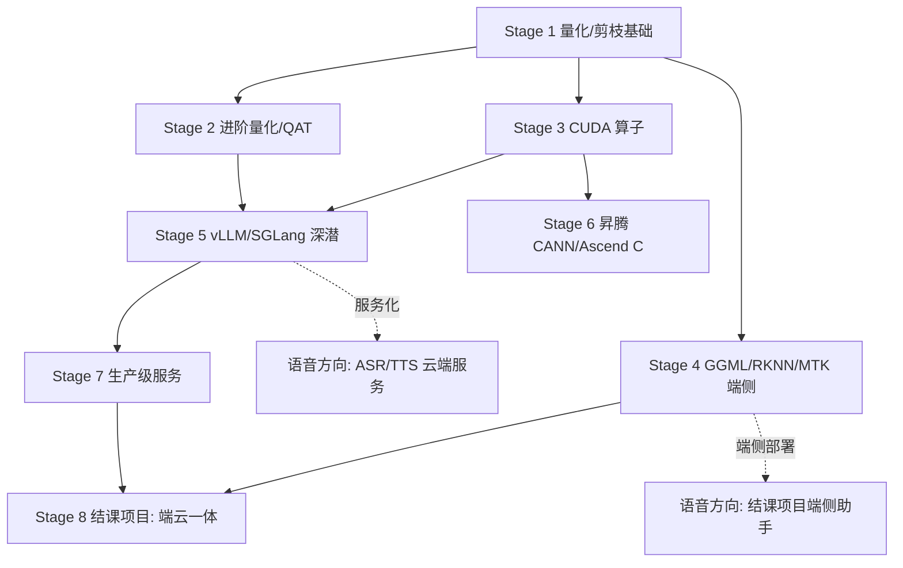

# 模型性能优化学习路线总览

> 结构参考「VLM & VLA」：每个 Stage 一个目录，内含《学习计划》（逐周路线 + 每周 MVP + 自测验收表 + 面试高频问题）。教程目录待需要时再建。

## 学习者画像（制定计划时的关键约束）

- **前置知识**：假设已掌握 VLM & VLA Stage 8 的内容（显存/ZeRO/FlashAttention/vLLM/SGLang/量化概览），本方向直接从算法细节与动手层切入
- **编程水平**：Python 为主，C++ 只能读懂，没写过 CUDA → Stage 3 刻意安排爬坡路径
- **算力**：无本地 GPU，训练/压测全部上云（预算无上限）
- **硬件**：华为 310P/Atlas 200I（推理）、RK3588/RK3576、MTK 板、x86 机器
- **目标**：端侧/云端推理全栈能力 + 求职面试储备

## 路线总览（8 个 Stage，约 48-56 周）

| Stage | 主题 | 周数 | 核心交付 |
| --- | --- | --- | --- |
| [Stage 1](Stage%201-剪枝与量化基础实战/学习计划.md) | 剪枝与量化基础实战 | 6 | 手写量化器 + PTQ 管线 + Wanda 剪枝 + 蒸馏，压缩评测基线 |
| [Stage 2](Stage%202-大模型进阶量化与%20QAT/学习计划.md) | 进阶量化与 QAT | 6 | GPTQ/AWQ/SmoothQuant/FP8/NF4/OmniQuant 七方案大横评 |
| [Stage 3](Stage%203-CUDA%20与算子优化入门到实战/学习计划.md) | CUDA 与算子优化 | 6 | 手写 5 个 CUDA kernel + Triton 三连 + FlashAttention 拆解 |
| [Stage 4](Stage%204-GGML-llama.cpp%20与端侧推理/学习计划.md) | GGML/llama.cpp + RKNN/MTK 端侧 | 6 | GGUF 解剖 + RK3588/MTK 双板部署 + 自定义算子 + 四平台选型报告 |
| [Stage 5](Stage%205-vLLM%20与%20SGLang%20推理引擎深潜/学习计划.md) | vLLM/SGLang 引擎深潜 | 6 | 调度器源码 + 投机解码 + 单引擎调优手册 |
| [Stage 6](Stage%206-昇腾%20CANN%20与算子开发/学习计划.md) | 昇腾 CANN + Ascend C 算子 | 8 | 310P 部署 + 910B 迁移 + 手写两个 Ascend C 算子 |
| [Stage 7](Stage%207-生产级推理服务与自动扩缩/学习计划.md) | 生产级服务与自动扩缩 | 6 | Ray Serve + Kind 模拟 K8s 集群 + 扩缩演练 + 设计文档 |
| [Stage 8](Stage%208-结课项目-端云一体推理引擎/学习计划.md) | **结课项目：端云一体推理引擎** | 6-8 | 端侧 + 云端 + 智能路由级联，与语音结课项目合成完整系统 |

## 技能依赖图

## 与「语音方向」的接口

1. **端侧部署联动**：语音方向的 SenseVoice/DeepFilterNet 等模型是 Stage 4（RKNN/MTK）的实战素材。
2. **端侧助手的脑**：语音结课项目的端侧 LLM 使用本方向 Stage 4-5 的量化部署成果。
3. **云端服务联动**：Stage 7 的编排架构直接承载语音方向的 ASR/TTS/Omni 云端服务。
4. **两个结课项目合并** = 完整的「端云协同语音+LLM 系统」，即旗舰作品集。

## 执行约定

- 执行顺序：先学完语音方向，再开始本方向。
- 每个 Stage 约 6 周（Stage 6 昇腾为 8 周，难度最高的阶段）。
- 每个 Stage 末尾自测清单全部通过才进入下一 Stage；「面试高频问题」列学完即入题库。
- 云上实验养成「用完即释放」的习惯：写实验脚本 + 记录实例用量。
