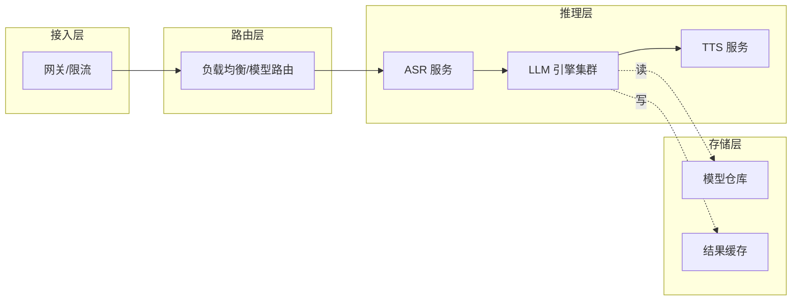

# 第 5-6 周教程：成本治理与部署设计文档复盘

> **本周要回答的三个问题**
> 1. GPU 推理的成本结构是什么？降本三板斧各自的量化收益怎么算？
> 2. 如何把前四周的成果（容量规划、编排、扩缩、可观测性）焊成一份完整的设计文档？
> 3. 这份文档如何变成架构面试的答卷——面试官想从每一节看到什么？

对应学习计划：第 5-6 周。交付物：《生产级语音+LLM 推理服务设计文档》——四层架构图 + 容量规划表 + 扩缩策略 + 可观测性方案 + 成本估算，全部基于模拟环境实证；附"真实多机与模拟环境差异清单"。这是本 Stage 的总交付，也是架构面试主答卷。

---

## 1. 第一性原理：推理成本 = 算力 × 时长，降本就是压这两项

### 1.1 成本模型

$$
\text{成本} = \text{实例数} \times \text{单卡时价} \times \text{运行时长}
$$

降本的三个方向对应三个乘数：**量化降显存 → 同负载少实例**；**提单卡并发 → 单实例多干活**；**潮汐扩缩 → 不闲时也烧钱变按需烧**。这就是"降本三板斧"。

### 1.2 三板斧的量化算法（交付核心）

**斧一：量化降显存 → 省实例**

```
原：7B FP16 权重 14 GB，单卡 A100-40G 放 1 实例（留 KV 空间）
量化后：W4 权重 3.5 GB，同卡可放 2 实例或开更大并发
实例数：N → N/2，成本约 -50%
代价：精度损失（需验证，见 Stage 2）
```

**斧二：提单卡并发 → 少实例**

```
原：单实例并发 32
优化后（KV 量化/调优）：并发 64
同负载所需实例减半
```

**斧三：潮汐扩缩 → 按负载付费**

```
负载曲线：白天 100%、夜间 20%
无扩缩：24h 按峰值实例计费
有扩缩：夜间缩到 20% 实例
节省 ≈ 峰谷差 × 低谷时长占比
例：夜间 12h 缩到 30%，节省 ≈ (1-0.3) × 0.5 ≈ 35%
```

### 1.3 综合估算表（交付）

```
| 手段 | 措施 | 成本变化 | 精度/风险 |
| 量化 | FP16→W4 | -50% 实例 | 需精度验证 |
| 并发 | KV FP8 | -30% 实例 | 小 |
| 扩缩 | 夜间缩容 | -35% 时长费 | 冷启动延迟 |
| 综合 | | 估算总省 __% | |
```

把每格的数字用你的实测/推算填实——**成本结论必须有数字支撑**，这是面试可信度的关键。

### 1.4 GPU 计费模式

- **按量计费**：按秒/小时，灵活但单价高——适合潮汐扩缩的弹性部分；
- **抢占式实例（Spot）**：便宜 60-80%，但可能被回收——适合可中断的离线批处理；
- **包年包月/预留**：折扣大——适合稳定的基线负载。

**组合策略**：基线用预留、弹性用按量、离线用 Spot——三层叠加成本最优。

---

## 2. 设计文档：把五周成果焊成一份（交付总纲）

### 2.1 文档结构（对应面试叙事结构）

```
《生产级语音+LLM 推理服务设计文档》
1. 背景与目标
   - 业务：端云协同语音助手（联动语音方向）
   - 目标：承载 ASR/TTS/LLM 云端 serving，满足延迟 SLO
2. 总体架构（四层图）
3. 容量规划（第 1 周计算书）
4. 编排与部署（第 2 周 Ray Serve / 第 3 周 K8s）
5. 扩缩策略（HPA/KEDA 选择与阈值）
6. 可观测性（第 4 周大盘 + 告警 + 追踪）
7. 成本估算（本周三板斧）
8. 模拟与真实差异清单
9. 风险与演进路线
```

### 2.2 架构图（Mermaid，文档核心图）



### 2.3 每节面试官想看什么

| 节 | 面试官的考点 | 你要展示的 |
| --- | --- | --- |
| 容量规划 | 会不会从业务量推资源 | 换算链 + 假设透明 |
| 扩缩策略 | 懂不懂负载特性 | 队列驱动的理由 |
| 可观测性 | 出事了能不能定位 | 分位数指标 + 追踪 |
| 成本 | 有没有工程经济意识 | 三板斧量化 |
| 差异清单 | 诚不诚实、清不清醒 | 明确模拟边界 |

**第 8 节"差异清单"尤其重要**：主动声明模拟局限，比假装做过真实压测更可信。

---

## 3. 真实多机与模拟环境差异清单（交付）

```
| 维度 | 模拟（Kind 单机）能验证 | 真实多机才有 |
| 网络延迟 | 本机网络栈（≈0） | 真实跨机网络（影响 KV 传输/PD分离） |
| 故障域 | 进程级 | 节点宕机、机架故障 |
| GPU 调度 | 无（CPU 模拟） | 真实 device plugin、拓扑 |
| 容量 | 不可外推 | 真实压测数字 |
| 存储 | 本地 | 分布式模型仓库 |
```

---

## 4. 与语音方向的整合（交付加分）

把语音云端服务纳入同一架构：

```
语音请求 → 接入层 → 路由
    ├─ ASR 服务（SenseVoice 云端版）
    ├─ LLM 服务（共享引擎集群）
    └─ TTS 服务（CosyVoice 流式）
```

**共享底座**：ASR/LLM/TTS 跑在同一个编排层，各自独立扩缩。这体现你"两个方向焊成一个系统"的能力——正是结课项目（Stage 8）的预演。

---

## 5. 工程权衡与失效模式

### 5.1 权衡

- **量化激进程度**：省得多但精度风险大，按业务容忍度定；
- **扩缩灵敏度**：灵敏省钱但冷启动影响体验；
- **文档详略**：全则长，面试讲重点；写全、讲精。

### 5.2 失效模式

1. **成本估算拍脑袋**：没数字支撑的"能省很多"。修复：每步换算可复现。
2. **忽略精度代价**：只算量化省钱、不算精度损失的业务代价。修复：成本与精度一起评估。
3. **模拟当真实**：把 Kind 数据写进容量结论。修复：明确标注 + 差异清单。
4. **文档无风险节**：只讲方案不讲风险。修复：加风险与演进路线，展示全局观。

---

## 6. 延伸思考题（含解析）

**Q1**：推理成本怎么砍？说出三板斧及各自量级。
**A**：① 量化降显存 → 同负载少实例（可省 ~50%）；② 提单卡并发（KV 量化/调优）→ 单实例多干活；③ 潮汐扩缩 → 低谷缩容省时长费（可省 ~30%）。每步要有量化依据与精度代价评估。

**Q2**：为什么基线用预留、弹性用按量、离线用 Spot？
**A**：基线负载稳定，预留折扣最大；弹性负载波动大，按量灵活不多付；离线可中断，Spot 最便宜但可能被回收。按负载特性匹配计费模式，总成本最优。

**Q3**：设计文档为什么要专门写"模拟与真实差异"？
**A**：诚实标注能力边界比夸大更可信。面试官通过这节判断你是否清醒知道模拟的局限、是否会在生产前补真实验证。这是工程成熟度的体现。

**Q4**：量化降本能省一半实例，为什么不无脑全上？
**A**：量化有精度损失，需逐业务验证可接受；某些场景（高精度要求）不能量化；且量化模型与引擎的匹配、运维复杂度也是成本。收益必须与精度/复杂度代价一起权衡。

**Q5**：这份文档在面试里怎么用？
**A**：按"目标→架构→容量→扩缩→可观测→成本→风险"讲，每节突出一个决策与依据；用差异清单主动展示边界意识；把语音整合体现跨方向系统能力。控制在 10-15 分钟主线，细节留追问。

---

## 本周交付清单

- [ ] 完成降本三板斧量化估算表（每格有数字依据）。
- [ ] 确定计费组合策略（预留+按量+Spot）。
- [ ] 产出完整《设计文档》（9 节结构 + 架构图）。
- [ ] 附"模拟与真实差异清单"。
- [ ] 整合语音云端服务进同一架构。
- [ ] 准备 10-15 分钟面试讲述主线。

## Stage 7 总结

完成本阶段，你已能：

1. **规划**：从业务量推容量，用排队论定余量；
2. **编排**：Ray Serve 推理图 + Kind 模拟 K8s 集群 + 扩缩演练；
3. **治理**：推理专属指标大盘 + 告警 + 分布式追踪 + 故障演练；
4. **经营**：降本三板斧量化 + 计费组合。

最终产出《生产级推理服务设计文档》。对照自测清单核验后，进入 **Stage 8：结课项目——端云一体推理引擎**。
