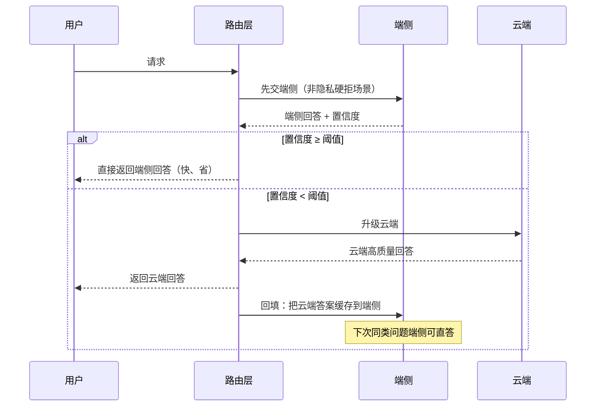

# 第 1-2 周教程：端云协同架构设计与分流策略

> **本周要回答的三个问题**
> 1. 一个请求进来，路由层凭什么决定"留端侧"还是"上云端"？四象限怎么落到可执行规则？
> 2. 端侧模型和云端模型能力不同，怎么保证用户感知的回答"一致"？
> 3. 级联推理（端侧答不好→云端升级→结果回填）的完整时序是什么？哪里最容易出错？

对应学习计划：第 1-2 周。交付物：《端云一体推理引擎架构设计文档》——架构图 + 分流决策表（隐私/延迟/能力/负载四象限）+ 级联推理时序图 + 风险清单。这是架构面试主答卷。

---

## 1. 第一性原理：端云协同解决的三个矛盾

### 1.1 纯云端与纯端侧各自的短板

| | 纯云端 | 纯端侧 |
| --- | --- | --- |
| 隐私 | 数据出端 | ✅ 数据不出端 |
| 延迟 | 网络往返 | ✅ 本地低延迟 |
| 能力 | ✅ 大模型强 | 小模型弱 |
| 离线 | ❌ 断网即废 | ✅ 可用 |
| 成本 | 按量计费 | 一次性硬件 |

端云协同的目标：**把每个请求送到"最合适"的地方**——隐私/离线/简单请求留端侧，复杂/重载请求上云端。

### 1.2 路由层是灵魂

没有智能路由，端云只是两套孤立系统。路由层回答："这个请求给谁？"它的决策质量直接决定整个系统的体验与成本。

---

## 2. 四象限分流决策（本周交付核心一）

### 2.1 四个决策维度

| 维度 | 判定 | 端侧 | 云端 |
| --- | --- | --- | --- |
| **隐私** | 数据能否出端 | 敏感（医疗/金融/个人对话） | 脱敏/公开内容 |
| **延迟** | 能否容忍网络往返 | 实时交互、弱网 | 可等待的批处理 |
| **能力** | 端侧模型答得了吗 | 简单问答、本地控制 | 复杂推理、长文、知识密集 |
| **负载** | 云端排队了吗 | 云端过载时兜底 | 正常时承载重载 |

### 2.2 决策逻辑（可执行规则）

```
路由决策（按优先级短路）：
1. 隐私标记 = 敏感            → 端侧（强制，不升级）
2. 云端不可达 / 断网           → 端侧（兜底）
3. 请求复杂度评估 > 端侧能力    → 云端
4. 云端队列长度 > 阈值          → 端侧兜底（降级）
5. 其余                       → 端侧先试（级联起点）
```

**关键点**：
- 隐私是**硬约束**（一票否决，绝不上传）；
- 能力是**主判据**（端侧答不了的必须上云）；
- 负载是**调节阀**（过载时牺牲质量保可用）。

### 2.3 复杂度评估怎么做

路由层需要一个轻量的"请求难度"估计：
- **启发式**：输入长度、是否需要联网知识、问题类型分类；
- **小分类器**：训练一个轻量模型预测"端侧能否胜任"；
- **端侧置信度反馈**：端侧先答，置信度低再升级（级联模式，见下节）。

---

## 3. 一致性设计（本周交付核心二）

### 3.1 问题：端云模型不同，回答会不一致

端侧跑 1.5B/3B 量化模型，云端跑 7B——同一问题可能给出不同甚至矛盾的回答。用户来回切换会困惑。

### 3.2 三个对齐手段

1. **量化精度对齐**：端侧量化模型的输出质量尽量逼近云端（Stage 2 的量化评测保证）；
2. **回答风格对齐**：端云用同一套 system prompt / 输出格式约束，风格一致；
3. **会话状态同步**：多轮对话的上下文在端云间同步，避免"换端后失忆"。

### 3.3 会话状态同步设计

```
会话状态存哪：
- 端侧本地（快、但切云端要同步）
- 云端集中（一致、但离线丢）
→ 折中：端侧为主，上云时同步上下文摘要
```

用 **Redis** 存会话状态，端云都读写同一份（端侧离线时用本地缓存，联网后补同步）。

---

## 4. 级联推理闭环（本周交付核心三）

### 4.1 时序图



### 4.2 级联的价值与难点

**价值**：
- 端侧答得好的请求不花云端钱（省钱）；
- 答不好的自动升级保质量（体验）；
- 云端答案回填端侧缓存，**同类问题下次端侧直答**——这是一个**知识蒸馏闭环**，端侧能力随使用增长。

**难点（易错点）**：
1. **置信度阈值**：太高 → 频繁上云（费钱）；太低 → 端侧硬答差答案（伤体验）。需用验证集标定；
2. **回填的正确性**：缓存键怎么设计（问题归一化），避免缓存错误答案；
3. **升级延迟**：端侧已花时间再上云，总延迟 = 端侧 + 云端。要设端侧超时（如 500ms 未出或低置信就立即升级）。

---

## 5. 降级与容灾

| 故障 | 策略 |
| --- | --- |
| 云端不可达 | 端侧兜底全部请求（质量降级但可用） |
| 断网重连 | 离线期间请求排队/缓存，重连后补同步 |
| 请求重复 | 用请求 ID 去重（级联升级时别重复计费） |
| 端侧故障 | 切纯云端模式 |

---

## 6. 交付：架构设计文档

把以上整合成文档（面试主答卷）：

```
《端云一体推理引擎架构设计文档》
1. 目标与场景（端云协同解决什么）
2. 总体架构图（端侧集群/云端集群/路由层/状态同步）
3. 分流决策表（四象限 + 决策伪代码）
4. 一致性设计（量化/风格/会话同步）
5. 级联推理时序图 + 置信度阈值标定方法
6. 降级与容灾
7. 风险清单
```

**风险清单示例**（主动暴露，面试加分）：
- 置信度估计不准 → 分流错误；
- 端云能力差距大 → 一致性难保；
- 回填缓存污染；
- 网络抖动导致级联超时。

---

## 7. 工程权衡与失效模式

### 7.1 权衡

- **分流激进度**：多留端侧省钱但质量风险，多上云保质量但贵；
- **级联深度**：端侧先试多一次往返延迟，直上云少一次但费钱；
- **缓存回填**：填了提速，但错误缓存有害。

### 7.2 失效模式

1. **隐私请求误上云**：分流逻辑漏判敏感数据。修复：隐私检测前置 + 端侧强制兜底 + 审计日志。
2. **置信度阈值失配**：分流错误率高。修复：用标注集标定阈值、上线后按反馈调整。
3. **级联双重延迟**：端侧慢 + 又上云，总延迟超 SLO。修复：端侧设短超时，快速升级。
4. **会话失忆**：端云切换后上下文丢。修复：统一会话存储 + 切换时同步。

---

## 8. 延伸思考题（含解析）

**Q1**：什么请求该留在端侧？
**A**：① 隐私敏感（硬约束，绝不上传）；② 简单、端侧能力内；③ 实时交互/弱网（延迟敏感）；④ 云端过载时的兜底。核心是"隐私一票否决 + 能力够就留端"。

**Q2**：端云回答不一致怎么办？
**A**：三层对齐：① 端侧量化质量逼近云端（量化评测把关）；② 统一 system prompt/输出格式保风格一致；③ 会话状态同步保多轮连贯。无法完全一致时，能力不足的问题直接路由云端，不让端侧硬答。

**Q3**：级联的置信度阈值怎么定？
**A**：用带标注的验证集标定：扫描阈值，找"端侧准确率达标（如 ≥90%）时的最高阈值"——既尽量留端侧省钱，又不让差答案流出。上线后按用户反馈/抽检持续调整。

**Q4**：级联推理相比直接路由，多了什么好处和代价？
**A**：好处：端侧能答的不花钱、答不好自动保质量、回填让端侧越用越强。代价：低置信请求有双重延迟（端侧+云端），需设端侧超时快速升级。

**Q5**：这套架构的商业价值在哪？
**A**：① 成本：简单请求留端侧，云端调用费大幅下降；② 体验：隐私本地、低延迟、离线可用；③ 差异化：端云协同 + 越用越强的蒸馏闭环是竞争壁垒。用对比报告量化成本节省。

---

## 本周交付清单

- [ ] 画总体架构图（端侧/云端/路由/状态同步四块）。
- [ ] 完成四象限分流决策表 + 决策伪代码。
- [ ] 画级联推理时序图，标注置信度分支与回填。
- [ ] 设计一致性方案（量化/风格/会话同步）。
- [ ] 列出风险清单（含置信度失配、缓存污染等）。
- [ ] 产出完整《架构设计文档》。
