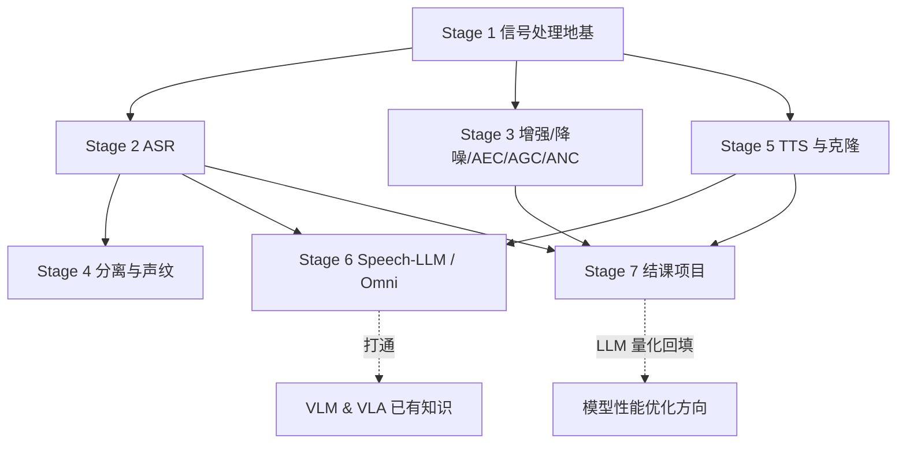

# 语音方向学习路线总览

> 结构参考「VLM & VLA」：每个 Stage 一个目录，内含《学习计划》（逐周路线 + 每周 MVP + 自测验收表 + 面试高频问题）。教程目录待需要时再建。

## 学习者画像（制定计划时的关键约束）

- **音频基础**：零基础 → Stage 1 地基不可跳过
- **算力**：无本地 GPU，训练/微调全部上云（预算无上限，按小时租用）
- **硬件**：华为 310P/Atlas 200I（推理）、RK3588/RK3576、MTK 板、x86 机器
- **目标**：端侧离线语音助手 + 云端语音服务 + Omni 多模态打通 VLM 知识 + 求职面试储备

## 路线总览（7 个 Stage，约 40-48 周）

| Stage | 主题 | 周数 | 核心交付 |
| --- | --- | --- | --- |
| [Stage 1](Stage%201-数字音频与信号处理基础/学习计划.md) | 数字音频与信号处理基础 | 4-6 | 手写 STFT / Mel 滤波器组 / 谱减法，建立全链路数值直觉 |
| [Stage 2](Stage%202-语音识别%20ASR/学习计划.md) | 语音识别 ASR | 6 | Whisper/SenseVoice/Paraformer 横评 + 云端 LoRA 微调 |
| [Stage 3](Stage%203-语音增强与前端信号处理/学习计划.md) | 增强 / 降噪 / AEC / AGC / ANC | 6 | DeepFilterNet + 手写 AEC/AGC/FXLMS + WebRTC APM 全链路 |
| [Stage 4](Stage%204-说话人分离与声纹识别/学习计划.md) | 说话人分离与声纹识别 | 6 | 会议转写系统：ASR + pyannote 分离 + 声纹库 |
| [Stage 5](Stage%205-语音生成与零样本克隆/学习计划.md) | 语音生成与零样本克隆 | 6-8 | CosyVoice 2 / F5-TTS / GPT-SoVITS 三路线横评 + TTS 微调 |
| [Stage 6](Stage%206-语音大模型与%20Omni%20多模态/学习计划.md) | Speech-LLM 与 Omni（打通 VLM 知识） | 6 | Qwen2.5-Omni/MiniCPM-o 拆解 + Speech SFT 微调 |
| [Stage 7](Stage%207-结课项目-端侧离线语音助手全链路/学习计划.md) | **结课项目：端侧离线语音助手** | 6-8 | RK3588 上全离线：前端 → ASR → LLM → TTS，端到端 < 1.5s |

## 技能依赖图

## 与「模型性能优化」方向的接口

1. **ASR/TTS 上板**：Stage 7 的模型量化与 NPU 部署依赖性能优化方向 Stage 4（RKNN）/ Stage 5（GGML）。
2. **端侧 LLM**：Stage 7 助手的语言模型使用性能优化方向 Stage 5-6 的端侧量化成果。
3. **Codec ↔ 量化**：Stage 6 的音频离散化（RVQ）与性能优化方向的量化理论互为镜像，面试联动题。

## 执行约定

- 每周弹性安排（无固定节奏），每个 Stage 约 6 周为参考值。
- 每个 Stage 末尾的自测清单全部通过才进入下一 Stage。
- 自测表的「面试高频问题」列是求职储备的直接素材，学完一个 Stage 就整理进面试题库。
