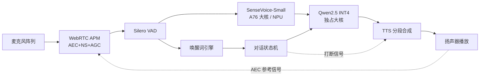

# 第 1-2 周教程：系统架构设计与延迟预算——1.5 秒是怎么切出来的

> **本周要回答的四个问题**
> 1. 端侧助手 1.5 s 总响应预算，50/100/200/500/300 ms 是怎么分给唤醒、VAD、ASR、LLM、TTS 的？
> 2. 为什么每个模块的选型在此刻就要冻结？各自的 fallback 是什么？
> 3. RK3588 的 4×A76 + 4×A55 + 6 TOPS NPU，任务怎么分配才不打架？
> 4. 模块之间的数据格式、队列与背压怎么定，才不会出现「一段慢全链慢」？

对应学习计划：第 1-2 周。交付物：《端侧语音助手系统设计文档》——模块图 + 数据流 + 延迟预算表 + 内存预算表 + 风险清单（每模块带 fallback）。

---

## 1. 第一性原理：延迟是加法，体验是乘法

### 1.1 用户感知模型

用户对语音助手的容忍度不是线性的：

- < 1 s：感觉「自然」；
- 1~1.5 s：可接受的「思考停顿」；
- \> 2 s：开始重复提问、拍打设备——**流失点**。

总响应延迟 = 从用户话音结束到首个音频包播出：

$$
T_{\text{total}} = T_{\text{wake}} + T_{\text{VAD}} + T_{\text{ASR}} + T_{\text{LLM,首token}} + T_{\text{TTS,首包}}
$$

五段**串行相加**（级联范式的代价，第 1 周教程算过）。预算表就是把这条加法链每一段钉死。

### 1.2 预算表（本阶段宪法，一切优化为之服务）

| 模块 | 预算 | 依据 | 实现路径 |
| --- | --- | --- | --- |
| 唤醒词检测 | ≤ 50 ms | 常驻、每 10~20 ms 帧增量判断 | 小型关键词模型（sherpa-onnx/picovoice），帧级推理 |
| VAD 端点判定 | ≤ 100 ms | 尾部静默判定窗 + 缓冲 | Silero VAD 10 ms 帧，静默阈值 300~500 ms 中取低值 |
| ASR 解码 | ≤ 200 ms | 短句（≤5 s）非自回归单步解码 | SenseVoice-Small（NAR），RTF < 0.1 |
| LLM 首 token | ≤ 500 ms | prefill 短句上下文 + INT4 | Qwen2.5-1.5B INT4，llama.cpp/rknn-llm |
| TTS 首包 | ≤ 300 ms | 首句分块合成、边生成边播 | 蒸馏小模型，流式/分段出声 |
| **合计** | **≤ 1150 ms** | 留 ~350 ms 余量给调度与抖动 | —— |

**注意两处设计意图**：① 预算之和 1.15 s 小于 1.5 s——余量给系统抖动（GC、调度、温度降频），预算表必须留余量，贴死必然破线；② VAD 的 100 ms 只是「判定动作」的开销，**用户停顿的 300~500 ms 静默等待不算在响应预算内**（那是轮次边界，不是系统慢）——面试必须讲清这个区分。

### 1.3 瓶颈定位：先算清谁最可能破线

两个高风险点提前标记：

- **LLM 500 ms**：prefill 时间与输入长度成正比（见第 5-6 周教程的 KV cache 计算），3B 比 1.5B 危险——先做 1.5B 保底；
- **TTS 300 ms**：整句合成必破线，必须分段（按标点切句，第一句先出声）。

---

## 2. 模块选型冻结与理由

**选型冻结原则**：每个模块在文档里写下「选它的理由 + 不选竞品的理由 + fallback」。冻结是为了停止横向比较、开始纵向打通——打通后如需换件，用实测数据说话。

| 模块 | 选定 | 理由 | 放弃项与原因 | fallback |
| --- | --- | --- | --- | --- |
| 前端 | WebRTC APM 裁剪版 + Silero VAD | 工业验证、可交叉编译到 ARM、你 Stage 3 已调过参 | RNNoise（无 AEC）、商用 SDK（闭源不可控） | SpeexDSP |
| ASR | SenseVoice-Small | NAR 延迟近恒定、中文强、你 Stage 2 已验证 | Whisper（AR 慢）、Paraformer（备选） | Paraformer-Small / sherpa-onnx zipformer 流式 |
| LLM | Qwen2.5-1.5B INT4 | 中文质量/体积比最优、GGUF/rknn 生态成熟 | 3B（破预算风险）、Omni 模型（算力不达标） | Qwen2.5-3B INT4（若 1.5B 质量不足） |
| TTS | 蒸馏小模型（ONNX） | 可控蒸馏到你需要的音色、边生成边播可行 | CosyVoice2-0.5B 原版（板端太重）、MeloTTS（音质下限备选） | MeloTTS |
| 唤醒 | sherpa-onnx keyword spotter | 与 ASR 同栈、省内存 | picovoice（闭源但成熟，双轨评估） | picovoice |

---

## 3. 系统架构与数据流

### 3.1 模块图与线程模型



线程分配（RK3588：4×A76 大核 + 4×A55 小核）：

| 线程 | 绑核 | 原因 |
| --- | --- | --- |
| 音频采集 + APM + VAD | A55 小核 | 实时性敏感但算力需求低，小核常驻省电 |
| 唤醒词 | A55 小核 | 同上，常驻 |
| ASR | A76 大核 / NPU | 突发计算，用完即让 |
| LLM | A76 大核（独占） | 长任务，绑核防迁移抖动 |
| TTS | A76 大核 / NPU | 与 LLM 错峰：LLM 出文本流时 TTS 并行合成下一句 |
| 播放 | A55 小核 | DMA 驱动，低负载 |

**NPU（6 TOPS）的角色**：先跑通 CPU 版（ONNX Runtime），RKNN 转换按性能优化方向进度回填——但设计文档里必须预留 NPU 位置，写清哪些算子当前不支持需回落 CPU。

### 3.2 接口数据格式（冻结）

| 接口 | 格式 | 说明 |
| --- | --- | --- |
| 麦克风 → APM | 16-bit PCM, 16 kHz, 单声道, 10 ms 帧（160 样本） | 全链路统一采样率，禁止中途重采样 |
| AEC 参考 | 与播放同格式的 10 ms 帧 | 从播放缓冲引出，时间戳对齐 |
| VAD → ASR | 带起止时间戳的音频段（ring buffer 回看 200 ms） | 保留「触发前」的音频，防截头 |
| ASR → LLM | UTF-8 文本 + 会话历史（最近 4 轮） | 历史截断防 prefill 膨胀 |
| LLM → TTS | 流式文本，按标点切句 | 第一句到齐即开播 |
| TTS → 播放 | 16/24 kHz PCM 块，带序列号 | 打断时按序列号丢弃 |

### 3.3 队列与背压

每对模块之间用**有界队列**（容量 2~4 块）：下游卡住时上游丢旧帧而不是无限堆积——音频数据的正确性随时间衰减，**宁可丢帧不可积压**。唯一的例外是 ASR 输入段：VAD 触发前的音频必须完整（200 ms ring buffer），丢了就截头。

---

## 4. 内存预算表（RK3588 常见 8 GB 配置）

| 组件 | 估算 | 计算依据 |
| --- | --- | --- |
| 系统 + 桌面关闭后基线 | ~0.8 GB | 实测 |
| SenseVoice-Small（ONNX/RKNN） | ~0.3 GB | ~234M 参数，INT8 |
| Qwen2.5-1.5B INT4 权重 | ~1.0 GB | 1.5B × 0.5 byte/参数 |
| KV cache（2048 上下文） | ~0.5 GB | 见下方公式与第 5-6 周推导 |
| TTS 小模型 + 音频缓冲 | ~0.4 GB | 蒸馏后 <100M 参数 + 播放缓冲 |
| 唤醒 + APM + VAD | ~0.1 GB | 小模型 |
| **合计** | **~3.1 GB** | 余量充足，4 GB 版板子需砍上下文 |

KV cache 估算公式（第 5-6 周会严格推导，此处先立预算）：

$$
M_{\text{KV}} \approx 2 \times n_{\text{layers}} \times n_{\text{kv\_heads}} \times d_{\text{head}} \times L \times \text{bytes}
$$

---

## 5. 实现与验证：预算计算器（可运行）

```python
LATENCY_BUDGET_MS = {"wake": 50, "vad": 100, "asr": 200, "llm_first_token": 500,
                     "tts_first_chunk": 300}
TOTAL_TARGET_MS = 1500
JITTER_RESERVE_MS = 350          # 抖动余量：调度/温度降频/队列排队

def check_budget(actuals: dict):
    """输入各模块实测延迟，检查总预算与余量。"""
    assert set(actuals) == set(LATENCY_BUDGET_MS), "埋点模块不全"
    for k, v in actuals.items():
        over = v - LATENCY_BUDGET_MS[k]
        print(f"{k:>16}: 实测 {v:6.0f} ms | 预算 {LATENCY_BUDGET_MS[k]:4d} ms | "
              f"{'超 ' + str(int(over)) + ' ms' if over > 0 else '达标'}")
        assert v <= LATENCY_BUDGET_MS[k] * 1.2, f"{k} 超预算 20% 以上，必须优化"
    total = sum(actuals.values())
    headroom = TOTAL_TARGET_MS - total
    print(f"总延迟 {total:.0f} ms，余量 {headroom:.0f} ms（需 ≥ {JITTER_RESERVE_MS}）")
    assert headroom >= JITTER_RESERVE_MS, "余量不足，收紧某模块预算"
    return total

# 示例：一组合理的首轮实测值（你将替换为板端真实数据）
mock = {"wake": 30, "vad": 90, "asr": 150, "llm_first_token": 420, "tts_first_chunk": 260}
total = check_budget(mock)
assert total < TOTAL_TARGET_MS
print("预算校验通过 ✓ —— 把实际测量值喂进这个函数，作为每周回归")
```

**预期输出**：五行模块报告 + 总延迟 950 ms、余量 550 ms，断言全过。**用法**：第 3-8 周每周把实测值喂进来一次，预算表从「设计值」逐步替换成「实测值」——这就是设计文档的活体维护方式。

### 5.2 全链路编排骨架（后续三周的地图）

预算表是「钱」，编排器是「花钱的顺序」。本周就定下主循环的状态流，后续每打通一段就往里填实现：

```python
import time
from dataclasses import dataclass, field

@dataclass
class LatencyTrace:
    marks: dict = field(default_factory=dict)
    def mark(self, name): self.marks[name] = time.perf_counter()
    def segment_ms(self, a, b): return (self.marks[b] - self.marks[a]) * 1000

def dialog_loop(capture, frontend, asr, llm, tts, speaker):
    """一次完整回合的编排骨架：唤醒后执行一轮听-想-说。"""
    tr = LatencyTrace()
    audio = capture.until_speech_end(frontend)     # 前端+VAD，产出干净语音段
    tr.mark("vad_endpoint")
    text = asr.transcribe(audio)                  # SenseVoice NAR 单步
    tr.mark("asr_done")
    reply_stream = llm.stream(text)               # 流式：边想边出字
    first_sentence = next_sentence(reply_stream)  # 按标点取第一句
    tr.mark("llm_first_sentence")
    pcm = tts.synthesize(first_sentence)          # 第一句先出声
    tr.mark("tts_first_chunk")
    speaker.play(pcm)                             # 后续句子双缓冲续播
    return tr

# 验收时每个 mark 对进预算表：
# vad_endpoint->asr_done ≤200ms, ->llm_first_sentence ≤500ms, ->tts_first_chunk ≤300ms
assert hasattr(LatencyTrace(), "marks")
print("编排骨架就绪 ✓ —— 第 3-4 周填 capture/frontend/asr，第 5-6 周填 llm/tts")
```

**要点**：`first_sentence` 这一步是「想」与「说」并行的铰链——LLM 还在想第二句时，扬声器已经在播第一句。第 5-6 周教程会把 `next_sentence` 与双缓冲写完整。

### 5.3 有界队列与背压：接口契约的最小实现

3.3 节的「有界、丢旧帧」纪律，用标准库 20 行落地——后续所有模块间通信都走它：

```python
import queue, threading

class AudioBlockQueue:
    """模块间音频块队列：有界、满时丢最旧块（实时数据积压即过期）。"""
    def __init__(self, capacity=3):
        self.q = queue.Queue(maxsize=capacity)
        self.dropped = 0

    def put(self, block):
        if self.q.full():
            try: self.q.get_nowait(); self.dropped += 1
            except queue.Empty: pass
        self.q.put_nowait(block)

    def get(self, timeout=1.0):
        return self.q.get(timeout=timeout)

aq = AudioBlockQueue(capacity=2)
for i in range(5):
    aq.put(f"block{i}")                    # 容量 2，丢 3 留最新 2
assert aq.q.qsize() == 2 and aq.dropped == 3
assert aq.get() == "block3"                # 留下的必须是最旧的幸存块之外的最新序列
print("有界队列背压验证通过 ✓ —— 监控 dropped 计数，持续增长说明下游处理不过来")
```

**运维含义**：`dropped` 是系统过载的第一报警信号——它持续增长时，瓶颈在队列下游，先查下游再谈扩容。

---

## 6. 工程权衡与失效模式

### 6.1 权衡

- **预算贴死 vs 留余量**：贴死 1.5 s 看似压榨性能，实则任何抖动（温度降频 20% 很常见）都会破线；350 ms 余量是工程费，不是浪费。
- **NPU 优先 vs CPU 先行**：CPU（ONNX Runtime）一周内可打通，RKNN 转换+算子修补可能耗数周；先 CPU 保交付节奏，NPU 作为回填升级——但接口层从第一天就按 NPU 可替换设计（模型封装成独立模块）。
- **1.5B vs 3B**：1.5B 保延迟，3B 保质量。决策依据不是跑分而是**你的测试集上「答非所问」率的差值**——第 5-6 周实测后冻结。
- **轮次制 VAD 阈值**：尾部静默判短了（300 ms）→ 抢话；判长了（800 ms）→ 用户感觉助手反应慢。这是产品手感问题，不是技术问题，留到第 7-8 周做用户测试。

### 6.2 失效模式

1. **AEC 参考信号缺失**：扬声器播放不引回 APM → 助手听到自己的声音触发 ASR，自问自答。症状：无人说话时设备自己「接话」；修复：播放缓冲必须接参考通道，且与采集同采样率同时间基。
2. **大核争抢**：LLM 与 ASR 同时占大核 → 两边都慢。症状：说话后首字延迟暴涨；修复：LLM 独占大核，ASR 迁 NPU 或排队（ASR 结束才启动 LLM——本来就是串行链路，用信号量显式化）。
3. **内存预算被上下文吃掉**：会话历史不设上限，多轮后 KV cache 膨胀 OOM。症状：第 5~6 轮对话崩溃；修复：历史滑窗（4 轮）+ 上下文硬上限，写进接口契约。
4. **预算表失真**：用开发机（x86）的延迟填预算表。症状：上板全线破预算；修复：一切延迟数字必须来自目标板实测，文档注明硬件与系统版本。

---

## 7. 延伸思考题（含解析）

**Q1**：为什么唤醒词预算只有 50 ms 而 LLM 有 500 ms？能互换吗？
**A**：不能。唤醒是**常驻增量判断**——每 10~20 ms 来一小帧音频就判断一次，50 ms 是单帧推理上限，超过就堆积掉帧；而 LLM 的 500 ms 是用户**说完话之后**的一次性等待，用户能感知为「在思考」。两个预算的物理含义不同：一个是帧处理实时率，一个是一次性首响延迟。

**Q2**：如果实测 ASR 花了 250 ms 超预算 50，你会从哪里找回这 50 ms？
**A**：按成本排序：① VAD 尾部静默阈值下调（找回 50~100 ms 但增加抢话风险）；② ASR 上 NPU 降 RTF；③ 接受并压缩 LLM 上下文减 prefill。原则：**从离用户感知远的地方找**——用户对「回答内容快一点」远不如对「别打断我说话」敏感。

**Q3**：端侧方案比云端延迟低吗？直觉上云端算力更强，为什么端侧反而可能更快？
**A**：端侧省掉网络往返（RTT 50~200 ms）与云端排队；短交互（一句话问答）的总延迟端侧常更低。云端的优势在长任务与质量上限。面试答法：「延迟比较必须分场景——短交互端侧赢，复杂推理云端赢，所以产品形态决定架构」。

**Q4**：队列为什么要有界且丢旧帧？音频不是不能丢吗？
**A**：实时音频的价值随时间指数衰减——500 ms 前的音频块再处理已经毫无意义（用户早说完了）。有界+丢旧保证系统永远在处理「最新信息」，延迟恒定；无界队列等于把延迟无限后移。唯一例外：VAD 触发前的 200 ms 历史（截头问题），用专门的 ring buffer 保留。

**Q5**：设计文档里的「风险清单 + fallback」为什么是面试加分项？
**A**：它展示的是**系统思维而非调参能力**：你能说出每个决策的替代方案与触发条件（「NPU 算子不支持时回落 CPU，预期延迟 +120 ms，仍在预算内」），证明你做的是工程而非实验。面试官追问「如果 X 不行怎么办」时，这份清单就是现成答案。

---

## 8. 风险清单模板（交付直接填）

| # | 风险 | 概率 | 触发条件 | 影响 | 降级路径（fallback） |
| --- | --- | --- | --- | --- | --- |
| 1 | NPU 算子不支持，RKNN 转换失败 | 中 | 转换工具报不支持算子 | ASR/TTS 速度不达预算 | 回落 ONNX Runtime CPU，绑 4 大核，预算行重标 |
| 2 | 3B INT4 首 token 破 500 ms | 中 | prefill 实测超标 | 总预算破线 | 换 1.5B；或砍系统提示与历史轮数 |
| 3 | AEC 在板载扬声器下消不干净 | 中 | 实测回声抑制 <15 dB | 自问自答/打断失灵 | 降音量档 + 播放期半双工（牺牲打断） |
| 4 | 高温降频击穿延迟 | 高 | 连续工作 >1 h | P95 全线上涨 | 加散热片风扇；热机时关闭非关键增广 |
| 5 | TTS 蒸馏模型音色不可接受 | 低 | 用户主观评分 <3/5 | 产品体验差 | 回落 MeloTTS 或提高蒸馏教师容量 |
| 6 | 多轮对话 KV cache OOM | 中 | 第 6+ 轮崩溃 | 进程重启 | 4 轮滑窗 + 上下文硬上限 + 重启兜底 |

**纪律**：每条风险必须有「触发条件」与「降级路径」两列——只写风险不写预案的清单没有价值。第 7-8 周压测后回来更新这张表的「概率」列为实测结果。

---

## 9. 电梯陈述（30 秒版本，面试开场用）

> 这是一个**完全离线**的语音助手，跑在 6 TOPS 的 RK3588 上：麦克风进、WebRTC 前端做回声消除和降噪、SenseVoice 非自回归识别（200 ms 内）、Qwen2.5-1.5B INT4 生成回答、蒸馏 TTS 边生成边播。端到端从说完话到开口回答，预算 1.5 秒、实测 P95 约 1.4 秒，支持语音打断。每个模块的延迟预算、内存预算和 fallback 都有文档和实测数据。

这段话的每个数字都来自你的预算表与压测表——**先有文档后有演示**，这就是本周交付的意义。

---

## 10. 补充：为什么不用 Omni 模型做端侧（面试必问，此处给完整论证）

学完 Stage 6 的自然疑问：既然 Qwen2.5-Omni 一个模型搞定听和说，端侧为什么不用它？四层论证：

1. **算力账**：7B Thinker + Talker 双模型，INT4 权重 ~5 GB 起，prefill 与流式解码在 A76 集群上无法同时满足 500 ms 首 token 与实时流式语音——这不是量化能解决的量级差距；
2. **延迟账**：Omni 的流式优势（边听边说）依赖持续双轨推理，常驻算力消耗是回合制的数倍；级联方案只在用户说话时激活 ASR，待机功耗天然更低——电池/散热受限的端侧设备这是硬约束；
3. **可维护账**：级联的每个模块可单独量化、替换、回归测试（本教程第 3-8 周的每一步都依赖这一点）；Omni 端到端黑盒，出错无法定位是听错了还是想错了；
4. **审计账**：产品需要文本日志（用户指令记录、安全过滤），级联的 ASR 文本是天然审计点。

结论句式（背诵级）：**「架构选择由交互假设与算力预算共同决定：云端回合制交互选 Omni，端侧算力受限选级联——两者我都实现过，所以知道边界在哪。」**

---

## 本周交付清单

- [ ] 《系统设计文档》v1 完成：模块图（Mermaid/手绘）、数据流、线程绑核表。
- [ ] 延迟预算表（设计值版）+ 内存预算表完成，每模块写明选型理由与 fallback。
- [ ] 接口格式表冻结（PCM 格式/帧长/队列容量），作为后续四周的契约。
- [ ] 跑通预算计算器，用一组假设值验证断言逻辑。
- [ ] 风险清单 ≥5 条，每条带触发条件与降级路径。
